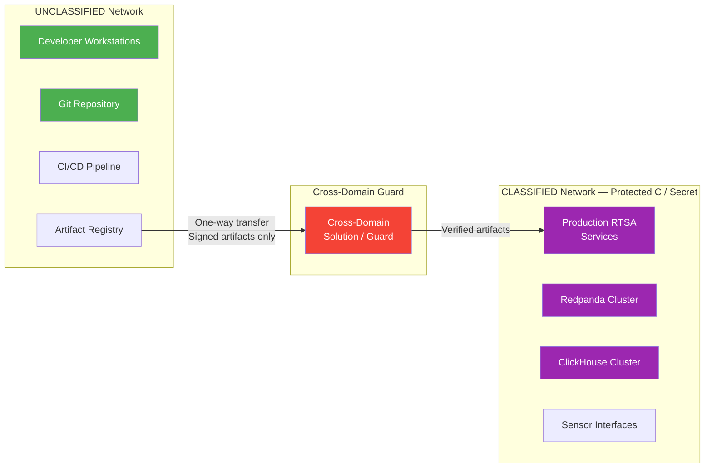

# Security Classification Guidelines

> **CLASSIFICATION: UNCLASSIFIED**
> **Document Type**: Security Policy
> **Parent**: `00_master_policy.md`
> **Compliance**: ITSG-33, NIST 800-53 Rev 5
> **Last Updated**: 2026-02-23

---

## 1. Purpose

This document defines data classification tiers, handling rules, marking requirements, and safeguarding procedures for the RTSA project. All AI agents, developers, and reviewers must enforce these rules when generating, reviewing, or deploying code and documentation.

## 2. Classification Tiers

The Government of Canada (GC) uses the following classification levels, aligned with the Treasury Board Policy on Government Security:

```mermaid
graph TD
    subgraph "Classification Hierarchy — Ascending Sensitivity"
        UC[UNCLASSIFIED<br/>No injury if disclosed]
        PRA[PROTECTED A<br/>Low injury to individual]
        PRB[PROTECTED B<br/>Serious injury to individual<br/>or organization]
        PRC[PROTECTED C<br/>Extremely grave injury<br/>to national interest]
        CONF[CONFIDENTIAL<br/>Could cause injury<br/>to national interest]
        SEC[SECRET<br/>Could cause serious injury<br/>to national interest]
        TS[TOP SECRET<br/>Could cause exceptionally<br/>grave injury to national interest]
    end

    UC --> PRA --> PRB --> PRC
    PRC -.->|"Government Security<br/>Boundary"| CONF
    CONF --> SEC --> TS

    style UC fill:#4caf50,color:#fff
    style PRA fill:#8bc34a,color:#fff
    style PRB fill:#ff9800,color:#fff
    style PRC fill:#f44336,color:#fff
    style CONF fill:#e91e63,color:#fff
    style SEC fill:#9c27b0,color:#fff
    style TS fill:#4a148c,color:#fff
```



### RTSA System Classification Ceiling: Protected C / Secret

The RTSA system is designed to **process** data up to **Protected C / Secret** classification. However:

- **This repository** contains ONLY **UNCLASSIFIED** artifacts (code, configs, docs).
- **Runtime data** (sensor feeds, entity tracks, intelligence products) may be classified up to Secret.
- **Test data** must be synthetic and UNCLASSIFIED.

## 3. Data Classification for RTSA Data Types

| Data Type | Classification at Rest | Classification in Transit | Handling Environment |
|---|---|---|---|
| Source code | UNCLASSIFIED | UNCLASSIFIED | Development network |
| Configuration templates | UNCLASSIFIED | UNCLASSIFIED | Development network |
| Test data (synthetic) | UNCLASSIFIED | UNCLASSIFIED | Development network |
| Sensor event payloads | Up to SECRET | Up to SECRET | Classified network only |
| Entity track data | Up to SECRET | Up to SECRET | Classified network only |
| AI model weights (trained) | PROTECTED B minimum | PROTECTED B minimum | Classified network only |
| AI model architecture (untrained) | UNCLASSIFIED | UNCLASSIFIED | Development network |
| Operator feedback | PROTECTED A minimum | PROTECTED B minimum | Classified network only |
| Audit logs | PROTECTED B | PROTECTED B | Classified network only |
| NATO exchange data (STANAG) | Per originator marking | Per originator marking | Cross-domain guard required |
| System metrics / health | UNCLASSIFIED | UNCLASSIFIED | Operations network |
| Cryptographic keys / certs | PROTECTED C | PROTECTED C | Key management system |

## 4. Marking Requirements

### 4.1 Source Code Files

Every source file must include a classification header as the **first line** (after shebang if applicable):

| Language | Header Format |
|---|---|
| Go | `// CLASSIFICATION: UNCLASSIFIED` |
| Protobuf | `// CLASSIFICATION: UNCLASSIFIED` |
| TypeScript/JavaScript | `// CLASSIFICATION: UNCLASSIFIED` |
| YAML/TOML | `# CLASSIFICATION: UNCLASSIFIED` |
| SQL | `-- CLASSIFICATION: UNCLASSIFIED` |
| Dockerfile | `# CLASSIFICATION: UNCLASSIFIED` |
| Shell scripts | `# CLASSIFICATION: UNCLASSIFIED` (after shebang) |
| Markdown | `<!-- CLASSIFICATION: UNCLASSIFIED -->` or in metadata block |

### 4.2 Documentation Files

All documentation must include classification marking in the document header metadata block:

```markdown
> **CLASSIFICATION: UNCLASSIFIED**
```

### 4.3 Runtime Data

All Protobuf messages that carry sensor or intelligence data must include a `classification` field:

```protobuf
enum Classification {
  CLASSIFICATION_UNSPECIFIED = 0;
  UNCLASSIFIED = 1;
  PROTECTED_A = 2;
  PROTECTED_B = 3;
  PROTECTED_C = 4;
  CONFIDENTIAL = 5;
  SECRET = 6;
}
```

Services must propagate classification markings from input to output. The output classification is the **maximum** of all input classifications.

## 5. Handling Rules by Classification Level

### 5.1 UNCLASSIFIED (Repository Content)

- May be stored on developer workstations and standard enterprise infrastructure
- May traverse public networks if encrypted (TLS 1.3)
- No special disposal requirements beyond standard data hygiene
- Code reviews may be conducted via standard tooling (GitHub)

### 5.2 PROTECTED A–B (Operator Feedback, Audit Logs)

- Must be stored on GC-approved infrastructure
- Must be encrypted at rest (AES-256) and in transit (TLS 1.3 with CSE-approved cipher suites)
- Access controlled by role-based access control (RBAC) with named accounts
- Disposal requires secure wipe (CCCS-approved method)
- No export to non-GC systems without authorization

### 5.3 PROTECTED C / SECRET (Sensor Data, Entity Tracks, Intelligence Products)

- Must be stored and processed ONLY on classified networks (no internet connectivity)
- Encryption: CSE-approved Type 1 or equivalent cryptographic equipment for transit between security zones
- Air-gap required between classified processing and unclassified development networks
- Access requires personnel security clearance at appropriate level
- All access is individually audited
- Disposal requires CCCS-approved media sanitization (overwrite, degauss, or physical destruction)
- TEMPEST protections required for processing environments

## 6. Air-Gap and Network Separation



### Air-Gap Rules

1. Code is developed on UNCLASSIFIED networks
2. Artifacts (container images, binaries) are built and signed on UNCLASSIFIED CI/CD
3. Signed artifacts are transferred to the classified network via a **cross-domain guard** (one-way data diode or approved CDS)
4. No data flows from classified → unclassified networks without explicit authorization and sanitization
5. Classified test data is NEVER exported to the development environment

## 7. Cryptographic Requirements

### 7.1 Approved Algorithms (CSE / CCCS)

| Purpose | Approved Algorithms | Key Length |
|---|---|---|
| Symmetric encryption | AES | 256-bit minimum |
| Hashing | SHA-256, SHA-384, SHA-512 | — |
| Digital signatures | ECDSA (P-384), RSA | P-384 or RSA-3072 minimum |
| Key exchange | ECDH (P-384), X25519 | P-384 or equivalent |
| TLS | TLS 1.3 only | — |
| mTLS cipher suites | `TLS_AES_256_GCM_SHA384`, `TLS_CHACHA20_POLY1305_SHA256` | — |

### 7.2 Prohibited

- MD5 for any security purpose
- SHA-1 for any security purpose
- DES, 3DES, RC4
- TLS 1.0, 1.1, 1.2 (1.3 only for new services)
- Custom or proprietary cryptographic algorithms
- Hardcoded cryptographic keys

## 8. Personnel Security

- Access to classified runtime environments requires a valid Government of Canada security clearance at the appropriate level
- Developer access to the UNCLASSIFIED repository requires Reliability Status at minimum
- All personnel must complete security awareness training annually
- Foreign nationals require special authorization per ITAR/EAR equivalents

## 9. Spillage Procedures

If classified data is inadvertently introduced to the UNCLASSIFIED repository:

1. **STOP** — Do not push or share the affected content
2. **NOTIFY** — Immediately inform the project Security Authority
3. **CONTAIN** — Isolate affected workstations; do not delete (evidence preservation)
4. **REMEDIATE** — Security Authority directs cleanup: git history rewrite, credential rotation, forensic audit
5. **REPORT** — File a security incident report per departmental procedures
6. **REVIEW** — Update procedures to prevent recurrence

## 10. TEMPEST Considerations

Processing environments for Protected C / Secret data must meet TEMPEST requirements:

- Processing hardware must be TEMPEST-certified or operated within a TEMPEST-approved facility
- Emanation security zones must be established per ITSG-11 (TEMPEST Security for Canada)
- Cabling between components must use shielded/fiber optic connections within the classification boundary
- Tactical edge deployments must use TEMPEST-hardened enclosures

## 11. AI Agent Rules for Classification

When generating code or documentation, AI agents must:

1. **NEVER** generate content that contains or simulates classified information
2. **ALWAYS** include the UNCLASSIFIED classification header on generated files
3. **ALWAYS** use synthetic/fictional data for test cases (fictional coordinates, fictional unit names, fictional sensor readings)
4. **ALWAYS** include the `Classification` enum field in Protobuf messages that carry sensor/intelligence data
5. **ALWAYS** propagate classification markings through data transformations (max-of-inputs rule)
6. **NEVER** log classified data fields — log only metadata (event type, timestamp, sensor ID) at INFO and above
7. **REJECT** any prompt that asks to embed real operational data, real coordinates, or real intelligence in code
