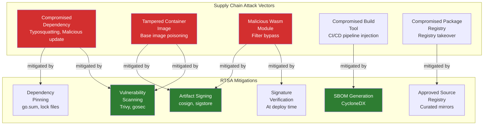

# Supply Chain Security Guidelines

> **CLASSIFICATION: UNCLASSIFIED**
> **Document Type**: Security Policy
> **Parent**: `00_master_policy.md` → `01_security_compliance/security_classification.md`
> **Compliance**: ITSG-33 SA-4, SA-12; NIST 800-53 SA-4, SR-3, SR-4
> **Last Updated**: 2026-02-23

---

## 1. Purpose

This document defines supply chain security requirements for all software dependencies, container images, Wasm modules, and third-party components used in the RTSA project. Given the Protected C / Secret classification of the operational environment, supply chain integrity is critical to prevent adversarial code injection, backdoors, or data exfiltration.

## 2. Supply Chain Threat Model

## 3. Approved Dependency Sources

### 3.1 Go Modules

| Source                  | Status      | Notes                                                                     |
| ----------------------- | ----------- | ------------------------------------------------------------------------- |
| `proxy.golang.org`      | APPROVED    | Primary Go module proxy; use `GONOSUMCHECK` for private modules only      |
| `sum.golang.org`        | APPROVED    | Checksum database; must be verified for all public modules                |
| GitHub (direct)         | CONDITIONAL | Only for modules not available via proxy; requires manual security review |
| Private module registry | APPROVED    | Internal Go modules hosted on approved registry                           |

### 3.2 Container Base Images

| Image                               | Status      | Notes                                                        |
| ----------------------------------- | ----------- | ------------------------------------------------------------ |
| `gcr.io/distroless/static-debian12` | APPROVED    | Preferred for Go binaries (no shell, minimal attack surface) |
| `gcr.io/distroless/base-debian12`   | APPROVED    | For services requiring glibc                                 |
| `node:22-alpine`                    | APPROVED    | SolidJS build stage only; not used in production images      |
| `scratch`                           | APPROVED    | Minimal base for statically-linked Go binaries               |
| Custom base images                  | CONDITIONAL | Must be built from approved bases; Dockerfile reviewed       |

### 3.3 NPM Packages (SolidJS Frontend)

| Source               | Status   | Notes                                               |
| -------------------- | -------- | --------------------------------------------------- |
| `registry.npmjs.org` | APPROVED | With lockfile integrity enforcement (`npm ci` only) |
| Private NPM registry | APPROVED | Internal packages; scoped under `@rtsa/`            |

### 3.4 Wasm Modules

| Source             | Status     | Notes                                                                    |
| ------------------ | ---------- | ------------------------------------------------------------------------ |
| Project-built Wasm | APPROVED   | Built from reviewed source in project repo; signed                       |
| Third-party Wasm   | PROHIBITED | No third-party Wasm modules without explicit security review and signing |

## 4. Dependency Management Rules

### 4.1 Pinning and Lock Files

- **RULE-SC-01**: All dependencies must be pinned to exact versions (no floating ranges like `^` or `~` in package.json).
- **RULE-SC-02**: Go modules: `go.sum` must be committed and verified. Never run `go mod tidy` without reviewing changes.
- **RULE-SC-03**: NPM: `package-lock.json` must be committed. Use `npm ci` (not `npm install`) in CI.
- **RULE-SC-04**: Container images: pin by SHA256 digest, not by tag. Example: `gcr.io/distroless/static-debian12@sha256:abc123...`
- **RULE-SC-05**: Wasm modules: pin by SHA256 hash; verify hash on deployment.

### 4.2 Dependency Review Process

Before adding any new dependency:

1. **License check**: Must be a permissive license (MIT, Apache 2.0, BSD). No copyleft (GPL, LGPL, AGPL) in production code. Copyleft allowed in dev/test tooling only.
2. **Maintenance check**: Must have been updated within the last 12 months. Must have more than 1 maintainer.
3. **Security history**: Check for past CVEs. Evaluate severity and response time.
4. **Transitive dependencies**: Review the full dependency tree. Flag any transitive dependency that fails checks 1-3.
5. **Size/scope check**: Prefer small, focused libraries over large frameworks. Minimize transitive dependency count.
6. **Alternatives**: Document why built-in/standard library alternatives are insufficient.

### 4.3 Prohibited Dependencies

| Category                                        | Reason                                         |
| ----------------------------------------------- | ---------------------------------------------- |
| Dependencies with known unpatched critical CVEs | Active security risk                           |
| Dependencies from sanctioned countries/entities | Export control compliance                      |
| Dependencies with obfuscated source code        | Cannot be audited                              |
| Dependencies that phone home / send telemetry   | Data leakage risk in classified environments   |
| Dependencies with GPL/LGPL/AGPL licenses        | License contamination risk for defence project |

## 5. SBOM Requirements

### 5.1 Standard

- Format: **CycloneDX** (JSON) — version 1.5 or later
- Generate for: every container image, every Go binary, the SolidJS frontend bundle
- Frequency: generated on every CI build; archived with release artifacts

### 5.2 SBOM Content

Each SBOM must include:

| Field                   | Required | Description                                         |
| ----------------------- | -------- | --------------------------------------------------- |
| Component name          | YES      | Full package name including scope/organization      |
| Version                 | YES      | Exact version (no ranges)                           |
| Package URL (purl)      | YES      | Standard purl format for unambiguous identification |
| License                 | YES      | SPDX license identifier                             |
| Hash (SHA-256)          | YES      | Content hash of the dependency                      |
| Supplier                | YES      | Publisher/maintainer identity                       |
| Dependency relationship | YES      | Direct vs. transitive; parent component             |

### 5.3 SBOM Tooling

| Language     | Tool                  | Notes                                        |
| ------------ | --------------------- | -------------------------------------------- |
| Go           | `cyclonedx-gomod`     | Generates from `go.mod` and `go.sum`         |
| Node/SolidJS | `@cyclonedx/cdxgen`   | Generates from `package-lock.json`           |
| Container    | `syft`                | Generates SBOM from container image layers   |
| Aggregation  | `cyclonedx-cli merge` | Merges per-component SBOMs into release SBOM |

## 6. Vulnerability Scanning

### 6.1 Scanning Tools

| Tool          | Scope                               | CI Stage | Blocking?                        |
| ------------- | ----------------------------------- | -------- | -------------------------------- |
| `govulncheck` | Go vulnerabilities (stdlib + deps)  | Build    | YES — Critical/High block merge  |
| `gosec`       | Go static analysis (security rules) | Build    | YES — all findings block merge   |
| `trivy`       | Container image vulnerabilities     | Build    | YES — Critical/High block merge  |
| `npm audit`   | NPM dependency vulnerabilities      | Build    | YES — Critical/High block merge  |
| `trivy fs`    | Filesystem-level vulnerability scan | Build    | YES — Critical block merge       |
| `semgrep`     | Multi-language SAST                 | Build    | YES — security rules block merge |

### 6.2 CVE Response SLA

| Severity                  | Response Time | Action                                                                      |
| ------------------------- | ------------- | --------------------------------------------------------------------------- |
| **Critical (CVSS 9.0+)**  | 24 hours      | Immediate patch or mitigation; block deployment                             |
| **High (CVSS 7.0-8.9)**   | 72 hours      | Patch in next release; risk acceptance requires Security Authority approval |
| **Medium (CVSS 4.0-6.9)** | 7 days        | Schedule patch; document compensating controls                              |
| **Low (CVSS 0.1-3.9)**    | 30 days       | Track and remediate in normal development cycle                             |

## 7. Container Image Security

### 7.1 Build Rules

- **RULE-IMG-01**: Multi-stage builds: build in full SDK image, run in distroless/scratch
- **RULE-IMG-02**: No secrets in image layers (ARG, ENV, COPY of secret files)
- **RULE-IMG-03**: Run as non-root user (UID 65534 / nobody)
- **RULE-IMG-04**: Read-only root filesystem
- **RULE-IMG-05**: No package managers in production images (no apt, apk, yum)
- **RULE-IMG-06**: Pin base image by digest, not tag

### 7.2 Image Signing

- All production images must be signed using `cosign` with the project signing key
- Signature verification is mandatory at deployment time (Kubernetes admission controller)
- Unsigned images must not be deployed to any environment

### 7.3 Image Scanning

- Every image scanned by `trivy` before push to registry
- Scan results stored alongside SBOM in release artifacts
- Images with Critical CVEs must not be pushed to registry

## 8. Wasm Module Security

- Wasm modules for Redpanda Data Transforms must be built from reviewed source code in this repository
- Each Wasm module must be signed using the project signing key
- Signature is verified by Redpanda before loading
- Wasm modules must be tested in isolation before deployment
- Wasm module source must include unit tests with 80%+ coverage
- No third-party Wasm modules without explicit security review

## 9. Air-Gap Distribution

For deployment to classified/tactical environments:

1. All artifacts (images, binaries, Wasm modules, SBOMs) are bundled into a signed distribution package
2. Package integrity is verified via SHA-256 manifest signed by the release key
3. Transfer to classified network via approved cross-domain solution (data diode)
4. On classified side: verify package signature, verify SBOM, scan with on-network scanner before deployment
5. Maintain a mirrored container registry on the classified network for air-gap deployments

## 10. AI Agent Instructions

When adding dependencies or creating Dockerfiles:

1. Check this document for approved sources before adding any dependency
2. Never introduce a dependency with a copyleft license (GPL, LGPL, AGPL) in production code
3. Always pin dependencies to exact versions; container images must be pinned by digest
4. Include a brief justification comment for every new dependency: `// Dependency: package-name — used for X; license: MIT; alternatives considered: Y`
5. Generate/update SBOM when dependencies change
6. When creating Dockerfiles, use multi-stage builds with distroless base, non-root user, and read-only filesystem
