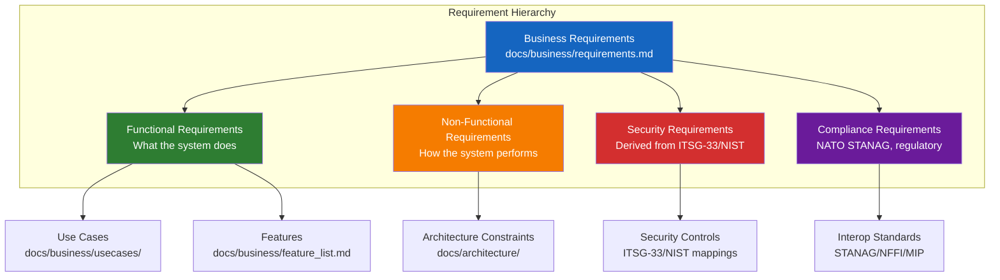
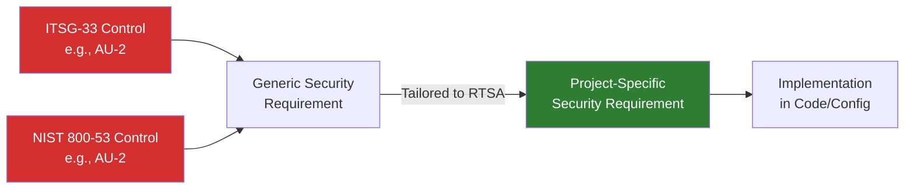

# Requirements Engineering Guidelines

> **CLASSIFICATION: UNCLASSIFIED**
> **Document Type**: SDLC Phase Guideline
> **Parent**: `00_master_policy.md`
> **Dependencies**: `01_security_compliance/security_classification.md`
> **Last Updated**: 2026-02-23

---

## 1. Purpose

This document defines how requirements are captured, formatted, classified, and managed for the RTSA project. All requirements must be traceable to features, use cases, architectural components, and compliance controls. AI agents generating requirements or user stories must follow these formats precisely.

## 2. Requirement Taxonomy



## 3. Requirement Format

### 3.1 Keyword Usage (RFC 2119)

All requirements use RFC 2119 keywords with precise meaning:

| Keyword | Meaning | Usage |
|---|---|---|
| **SHALL** | Absolute requirement — non-negotiable | Security, compliance, core functional requirements |
| **SHALL NOT** | Absolute prohibition | Security constraints, classification rules |
| **SHOULD** | Recommended — deviation requires documented justification | Performance targets, best practices |
| **SHOULD NOT** | Discouraged — deviation requires documented justification | Anti-patterns, deprecated approaches |
| **MAY** | Optional — implementation choice | Enhancement features, optimization options |

### 3.2 Requirement ID Format

```
[Category]-[SubCategory]-[Number]

Categories:
  FR   = Functional Requirement
  NFR  = Non-Functional Requirement
  SR   = Security Requirement
  CR   = Compliance Requirement

SubCategories:
  ING  = Ingestion
  FUS  = Fusion
  DET  = Detection
  INF  = Inference / AI
  VIS  = Visualization
  FBK  = Feedback
  TRN  = Training
  AUD  = Audit
  STO  = Storage
  DEP  = Deployment
  INT  = Interoperability
  SEC  = Security
  PER  = Performance
  AVL  = Availability

Example: FR-ING-001 = Functional Requirement, Ingestion, #001
```

### 3.3 Requirement Record Template

Every requirement must be documented as follows:

```markdown
### [REQ-ID] — [Short Title]

| Attribute | Value |
|---|---|
| **ID** | [REQ-ID] |
| **Type** | Functional / Non-Functional / Security / Compliance |
| **Priority** | Must / Should / Could (MoSCoW) |
| **Classification** | UNCLASSIFIED |
| **Source** | [Stakeholder / Standard / Derived from REQ-ID] |
| **Rationale** | [Why this requirement exists] |
| **Acceptance Criteria** | [Testable conditions — see Section 3.4] |
| **Features** | [Feature IDs: F-001, F-002] |
| **Use Cases** | [UC IDs: UC001, UC003] |
| **ITSG-33 Controls** | [Control IDs: AC-3, AU-2] |
| **NIST 800-53 Controls** | [Control IDs: AC-3, AU-2] |

**Statement**: The system [SHALL/SHOULD/MAY] [action] [object] [condition] [constraint].
```

### 3.4 Acceptance Criteria Format

Use Given-When-Then (GWT) format for testable acceptance criteria:

```
GIVEN [precondition]
WHEN [action or trigger]
THEN [expected outcome]
AND [additional outcome, if any]
```

Example:
```
GIVEN a radar sensor is registered and authenticated via mTLS
WHEN the sensor sends a track event via the Ingestion gRPC API
THEN the event SHALL be published to the `sensor.radar.tracks` Redpanda topic within 50ms
AND an audit record SHALL be created with sensor_id, timestamp, and event_type
```

## 4. User Story Template

For agile development, requirements are decomposed into user stories:

```markdown
### Story: [ID] — [Title]

**As a** [role/persona],
**I want to** [action/capability],
**So that** [business value/outcome].

**Acceptance Criteria:**
1. GIVEN ... WHEN ... THEN ...
2. GIVEN ... WHEN ... THEN ...

**Security Considerations:**
- [Classification of data involved]
- [Authentication/authorization required]
- [Audit events generated]

**Technical Notes:**
- [Relevant technology/service]
- [Dependencies on other stories]

**Definition of Done:**
- [ ] Code implemented with classification headers
- [ ] Unit tests written (80%+ coverage)
- [ ] SAST scan passes
- [ ] Code review completed
- [ ] Threat model updated (if new data flow)
- [ ] Documentation updated
```

## 5. Personas / Actors

| Actor | Description | Clearance | Access Level |
|---|---|---|---|
| **Military Operator** | Monitors situational awareness display; provides feedback on AI classifications | SECRET | Read all tracks; write feedback |
| **Intelligence Analyst** | Performs historical analysis; reviews AI anomaly detections; queries forensic data | SECRET | Read all data; query ClickHouse; export reports |
| **System Administrator** | Manages system configuration, user accounts, deployments | SECRET | Full admin; restricted data access |
| **AI/ML Engineer** | Manages ML models, reviews training data, validates anti-poisoning | SECRET | Model management; training pipeline; read feedback |
| **NATO Partner System** | External allied system exchanging data via STANAG 5516/NFFI | Per bilateral agreement | Read/write via interop adapter only |
| **Sensor System** | Automated sensor sending detection events | N/A (device) | Write to sensor-specific ingestion endpoints only |
| **Field Technician** | Deploys and maintains tactical edge nodes | PROTECTED B | Deploy; diagnose; limited config |

## 6. Requirements Classification Rules

- Every requirement must have a `Classification` attribute (UNCLASSIFIED for all requirements in this repo)
- Requirements that reference classified capabilities must describe them abstractly (e.g., "The system SHALL support sensor type X" not "The system SHALL ingest data from [specific classified system name]")
- Acceptance criteria must use synthetic test data examples
- No real operational data, coordinates, or unit designations in requirements

## 7. Security Requirements Derivation

Security requirements are derived from ITSG-33 and NIST 800-53 controls:



For every ITSG-33/NIST control mapped in `01_security_compliance/`, derive at least one project-specific security requirement. The requirement must:
- Reference the source control ID
- Specify the RTSA component(s) it applies to
- Include testable acceptance criteria
- Be traceable to a feature and use case

## 8. AI Agent Instructions

When generating or updating requirements:

1. Use the exact requirement format from Section 3.3
2. Assign a unique requirement ID following the convention in Section 3.2
3. Include at least one acceptance criterion in GWT format
4. Map every requirement to at least one feature and one use case
5. Map security requirements to ITSG-33 and NIST 800-53 controls
6. Use RFC 2119 keywords (SHALL, SHOULD, MAY) precisely — do not use informal language like "must" or "needs to"
7. Never include classified information, real coordinates, or real unit designations
8. Include security considerations for every user story (classification of data, auth required, audit events)
