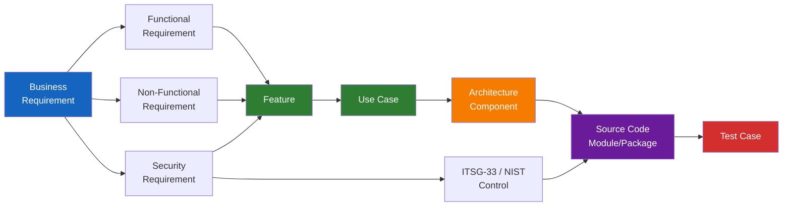
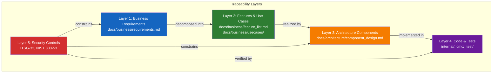

# Traceability Standards

> **CLASSIFICATION: UNCLASSIFIED**
> **Document Type**: SDLC Phase Guideline
> **Parent**: `00_master_policy.md`
> **Dependencies**: `02_requirements/requirements_engineering.md`
> **Last Updated**: 2026-02-23

---

## 1. Purpose

This document defines the bidirectional traceability framework for the RTSA project. Every artifact — from business requirements to deployed code — must trace forward and backward through the full chain. This ensures: no orphan code (code without a requirement), no unimplemented requirements, and complete compliance audit trails.

## 2. Traceability Chain



### Forward Traceability (Requirement → Code)
Answers: "Is this requirement implemented?"

### Backward Traceability (Code → Requirement)
Answers: "Why does this code exist?"

## 3. Artifact ID Conventions

| Artifact | ID Format | Example | Location |
|---|---|---|---|
| Business Requirement | `BR-NNN` | `BR-001` | `docs/business/requirements.md` |
| Functional Requirement | `FR-[SUB]-NNN` | `FR-ING-001` | `docs/business/requirements.md` |
| Non-Functional Requirement | `NFR-[SUB]-NNN` | `NFR-PER-001` | `docs/business/requirements.md` |
| Security Requirement | `SR-[SUB]-NNN` | `SR-SEC-001` | `docs/business/requirements.md` |
| Compliance Requirement | `CR-[SUB]-NNN` | `CR-INT-001` | `docs/business/requirements.md` |
| Feature | `F-NNN` | `F-001` | `docs/business/feature_list.md` |
| Use Case | `UC-NNN` | `UC-001` | `docs/business/usecases/UC001_*.md` |
| Architecture Component | `COMP-NNN` | `COMP-001` | `docs/architecture/component_design.md` |
| Security Control | `ITSG33-[FAMILY]-[NUM]` | `ITSG33-AU-2` | `docs/sdlc_guidelines/01_security_compliance/` |
| Test Case | `TC-[TYPE]-NNN` | `TC-UT-001` | Test source files |

## 4. Traceability Matrix Template

### 4.1 Requirement → Feature → Use Case

| Requirement | Feature(s) | Use Case(s) | Priority | Status |
|---|---|---|---|---|
| `FR-ING-001` | `F-001` | `UC-001` | Must | Not Started |
| `FR-FUS-001` | `F-002` | `UC-002` | Must | Not Started |
| `SR-SEC-001` | `F-001`, `F-010` | `UC-001`, `UC-012` | Must | Not Started |

### 4.2 Use Case → Component → Code Module

| Use Case | Component(s) | Code Module(s) | Test Case(s) |
|---|---|---|---|
| `UC-001` | `COMP-001` (Ingestion) | `internal/ingestion/` | `TC-UT-001..010` |
| `UC-002` | `COMP-002` (Fusion) | `internal/fusion/` | `TC-UT-011..020` |

### 4.3 Security Control → Requirement → Implementation

| Control | Requirement(s) | Component(s) | Implementation Evidence |
|---|---|---|---|
| `ITSG33-AC-3` | `SR-SEC-001` | `COMP-001`, `COMP-003` | gRPC auth interceptor in `internal/middleware/auth.go` |
| `ITSG33-AU-2` | `SR-AUD-001` | All components | Audit event producer in `internal/audit/producer.go` |

## 5. Traceability Rules

### 5.1 Forward Coverage Rules

- **RULE-TR-01**: Every business requirement (`BR-*`) SHALL trace to at least one functional, non-functional, or security requirement.
- **RULE-TR-02**: Every functional requirement (`FR-*`) SHALL trace to at least one feature (`F-*`).
- **RULE-TR-03**: Every feature (`F-*`) SHALL trace to at least one use case (`UC-*`).
- **RULE-TR-04**: Every use case (`UC-*`) SHALL trace to at least one architecture component (`COMP-*`).
- **RULE-TR-05**: Every architecture component SHALL have at least one test case (`TC-*`).

### 5.2 Backward Coverage Rules

- **RULE-TR-06**: Every code module SHALL trace back to at least one use case. No orphan code.
- **RULE-TR-07**: Every test case SHALL reference the requirement or use case it validates.
- **RULE-TR-08**: Every security control implementation SHALL trace back to the ITSG-33/NIST control ID.

### 5.3 Change Impact Rules

- **RULE-TR-09**: When a requirement changes, all downstream artifacts (features, use cases, components, tests) must be reviewed for impact.
- **RULE-TR-10**: When a component changes, all upstream requirements must be checked for continued satisfaction.
- **RULE-TR-11**: All traceability links must be verified during each phase-gate review.

## 6. In-Code Traceability

Developers and AI agents must include traceability comments in source code for key implementations:

### Go Code Example
```go
// CLASSIFICATION: UNCLASSIFIED

// Package ingestion implements sensor event ingestion via gRPC.
//
// Traceability:
//   Feature:     F-001 (Sensor Ingestion Pipeline)
//   Use Cases:   UC-001 (Sensor Event Ingestion)
//   Requirements: FR-ING-001, FR-ING-002, SR-SEC-001
//   Controls:    ITSG-33 AC-3, AU-2, SI-10
package ingestion
```

### Protobuf Example
```protobuf
// CLASSIFICATION: UNCLASSIFIED

// SensorEvent represents a normalized sensor detection event.
//
// Traceability:
//   Feature:     F-001 (Sensor Ingestion Pipeline)
//   Use Cases:   UC-001 (Sensor Event Ingestion)
//   Requirements: FR-ING-001
message SensorEvent {
  // ...
}
```

### Test File Example
```go
// CLASSIFICATION: UNCLASSIFIED

// TestIngestRadarEvent validates radar event ingestion.
//
// Traceability: FR-ING-001, UC-001, ITSG-33 SI-10
func TestIngestRadarEvent(t *testing.T) {
    // ...
}
```

## 7. Master Dependency Graph

The master dependency graph (`docs/architecture/dependency_graph.md`) contains the full cross-reference of all traceability links. It is the single source of truth for traceability and must be updated whenever requirements, features, use cases, or components change.



## 8. AI Agent Instructions

When generating or modifying any artifact:

1. Always include traceability references (requirement IDs, feature IDs, use case IDs, control IDs) in the artifact
2. When creating a new code module, include the package-level traceability comment (Section 6)
3. When creating a test, reference the requirement(s) or use case(s) it validates
4. When adding a new requirement, ensure it traces to at least one feature and one use case
5. When modifying a requirement, flag all downstream artifacts that may need updates
6. Verify no orphan artifacts exist: every requirement has an implementation, every code module has a requirement
7. Update `docs/architecture/dependency_graph.md` when adding new traceability links
