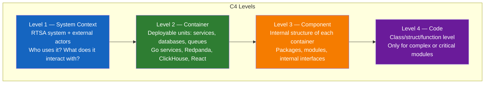

# Architecture Guidelines

> **CLASSIFICATION: UNCLASSIFIED**
> **Document Type**: SDLC Phase Guideline
> **Parent**: `00_master_policy.md`
> **Dependencies**: `01_security_compliance/*`, `02_requirements/*`
> **Last Updated**: 2026-02-23

---

## 1. Purpose

This document defines the architecture methodology, documentation standards, and decision-recording process for the RTSA project. All architecture documentation uses the C4 model with Mermaid diagrams. Architecture decisions are recorded as ADRs (Architecture Decision Records).

## 2. C4 Model Usage

The RTSA project uses the C4 model (Context, Container, Component, Code) for systematic architecture documentation at progressive levels of detail.



### Required Diagrams per Architecture Document

| Architecture Document | C4 Levels | Additional Diagrams |
|---|---|---|
| `high_level_architecture.md` | L1 (System Context), L2 (Container) | Data flow overview |
| `component_design.md` | L3 (Component) for each container | Interface definitions |
| `data_architecture.md` | — | ER diagrams, data flow diagrams, topic maps |
| `security_architecture.md` | — | Security zone diagram, trust boundary diagram |
| `deployment_architecture.md` | — | Deployment topology (×3 environments) |
| `integration_architecture.md` | L1 (external interfaces) | Protocol/format diagrams |
| `dependency_graph.md` | — | Traceability matrices as diagrams |

### Mermaid Syntax for C4

Since native C4 support in Mermaid is limited, use labeled `graph` diagrams with consistent styling:

- **Person/Actor**: Rectangle with user icon description
- **System**: Rectangle with system name and description
- **Container**: Rectangle with technology label
- **Component**: Rectangle with responsibility label
- **External System**: Dashed border or distinct color
- **Data Store**: Cylinder shape (using subgraph label)

Color conventions:
- Blue (`#1565c0`): Internal RTSA systems/containers
- Green (`#2e7d32`): Data stores
- Orange (`#f57c00`): External systems
- Red (`#d32f2f`): Security boundaries / guards
- Purple (`#6a1b9a`): Presentation / UI

## 3. Architecture Decision Records (ADRs)

### 3.1 When to Create an ADR

Create an ADR for any decision that:
- Affects more than one service or component
- Introduces or replaces a technology
- Changes a data model or event schema
- Modifies security boundaries or trust relationships
- Has significant trade-offs or alternative approaches considered
- Cannot be easily reversed

### 3.2 ADR Format

```markdown
# ADR-[NNN]: [Decision Title]

| Attribute | Value |
|---|---|
| **Status** | Proposed / Accepted / Deprecated / Superseded by ADR-NNN |
| **Date** | YYYY-MM-DD |
| **Decision Makers** | [Names/Roles] |
| **Affected Components** | [COMP IDs or service names] |
| **Related Requirements** | [REQ IDs] |

## Context

[Describe the problem or situation that requires a decision. Include constraints, requirements, and forces at play.]

## Decision

[State the decision clearly. Use "We will..." language.]

## Alternatives Considered

### Alternative 1: [Name]
- **Pros**: ...
- **Cons**: ...

### Alternative 2: [Name]
- **Pros**: ...
- **Cons**: ...

## Consequences

### Positive
- [Positive outcomes of this decision]

### Negative
- [Trade-offs and risks accepted]

### Risks & Mitigations
- **Risk**: [Description] → **Mitigation**: [How we address it]

## Security Impact

[How does this decision affect the security posture? Which ITSG-33/NIST controls are affected?]

## Compliance Impact

[Does this affect NATO interoperability? ITSG-33 SA&A?]
```

### 3.3 ADR Storage

ADRs are stored in `docs/architecture/decisions/` with filenames `ADR-NNN_short_title.md`. The master list is maintained in `docs/architecture/high_level_architecture.md`.

## 4. Architecture Review Checklist

Before any architecture document or ADR is approved:

- [ ] Does it include the required C4 diagram level(s)?
- [ ] Are all Mermaid diagrams syntactically valid and renderable?
- [ ] Are trust boundaries clearly marked?
- [ ] Are all data flows classified (data classification level)?
- [ ] Does every new service have a defined authentication mechanism?
- [ ] Does every new data store have encryption at rest specified?
- [ ] Does every new external interface have a threat model entry?
- [ ] Are deployment implications addressed for all three environments (data centre, edge, hybrid)?
- [ ] Are performance implications quantified (latency, throughput, resource usage)?
- [ ] Does the design support graceful degradation at the tactical edge?
- [ ] Is backward compatibility addressed for Protobuf schema changes?
- [ ] Are ADRs created for significant decisions?
- [ ] Is the dependency graph updated?

## 5. Event-Driven Architecture Patterns

RTSA follows event-driven architecture with Redpanda as the central event backbone. The following patterns are approved:

### 5.1 Event Sourcing

All state changes are captured as immutable events in Redpanda. Services derive their current state by replaying events from their assigned topics.

### 5.2 CQRS (Command Query Responsibility Segregation)

- **Commands** (writes): Flow through gRPC services → Redpanda events
- **Queries** (reads): Served from materialized views in ClickHouse or in-memory state
- Command and query models may differ in schema

### 5.3 Event Choreography

Services react to events independently. No central orchestrator. Preferred for the sensor processing pipeline:

```
Sensor → Ingestion Service → Redpanda → [AI Inference | Archiver | Feedback Router]
```

### 5.4 Saga Pattern (for multi-step operations)

For operations spanning multiple services (e.g., feedback → validation → retraining), use compensating events for failure rollback. Each step publishes its outcome event.

## 6. Service Design Principles

1. **Single Responsibility**: Each service owns one bounded context (e.g., Ingestion, Inference, Feedback)
2. **API First**: Define Protobuf service contract before implementation
3. **Idempotency**: All event consumers must handle duplicate events gracefully
4. **Statelessness**: Services are stateless; state lives in Redpanda or ClickHouse
5. **Observability**: Every service exposes metrics (Prometheus), structured logs (slog), and traces (OpenTelemetry)
6. **Resilience**: Services must handle downstream failures (timeouts, retries with backoff, circuit breakers)
7. **Portability**: No environment-specific logic in code; all config via environment variables

## 7. AI Agent Instructions

When generating architecture documentation or making design decisions:

1. Always use Mermaid diagrams (not PlantUML or ASCII art)
2. Follow the C4 model levels — don't skip levels
3. Use the ADR template for any non-trivial decision
4. Mark trust boundaries and data classification levels on all diagrams
5. Ensure every new service/component has entries in the dependency graph
6. Address all three deployment environments (data centre, edge, hybrid) in design documents
7. Reference specific ITSG-33/NIST controls for security-relevant design elements
8. Validate that Mermaid syntax renders correctly before committing
