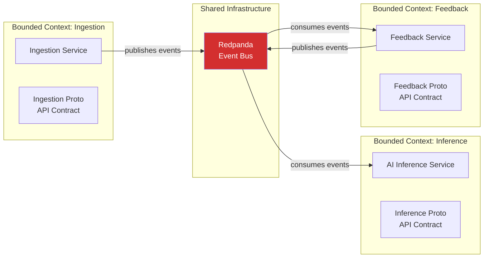
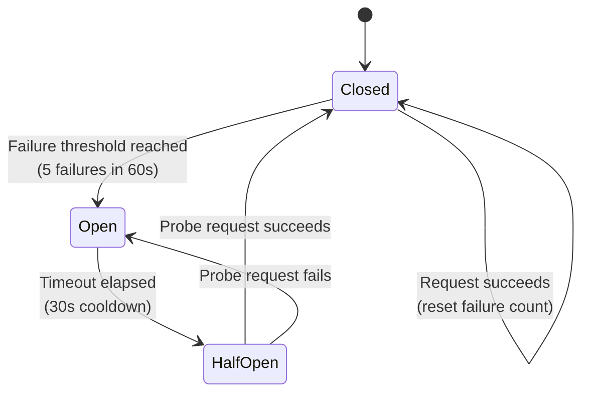

# Design Guidelines

> **CLASSIFICATION: UNCLASSIFIED**
> **Document Type**: SDLC Phase Guideline
> **Parent**: `00_master_policy.md`
> **Dependencies**: `03_architecture_design/architecture_guidelines.md`
> **Last Updated**: 2026-02-23

---

## 1. Purpose

This document defines design-level principles and patterns for RTSA microservices, data pipelines, and event schemas. It bridges architecture (what containers exist) and coding (how they are built internally).

## 2. Microservice Design Principles

### 2.1 Bounded Contexts

Each microservice owns exactly one bounded context. Services communicate ONLY through Redpanda events or gRPC APIs — never by direct database access.



### 2.2 Service Structure (Go)

Every Go microservice follows this internal structure:

```
cmd/
  [service-name]/
    main.go                  # Entry point, DI wiring, graceful shutdown
internal/
  [service-name]/
    config/
      config.go              # Configuration loading (env vars)
    server/
      grpc_server.go         # gRPC server setup, interceptor chain
    handler/
      [domain]_handler.go    # gRPC method implementations
    service/
      [domain]_service.go    # Business logic (no infrastructure deps)
    repository/
      [store]_repository.go  # Data access (Redpanda producer, ClickHouse client)
    model/
      [domain]_model.go      # Internal domain models
    middleware/
      auth.go                # mTLS + RBAC interceptor
      audit.go               # Audit event interceptor
      logging.go             # Structured logging interceptor
      metrics.go             # Prometheus metrics interceptor
    mapper/
      proto_mapper.go        # Protobuf ↔ domain model mapping
proto/
  [service-name]/
    v1/
      [service].proto        # Service contract
```

### 2.3 Dependency Injection

- Use constructor injection (function parameters), not global state
- `main.go` is the composition root — all dependencies wired here
- NO service locator or global registries
- Interfaces for all infrastructure dependencies (repositories, clients) to enable testing

## 3. Data Partitioning Strategy

### 3.1 Event Streaming Partitioning

Strict event ordering is maintained per partition. Partition keys must be chosen to balance ordering requirements with parallelism:

| Consideration | Guideline | Example |
|---|---|---|
| **Entity ordering** | Use the primary entity identifier as partition key | `sensor_id`, `entity_id`, `user_id` |
| **Compound keys** | Combine type and ID for finer-grained ordering with better distribution | `sensor_type:sensor_id`, `entity_type:entity_id` |
| **Even distribution** | Choose keys with high cardinality to avoid hot partitions | Avoid partitioning by a low-cardinality category alone |
| **Partition count** | Start with 6–12 partitions; increase for high-throughput topics | High-volume streams: 16–64; control channels: 1–3 |
| **Ordering guarantee** | Messages with the same key are ordered within a partition | Use this to maintain entity-level ordering |

**Anti-patterns:**
- Do not use timestamps as partition keys (no ordering benefit, poor distribution)
- Do not use random keys unless ordering is irrelevant (sacrifices locality)
- Do not over-partition (creates overhead; consumer groups limited by partition count)

### 3.2 OLAP Store Partitioning

For columnar OLAP stores (e.g., ClickHouse), partitioning controls physical data layout:

| Guideline | Explanation |
|---|---|
| Partition by time | Use monthly (`toYYYYMM`) for moderate volume or daily (`toYYYYMMDD`) for high volume |
| Lead ORDER BY with filter columns | Place most-filtered, low-cardinality columns first in the ORDER BY |
| Include entity + time in ORDER BY | Common pattern: `ORDER BY (category, entity_id, timestamp)` |
| Target 50–300 partitions | Too many degrade merge performance; too few reduce pruning benefit |
| Match retention to partition | TTL should align with partition boundaries for efficient expiration |

## 4. Event Schema Evolution Rules

### 4.1 Backward Compatibility

All Protobuf schema changes must be backward compatible. Consumers built against an older schema version must still function correctly with new messages.

### 4.2 Allowed Changes

| Change | Allowed? | Notes |
|---|---|---|
| Add new optional field | YES | New field defaults to zero value; old consumers ignore it |
| Add new enum value | YES | Old consumers treat unknown values as default |
| Remove a field | NO | Mark as `reserved` instead |
| Change field type | NO | Add a new field with the new type instead |
| Change field number | NO | Field numbers are permanent |
| Rename a field | YES | Only the JSON name changes; wire format unchanged |
| Change `optional` to `repeated` | NO | Wire format incompatible |

### 4.3 Schema Versioning

- Protobuf packages use version suffixes: `rtsa.ingestion.v1`, `rtsa.ingestion.v2`
- Major version bump = new package version with migration period
- Old and new versions co-exist during migration; consumers upgraded before producers
- Schema changes require an ADR documenting migration strategy

## 5. Error Handling Patterns

### 5.1 Error Categories

| Category | HTTP Equiv | gRPC Code | Action | Retry? |
|---|---|---|---|---|
| Validation error | 400 | `INVALID_ARGUMENT` | Return to caller with details | No |
| Authentication failure | 401 | `UNAUTHENTICATED` | Log security event; reject | No |
| Authorization failure | 403 | `PERMISSION_DENIED` | Log security event; reject | No |
| Resource not found | 404 | `NOT_FOUND` | Return to caller | No |
| Conflict / duplicate | 409 | `ALREADY_EXISTS` | Idempotent: succeed silently | No |
| Rate limited | 429 | `RESOURCE_EXHAUSTED` | Return with retry-after | Yes (backoff) |
| Internal error | 500 | `INTERNAL` | Log with stack; return generic | Yes (backoff) |
| Downstream timeout | 504 | `DEADLINE_EXCEEDED` | Log; propagate deadline | Yes (backoff) |
| Downstream unavailable | 503 | `UNAVAILABLE` | Circuit breaker; degrade gracefully | Yes (backoff) |

### 5.2 Error Wrapping in Go

```go
// ALWAYS wrap errors with context
if err != nil {
    return fmt.Errorf("ingestion.ProcessRadarEvent(sensorID=%s): %w", sensorID, err)
}

// NEVER swallow errors
// BAD:  _ = producer.Send(event)
// GOOD: if err := producer.Send(event); err != nil { ... }

// NEVER panic in production code
// BAD:  panic("unexpected state")
// GOOD: return fmt.Errorf("unexpected state: %s", state)
```

## 6. Circuit Breaker Pattern

For inter-service gRPC calls and external system integrations:



- **Closed**: Normal operation; track failure count
- **Open**: All requests fail fast; no downstream calls; return `UNAVAILABLE`
- **Half-Open**: Allow one probe request; if success → Closed; if fail → Open
- Configure per downstream dependency; default: 5 failures in 60s → open; 30s cooldown

## 7. Graceful Degradation for Tactical Edge

When operating in resource-constrained or disconnected environments:

| Capability | Full Mode (Data Centre) | Degraded Mode (Edge) |
|---|---|---|
| Sensor ingestion | All 6 sensor types, full rate | Priority sensors only, rate-limited |
| AI inference | Full model, all anomaly types | Lightweight model, critical anomalies only |
| Sensor fusion | Full multi-source correlation | Reduced correlation window |
| Historical queries | Full ClickHouse cluster | Single-node, recent data only |
| NATO interop | Real-time bidirectional | Store-and-forward when connected |
| Feedback loop | Real-time submission | Queued for sync when connected |
| Tiered storage | Hot + warm + cold | Hot only (local disk) |
| Audit trail | Real-time to central + local | Local only; sync when connected |

Design Pattern: Each service checks a `deployment.mode` configuration (`full`, `edge`, `hybrid`) and adjusts behavior accordingly. Feature flags, not code branches:

```go
if cfg.DeploymentMode == config.Edge {
    opts = append(opts, inference.WithLightweightModel())
    opts = append(opts, inference.WithRateLimit(100)) // events/sec cap
}
```

## 8. Idempotency Design

All event consumers must handle duplicate events. Strategies:

| Strategy | When to Use | Implementation |
|---|---|---|
| Natural idempotency | Operation is inherently safe to repeat (e.g., SET vs. INCREMENT) | Prefer SET-style operations |
| Idempotency key | Exactly-once processing required | Store processed event IDs in local state; skip duplicates |
| Deduplication window | High-throughput streams | Bloom filter or time-windowed dedup in Redpanda consumer |

## 9. API Design Principles

1. **Protobuf first**: Define the `.proto` file before writing any code
2. **Versioned APIs**: Package path includes version (`v1`, `v2`)
3. **Pagination**: Use cursor-based pagination for list operations
4. **Deadlines**: Every gRPC call must set a deadline; services must propagate deadlines
5. **Field masks**: Use `FieldMask` for partial updates
6. **Error details**: Use gRPC rich error model (`google.rpc.Status` with `details`)
7. **Streaming**: Use server-streaming for real-time data feeds; bidirectional streaming for long-lived connections

## 10. AI Agent Instructions

When designing services or components:

1. Follow the service structure template in Section 2.2
2. Use constructor injection; no global state
3. Choose partition keys that maintain ordering while enabling parallelism (Section 3)
4. Never make breaking Protobuf schema changes; follow Section 4 rules
5. Use the error categories in Section 5 — map every error to the correct gRPC status code
6. Implement circuit breakers for all downstream gRPC calls
7. Design for graceful degradation at the edge (Section 7)
8. Make all event consumers idempotent (Section 8)
9. Define Protobuf contracts before implementation (Section 9)
