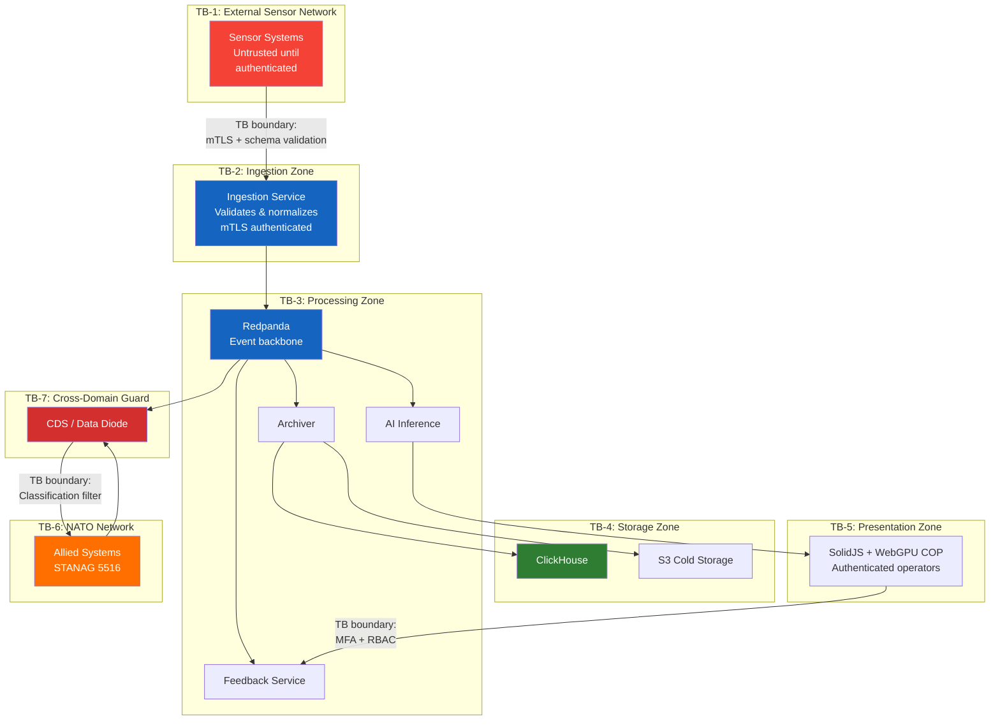

# Threat Modeling Guidelines

> **CLASSIFICATION: UNCLASSIFIED**
> **Document Type**: SDLC Phase Guideline
> **Parent**: `00_master_policy.md`
> **Dependencies**: `01_security_compliance/*`, `03_architecture_design/architecture_guidelines.md`
> **Compliance**: ITSG-33 RA-3, NIST 800-53 RA-3
> **Last Updated**: 2026-02-23

---

## 1. Purpose

This document defines the threat modeling methodology for the RTSA project. Threat modeling is mandatory for every new service, data flow, and external interface. The methodology uses STRIDE for threat identification and DREAD for risk scoring.

## 2. When to Perform Threat Modeling

Threat modeling is **required** when:

- A new microservice is introduced
- A new data flow is created between components
- A new external interface is added (sensor type, NATO exchange, UI endpoint)
- An existing trust boundary changes
- A new authentication or authorization mechanism is introduced
- A data classification level changes for any data flow
- An ADR modifies the security architecture

## 3. STRIDE Threat Categories

| Category                   | Description                              | RTSA Examples                                                        |
| -------------------------- | ---------------------------------------- | -------------------------------------------------------------------- |
| **S**poofing               | Impersonating a user, service, or sensor | Rogue sensor sending false tracks; spoofed operator identity         |
| **T**ampering              | Unauthorized modification of data        | Altered sensor events in transit; poisoned feedback data             |
| **R**epudiation            | Denying an action occurred               | Operator denies submitting feedback; service denies publishing event |
| **I**nformation Disclosure | Unauthorized data access                 | Classified sensor data leaked to unclassified network; log spillage  |
| **D**enial of Service      | Disrupting availability                  | Flooding ingestion endpoints; exhausting Redpanda partitions         |
| **E**levation of Privilege | Escalating access beyond authorization   | Operator gaining admin access; service accessing unauthorized topics |

## 4. DREAD Risk Scoring

Each identified threat is scored on five dimensions (1-10 scale):

| Dimension           | Question                            | Scoring Guide                                                                |
| ------------------- | ----------------------------------- | ---------------------------------------------------------------------------- |
| **D**amage          | How bad is the impact?              | 1=minimal, 5=significant data loss, 10=classified data breach                |
| **R**eproducibility | How easy to reproduce?              | 1=nearly impossible, 5=requires specific conditions, 10=trivially repeatable |
| **E**xploitability  | How easy to exploit?                | 1=requires physical access, 5=requires insider, 10=remote unauthenticated    |
| **A**ffected Users  | How many users/systems impacted?    | 1=single user, 5=operational group, 10=entire force/NATO partners            |
| **D**iscoverability | How easy to find the vulnerability? | 1=requires source code, 5=requires network access, 10=publicly visible       |

**Risk Score** = Average of D+R+E+A+D (1-10 scale)

| Score Range | Risk Level   | Required Action                                                       |
| ----------- | ------------ | --------------------------------------------------------------------- |
| 8.0–10.0    | **CRITICAL** | Must mitigate before deployment; Security Authority approval required |
| 5.0–7.9     | **HIGH**     | Must mitigate or document compensating controls; track in ADR         |
| 2.5–4.9     | **MEDIUM**   | Should mitigate; may accept risk with documented justification        |
| 1.0–2.4     | **LOW**      | Mitigate when practical; monitor                                      |

## 5. Threat Model Template

```markdown
# Threat Model: [Component/Data Flow Name]

| Attribute        | Value                       |
| ---------------- | --------------------------- |
| **Component**    | [COMP-ID and name]          |
| **Author**       | [Name]                      |
| **Date**         | [YYYY-MM-DD]                |
| **Status**       | Draft / Reviewed / Approved |
| **Related ADRs** | [ADR-NNN]                   |

## Data Flow Diagram

[Mermaid DFD showing processes, data stores, data flows, trust boundaries]

## Assets

| Asset        | Classification         | Value            |
| ------------ | ---------------------- | ---------------- |
| [Asset name] | [Classification level] | [Why it matters] |

## Trust Boundaries

| Boundary        | Between             | Security Controls           |
| --------------- | ------------------- | --------------------------- |
| [Boundary name] | [Zone A] ↔ [Zone B] | [Controls at this boundary] |

## Threats (STRIDE Analysis)

### T-001: [Threat Title]

| Attribute            | Value                                                            |
| -------------------- | ---------------------------------------------------------------- |
| **Category**         | Spoofing / Tampering / Repudiation / Info Disclosure / DoS / EoP |
| **Description**      | [Detailed threat description]                                    |
| **Attack Vector**    | [How the attack is carried out]                                  |
| **Assets at Risk**   | [Which assets are threatened]                                    |
| **DREAD Score**      | D=_ R=_ E=_ A=_ D=_ → Average = _                                |
| **Risk Level**       | Critical / High / Medium / Low                                   |
| **Mitigation**       | [Controls that address this threat]                              |
| **ITSG-33 Controls** | [Relevant control IDs]                                           |
| **Residual Risk**    | [Risk remaining after mitigation]                                |
| **Status**           | Open / Mitigated / Accepted                                      |

## Summary

| Threat ID | Category | Risk Level | Status   |
| --------- | -------- | ---------- | -------- |
| T-001     | [STRIDE] | [Level]    | [Status] |
```

## 6. RTSA System-Level Trust Boundaries



### Trust Boundary Controls

| Boundary        | From → To              | Controls                                                                                     |
| --------------- | ---------------------- | -------------------------------------------------------------------------------------------- |
| **TB-1 → TB-2** | Sensors → Ingestion    | mTLS with sensor certificates; Protobuf schema validation; rate limiting; input range checks |
| **TB-2 → TB-3** | Ingestion → Processing | Redpanda ACLs; service identity (SPIFFE); message signing                                    |
| **TB-3 → TB-4** | Processing → Storage   | Redpanda Connect authenticated to ClickHouse; encrypted connections; write-only access       |
| **TB-5 → TB-3** | UI → Feedback          | MFA + RBAC; input validation; trust scoring; CSRF/XSS protection                             |
| **TB-3 → TB-7** | Processing → CDG       | Classification filtering; schema validation; rate limiting; audit logging                    |
| **TB-7 → TB-6** | CDG → NATO             | One-way data diode for outbound; format validation for inbound                               |

## 7. Key Threat Scenarios for RTSA

### 7.1 Feedback Poisoning Attack

An adversary (insider or compromised operator account) submits malicious feedback to manipulate AI model training, causing the model to misclassify threats.

- **STRIDE**: Tampering + Elevation of Privilege
- **DREAD**: D=9 R=6 E=5 A=8 D=4 → **6.4 (HIGH)**
- **Mitigations**: Trust scoring engine; Wasm anti-poisoning filters; feedback anomaly detection; human review for low-trust feedback; feedback provenance audit trail
- **Controls**: SI-3, SI-10, AU-2, AC-3

### 7.2 Sensor Spoofing

An adversary introduces a rogue sensor that sends fabricated detection events, creating false situational awareness.

- **STRIDE**: Spoofing + Tampering
- **DREAD**: D=9 R=5 E=4 A=9 D=3 → **6.0 (HIGH)**
- **Mitigations**: mTLS with PKI-issued certificates; sensor registration workflow; anomaly detection on sensor patterns; out-of-band sensor health verification
- **Controls**: IA-3, IA-5, SI-4, SI-10

### 7.3 Classified Data Spillage

A software defect causes classified sensor data or entity track information to be written to an unclassified log, repository, or external system.

- **STRIDE**: Information Disclosure
- **DREAD**: D=10 R=3 E=2 A=7 D=3 → **5.0 (HIGH)**
- **Mitigations**: Structured logging (no raw payloads); classification field propagation; log filtering by classification level; cross-domain guard content inspection
- **Controls**: SC-7, SC-8, AC-4, AU-3

### 7.4 Denial of Service via Sensor Flooding

An adversary (or malfunctioning sensor) sends extremely high volumes of events to exhaust Redpanda partitions, ClickHouse storage, or service CPU/memory.

- **STRIDE**: Denial of Service
- **DREAD**: D=7 R=8 E=7 A=8 D=6 → **7.2 (HIGH)**
- **Mitigations**: Per-sensor rate limiting at ingestion; Redpanda partition quotas; circuit breakers; auto-scaling where available; resource limits per container
- **Controls**: SC-5, SI-4, AC-7

## 8. AI Agent Instructions

When creating or modifying services, data flows, or external interfaces:

1. Check if a threat model exists for the affected component — if not, create one using the template in Section 5
2. Apply STRIDE analysis to every trust boundary crossing in the new/modified design
3. Score each identified threat using DREAD (Section 4)
4. For HIGH or CRITICAL threats, specify mitigations and map to ITSG-33/NIST controls
5. Include the Mermaid data flow diagram showing trust boundaries
6. Update the Security Architecture document (`docs/architecture/security_architecture.md`) if trust boundaries change
7. Reference threat model entries in the related ADR
8. Never dismiss a threat without documenting justification and residual risk
