# Protobuf & gRPC Standards

> **CLASSIFICATION: UNCLASSIFIED**
> **Document Type**: Coding Standard
> **Parent**: `04_coding_standards/general_coding.md`
> **Dependencies**: `04_coding_standards/secure_coding.md`
> **Last Updated**: 2026-02-23

---

## 1. Purpose

This document defines Protobuf (Proto3) and gRPC coding standards for RTSA service contracts, message definitions, and communication patterns.

## 2. Proto File Organization

```
proto/
├── rtsa/
│   ├── common/
│   │   └── v1/
│   │       ├── classification.proto   # Classification enum, security markings
│   │       ├── pagination.proto       # Cursor-based pagination messages
│   │       ├── audit.proto            # Audit event wrapper
│   │       └── geo.proto              # WGS 84 coordinates, kinematics
│   ├── ingestion/
│   │   └── v1/
│   │       └── ingestion.proto        # Sensor event ingestion service
│   ├── inference/
│   │   └── v1/
│   │       └── inference.proto        # AI inference service
│   ├── feedback/
│   │   └── v1/
│   │       └── feedback.proto         # Operator feedback service
│   ├── entity/
│   │   └── v1/
│   │       └── entity.proto           # Entity track service
│   ├── audit/
│   │   └── v1/
│   │       └── audit_service.proto    # Audit query service
│   └── nato/
│       └── v1/
│           └── interop.proto          # NATO interop adapter service
```

## 3. Package Naming

```protobuf
// Package naming convention:
// rtsa.[bounded-context].v[major-version]
package rtsa.ingestion.v1;

// Go package mapping:
option go_package = "github.com/[org]/rtsa/generated/ingestion/v1;ingestionv1";
```

## 4. Message Design

### 4.1 Common Patterns

```protobuf
// CLASSIFICATION: UNCLASSIFIED

syntax = "proto3";
package rtsa.common.v1;

// Classification level for data marking.
// Every message carrying sensor or intelligence data MUST include this field.
// ITSG-33: AC-4, SC-8 — Information flow enforcement and transmission protection.
enum Classification {
  CLASSIFICATION_UNSPECIFIED = 0;
  CLASSIFICATION_UNCLASSIFIED = 1;
  CLASSIFICATION_PROTECTED_A = 2;
  CLASSIFICATION_PROTECTED_B = 3;
  CLASSIFICATION_PROTECTED_C = 4;
  CLASSIFICATION_CONFIDENTIAL = 5;
  CLASSIFICATION_SECRET = 6;
}

// WGS 84 geographic position.
message Position {
  double latitude_deg = 1;   // WGS 84 decimal degrees [-90, 90]
  double longitude_deg = 2;  // WGS 84 decimal degrees [-180, 180]
  double altitude_m = 3;     // Meters above MSL
  float  accuracy_m = 4;     // Position accuracy (CEP) in meters
}

// Kinematics — velocity and heading.
message Kinematics {
  float speed_mps = 1;       // Speed in meters per second
  float heading_deg = 2;     // Heading in degrees true [0, 360)
  float climb_rate_mps = 3;  // Vertical rate in meters per second
}

// Timestamp with nanosecond precision.
message Timestamp {
  int64 seconds = 1;         // Unix epoch seconds (UTC)
  int32 nanos = 2;           // Nanoseconds [0, 999999999]
}
```

### 4.2 Field Numbering Strategy

| Range | Usage |
|---|---|
| 1–15 | High-frequency fields (use single-byte encoding) — IDs, timestamps, types |
| 16–100 | Standard fields |
| 100–199 | Extension fields (for future use) |
| 200–299 | Metadata fields (classification, audit) |
| 900–999 | Reserved for internal/debug use |

### 4.3 Enum Design

```protobuf
// Enum naming: ENUM_NAME_VALUE_NAME
// First value MUST be UNSPECIFIED = 0
enum SensorType {
  SENSOR_TYPE_UNSPECIFIED = 0;
  SENSOR_TYPE_RADAR = 1;
  SENSOR_TYPE_EW_SIGINT = 2;
  SENSOR_TYPE_ELINT_COMINT = 3;
  SENSOR_TYPE_ISR = 4;
  SENSOR_TYPE_AIS_BFT = 5;
  SENSOR_TYPE_CYBER = 6;
}

enum EntityType {
  ENTITY_TYPE_UNSPECIFIED = 0;
  ENTITY_TYPE_AIR = 1;
  ENTITY_TYPE_SURFACE = 2;
  ENTITY_TYPE_SUBSURFACE = 3;
  ENTITY_TYPE_LAND = 4;
  ENTITY_TYPE_SPACE = 5;
  ENTITY_TYPE_CYBER = 6;
}

enum HostileStatus {
  HOSTILE_STATUS_UNSPECIFIED = 0;
  HOSTILE_STATUS_FRIENDLY = 1;
  HOSTILE_STATUS_HOSTILE = 2;
  HOSTILE_STATUS_NEUTRAL = 3;
  HOSTILE_STATUS_UNKNOWN = 4;
  HOSTILE_STATUS_SUSPECT = 5;
}
```

## 5. Service Definition Patterns

### 5.1 Unary RPC (Request/Response)

```protobuf
service IngestionService {
  // Ingest a single sensor event.
  rpc IngestEvent(IngestEventRequest) returns (IngestEventResponse);
}

message IngestEventRequest {
  SensorEvent event = 1;
  string idempotency_key = 2;  // Client-generated UUID for deduplication
}

message IngestEventResponse {
  string event_id = 1;         // Server-assigned event ID
  Timestamp accepted_at = 2;
}
```

### 5.2 Server Streaming (Real-Time Feeds)

```protobuf
service EntityService {
  // Stream entity track updates in real-time.
  rpc StreamEntityUpdates(StreamEntityRequest) returns (stream EntityUpdate);
}

message StreamEntityRequest {
  repeated EntityType type_filter = 1;    // Filter by entity type
  Position bounding_box_sw = 2;           // Southwest corner
  Position bounding_box_ne = 3;           // Northeast corner
  Classification max_classification = 4;   // Max classification level for this stream
}
```

### 5.3 Client Streaming (Batch Ingestion)

```protobuf
service IngestionService {
  // Batch ingest sensor events via client stream.
  rpc IngestEventStream(stream SensorEvent) returns (IngestBatchResponse);
}

message IngestBatchResponse {
  int32 accepted_count = 1;
  int32 rejected_count = 2;
  repeated string rejected_event_ids = 3;
}
```

## 6. Backward Compatibility Rules

### 6.1 NEVER Do

- Change a field number
- Change a field type
- Remove a field (use `reserved` instead)
- Change `optional` to `repeated`
- Change `oneof` membership
- Reuse a field number that was previously `reserved`

### 6.2 ALWAYS Do

- Add new fields to the end (next available number)
- Mark removed fields as `reserved`
- Add new enum values at the end
- Keep the first enum value as `*_UNSPECIFIED = 0`

### 6.3 Breaking Changes

If a breaking change is unavoidable:
1. Create a new package version (`v1` → `v2`)
2. Write an ADR documenting the migration strategy
3. Maintain backward compatibility for at least one release cycle
4. Migrate all consumers before producers

## 7. Deadline and Timeout Policies

| RPC Type | Default Deadline | Max Deadline | Notes |
|---|---|---|---|
| Unary (ingestion) | 5s | 30s | Sensor events must be processed quickly |
| Unary (query) | 10s | 60s | Historical queries may take longer |
| Server streaming | 5 min | 24h | Long-lived for real-time feeds |
| Client streaming | 30s | 5 min | Batch ingestion window |
| NATO interop | 30s | 120s | Cross-domain transfer latency |

### Deadline Propagation

```go
// Always set deadline on outbound calls
ctx, cancel := context.WithTimeout(ctx, 5*time.Second)
defer cancel()

resp, err := client.IngestEvent(ctx, req)
```

## 8. Error Code Usage

| gRPC Code | When to Use | Example |
|---|---|---|
| `OK` | Success | Event ingested successfully |
| `INVALID_ARGUMENT` | Client sent invalid data | Coordinates out of range |
| `NOT_FOUND` | Requested resource doesn't exist | Entity track not found |
| `ALREADY_EXISTS` | Duplicate (idempotency) | Event with same idempotency key |
| `PERMISSION_DENIED` | Authenticated but not authorized | Operator accessing admin endpoint |
| `UNAUTHENTICATED` | Missing or invalid credentials | Invalid mTLS certificate |
| `RESOURCE_EXHAUSTED` | Rate limited | Sensor exceeding ingestion quota |
| `INTERNAL` | Server-side error | Redpanda publish failed |
| `UNAVAILABLE` | Downstream service down | ClickHouse connection refused |
| `DEADLINE_EXCEEDED` | Timeout | Query took too long |

## 9. Interceptor Chain Order

```mermaid
graph LR
    REQ[Incoming<br/>gRPC Request] --> RECOVERY[Recovery<br/>Panic → INTERNAL]
    RECOVERY --> METRICS[Metrics<br/>Prometheus counters]
    METRICS --> LOGGING[Logging<br/>slog structured]
    LOGGING --> AUTH[Auth<br/>mTLS + RBAC]
    AUTH --> AUDIT[Audit<br/>Event producer]
    AUDIT --> HANDLER[Handler<br/>Business logic]

    HANDLER --> AUDIT_R[Audit<br/>Response]
    AUDIT_R --> LOGGING_R[Logging<br/>Response]
    LOGGING_R --> METRICS_R[Metrics<br/>Response]
    METRICS_R --> RECOVERY_R[Recovery]
    RECOVERY_R --> RESP[gRPC<br/>Response]

    style REQ fill:#1565c0,color:#fff
    style AUTH fill:#d32f2f,color:#fff
    style AUDIT fill:#f57c00,color:#fff
    style HANDLER fill:#2e7d32,color:#fff
```



## 10. AI Agent Instructions

When generating Protobuf or gRPC code:

1. Start every `.proto` file with `// CLASSIFICATION: UNCLASSIFIED`
2. Use `package rtsa.[context].v[N]` naming convention
3. Include `Classification` field in all messages carrying sensor/intelligence data
4. First enum value must be `*_UNSPECIFIED = 0`
5. Use field numbers 1-15 for frequently accessed fields
6. Never make backward-incompatible changes; use `reserved` for removed fields
7. Set deadlines on all outbound gRPC calls
8. Map domain errors to appropriate gRPC status codes
9. Include documentation comments on services, RPCs, and messages
10. Follow the interceptor chain order for all gRPC servers
