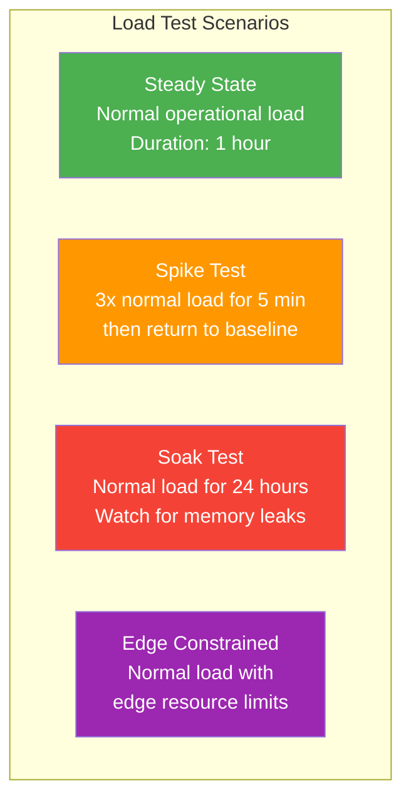

# Performance Testing Standards

> **CLASSIFICATION: UNCLASSIFIED**
> **Document Type**: Testing Standard
> **Parent**: `05_testing/testing_strategy.md`
> **Compliance**: ITSG-33 SC-5; NIST 800-53 SC-5
> **Last Updated**: 2026-02-23

---

## 1. Purpose

This document defines performance testing requirements for RTSA. The system must meet strict latency and throughput targets for real-time situational awareness in operational military environments, including resource-constrained tactical edge deployments.

## 2. Performance Budgets

### 2.1 Latency Targets

| Path | P50 | P99 | Max | Measurement Point |
|---|---|---|---|---|
| Sensor ingestion → Redpanda | < 5ms | < 20ms | < 50ms | Sensor adapter → Redpanda ACK |
| Redpanda → Fusion Engine | < 10ms | < 50ms | < 100ms | Consume → fused track emitted |
| Fused track → Inference Engine | < 15ms | < 75ms | < 150ms | Track in → anomaly score out |
| Inference → UI display | < 20ms | < 100ms | < 200ms | Score emitted → WebSocket push |
| **End-to-end**: Sensor → UI | < 50ms | < 200ms | < 500ms | Sensor event → UI render |
| Operator feedback → ACK | < 10ms | < 50ms | < 100ms | Submit → confirmation |
| ClickHouse query (simple) | < 50ms | < 200ms | < 500ms | Query → result set |
| ClickHouse query (complex) | < 500ms | < 2s | < 5s | Aggregation query → result set |

### 2.2 Throughput Targets

| Metric | Data Centre | Tactical Edge | Notes |
|---|---|---|---|
| Sensor events / second | 50,000 | 5,000 | All sensor types combined |
| Fused tracks / second | 10,000 | 1,000 | After correlation |
| Concurrent WebSocket connections | 500 | 50 | Operator displays |
| Feedback submissions / minute | 1,000 | 100 | Operator input rate |
| ClickHouse inserts / second | 100,000 | 10,000 | Batch inserts via Redpanda Connect |

### 2.3 Resource Limits

| Resource | Data Centre (per service) | Tactical Edge (per service) |
|---|---|---|
| CPU | 2 cores | 0.5 cores |
| Memory | 2 GB | 256 MB |
| Disk I/O | 1000 IOPS | 200 IOPS |
| Network | 1 Gbps | 100 Mbps |

## 3. Benchmark Testing

### 3.1 Go Benchmarks

Required for all hot-path code (sensor parsing, fusion, inference scoring):

```go
// CLASSIFICATION: UNCLASSIFIED

func BenchmarkFuseEntityTracks(b *testing.B) {
    tracks := generateSyntheticTracks(100)
    b.ResetTimer()
    b.ReportAllocs()

    for i := 0; i < b.N; i++ {
        _ = FuseEntityTracks(tracks)
    }
}

func BenchmarkCalculateTrustScore(b *testing.B) {
    input := TrustInput{
        ClearanceLevel:      ClearanceSECRET,
        HistoricalAccuracy:  0.85,
        TemporalConsistency: 0.9,
        StatisticalDeviation: 0.15,
    }
    b.ResetTimer()

    for i := 0; i < b.N; i++ {
        _ = CalculateTrustScore(input)
    }
}
```

### 3.2 Benchmark Rules

- Benchmarks must exist for every function in the critical path
- Run benchmarks in CI on every merge to `main`
- Track benchmark results over time (use `benchstat` for comparison)
- Alert on > 10% regression in any benchmark
- Use `b.ReportAllocs()` to track memory allocations

## 4. Load Testing

### 4.1 Tools

| Tool | Purpose |
|---|---|
| `ghz` | gRPC load testing |
| k6 | HTTP/WebSocket load testing |
| Custom Go load generator | Sensor feed simulation |

### 4.2 Scenarios



### 4.3 Steady-State Load Profile

| Sensor Type | Events/sec (Data Centre) | Events/sec (Edge) |
|---|---|---|
| Radar | 10,000 | 1,000 |
| EW / SIGINT | 8,000 | 800 |
| ELINT / COMINT | 5,000 | 500 |
| ISR (imagery metadata) | 2,000 | 200 |
| AIS / BFT | 3,000 | 300 |
| Cyber (threat indicators) | 2,000 | 200 |
| **Total** | **30,000** | **3,000** |

### 4.4 Acceptance Criteria

- All latency targets met at P99 under steady-state load
- No errors (gRPC status != OK) above 0.01% rate
- No memory growth trend during soak test (< 5% increase over 24h)
- Graceful degradation under spike load (latency increase ≤ 3x, no data loss)
- Edge deployment meets edge targets within edge resource limits

## 5. Profiling

### 5.1 Go Profiling

```go
// Enable pprof in development and staging
import _ "net/http/pprof"

go func() {
    http.ListenAndServe("localhost:6060", nil)
}()
```

### 5.2 Required Profiles

| Profile | When | What to Look For |
|---|---|---|
| CPU profile | Before each release | Hot functions, unnecessary work |
| Heap profile | During soak test | Memory leaks, excessive allocations |
| Goroutine profile | During load test | Goroutine leaks, blocked goroutines |
| Mutex profile | During contention | Lock contention in fusion engine |
| Block profile | During high load | Blocking operations on critical path |

## 6. Edge-Specific Performance

### 6.1 Memory Budgets

```go
// Set GOMEMLIMIT for edge deployments
// Prevents OOM kills by triggering GC earlier
debug.SetMemoryLimit(200 * 1024 * 1024) // 200 MB for edge
```

### 6.2 Edge Performance Tests

- Run all benchmarks with `GOMEMLIMIT` set to edge values
- Measure GC pause times — must be < 5ms P99
- Test with reduced CPU (use `GOMAXPROCS=1` for edge simulation)
- Verify graceful degradation when approaching memory limits

## 7. CI Integration

| Test Type | Trigger | Time Budget | Failure Action |
|---|---|---|---|
| Go benchmarks | Every PR | < 5 min | Warn on > 10% regression |
| gRPC load test (mini) | Every merge to main | < 10 min | Block release if targets missed |
| Full load test | Weekly / pre-release | < 2 hours | Block release |
| Soak test | Pre-release | 24 hours | Block release |
| Edge performance test | Pre-release | < 1 hour | Block release |

## 8. AI Agent Instructions

When generating performance-related code:

1. Include `b.ReportAllocs()` in all Go benchmarks
2. Use `sync.Pool` for frequently allocated objects on hot paths
3. Prefer pre-allocated slices (`make([]T, 0, expectedCapacity)`) over dynamic growth
4. Set `GOMEMLIMIT` in edge deployment configurations
5. Add timeout contexts on all gRPC calls — never allow unbounded waits
6. Design for the edge resource profile (0.5 CPU, 256 MB RAM) as the constraint
7. When generating load test scenarios, use the steady-state profile from Section 4.3
