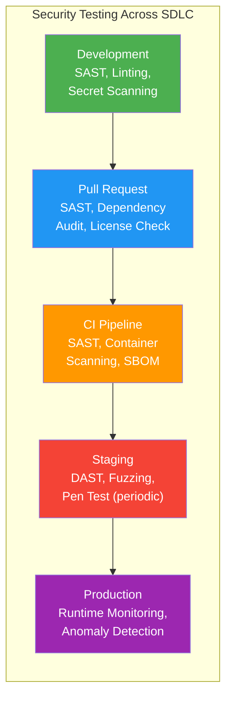

# Security Testing Standards

> **CLASSIFICATION: UNCLASSIFIED**
> **Document Type**: Testing Standard
> **Parent**: `05_testing/testing_strategy.md`
> **Compliance**: ITSG-33 SA-11, CA-8; NIST 800-53 SA-11, CA-8
> **Last Updated**: 2026-02-23

---

## 1. Purpose

This document defines security testing requirements for RTSA. Given the Protected C / Secret classification ceiling, security testing is not optional — it is a mandatory quality gate at every stage of the SDLC.

## 2. Security Testing Lifecycle



## 3. Static Application Security Testing (SAST)

### 3.1 Tools

| Tool | Language | Purpose |
|---|---|---|
| `semgrep` | Go, TypeScript, Proto | Pattern-based vulnerability detection |
| `gosec` | Go | Go-specific security analysis |
| `golangci-lint` (security linters) | Go | Error handling, unsafe usage, SQL injection |
| `eslint-plugin-security` | TypeScript | Frontend security patterns |
| `buf lint` | Protobuf | Schema security and best practices |

### 3.2 Rules

- SAST runs on every PR — merge is blocked on Critical or High findings
- Medium findings must be triaged within 5 business days
- Custom semgrep rules for RTSA-specific patterns:

```yaml
# CLASSIFICATION: UNCLASSIFIED
rules:
  - id: rtsa-no-hardcoded-coordinates
    pattern: |
      $LAT = $FLOAT_VAL
    message: "Potential hardcoded coordinate — verify this is synthetic test data"
    severity: WARNING
    languages: [go]
    metadata:
      compliance: ITSG-33 SC-28

  - id: rtsa-no-fmt-sprintf-sql
    pattern: |
      fmt.Sprintf("... SELECT ... $INPUT ...")
    message: "SQL injection risk — use parameterized queries"
    severity: ERROR
    languages: [go]
    metadata:
      compliance: ITSG-33 SI-10
```

## 4. Dynamic Application Security Testing (DAST)

### 4.1 Scope

- gRPC endpoint fuzzing (malformed Protobuf messages)
- TLS configuration verification (ensure TLS 1.3, mTLS enforcement)
- Authentication bypass attempts
- Authorization boundary testing (cross-tenant, cross-classification)

### 4.2 Schedule

| Test Type | Frequency | Environment |
|---|---|---|
| Automated DAST scans | Weekly (staging) | Staging |
| gRPC fuzzing | Per release | Staging |
| mTLS enforcement verification | Per release | Staging |
| Manual penetration testing | Quarterly | Staging (isolated) |

## 5. Dependency Vulnerability Scanning

### 5.1 Tools

| Tool | Scope | Integration |
|---|---|---|
| `govulncheck` | Go module vulnerabilities | CI pipeline |
| `trivy` | Container image vulnerabilities | CI pipeline |
| `npm audit` | NPM package vulnerabilities | CI pipeline |
| `grype` | SBOM-based vulnerability scanning | CI pipeline |

### 5.2 SLA for Remediation

| Severity | Response Time | Resolution Time |
|---|---|---|
| Critical (CVSS 9.0+) | 4 hours | 24 hours |
| High (CVSS 7.0-8.9) | 24 hours | 72 hours |
| Medium (CVSS 4.0-6.9) | 5 business days | 14 business days |
| Low (CVSS 0.1-3.9) | Next sprint | 30 business days |

## 6. Fuzz Testing

### 6.1 Go Native Fuzzing

Required for all input parsing functions (sensor data, NATO messages, operator input):

```go
// CLASSIFICATION: UNCLASSIFIED

func FuzzParseSensorEvent(f *testing.F) {
    // Seed corpus with valid events
    f.Add([]byte{0x0a, 0x10, 0x74, 0x65, 0x73, 0x74})

    f.Fuzz(func(t *testing.T, data []byte) {
        event := &pb.SensorEvent{}
        err := proto.Unmarshal(data, event)
        if err != nil {
            return // Invalid protobuf is expected for fuzzing
        }
        // The parser must not panic on any valid protobuf input
        _ = ValidateSensorEvent(event)
    })
}
```

### 6.2 Fuzz Targets

| Target | Input Type | Goal |
|---|---|---|
| Sensor event parser | Raw bytes → Protobuf | No panics, no memory corruption |
| NATO STANAG 5516 parser | Link 16 messages | No panics, correct rejection of malformed messages |
| NFFI XML parser | XML payloads | No XXE, no billion laughs, no panics |
| Feedback validator | Operator feedback Protobuf | No trust score bypass |
| ClickHouse query builder | Query parameters | No SQL injection |

## 7. Container Security Testing

### 7.1 Image Scanning

- Scan all container images before pushing to registry
- Scan base images weekly for new vulnerabilities
- Block deployment of images with Critical or High CVEs

### 7.2 Compliance Checks

| Check | Standard | Tool |
|---|---|---|
| Non-root user | CIS Benchmark | `trivy`, `dockle` |
| Read-only filesystem | CIS Benchmark | Kubernetes SecurityContext |
| No unnecessary capabilities | CIS Benchmark | `trivy`, `dockle` |
| Distroless base image | RTSA Policy | Dockerfile lint |
| SBOM attached | Supply Chain Security | `syft` |
| Image signed | Supply Chain Security | `cosign` |

## 8. Secret Detection

### 8.1 Pre-commit

```yaml
# CLASSIFICATION: UNCLASSIFIED
# .pre-commit-config.yaml
repos:
  - repo: https://github.com/gitleaks/gitleaks
    rev: v8.18.0
    hooks:
      - id: gitleaks
        stages: [commit]
```

### 8.2 CI Pipeline

- `gitleaks detect --source .` runs on every PR
- Scans full commit history on the default branch weekly
- Any secret detection blocks the pipeline immediately

## 9. Threat-Specific Test Scenarios

### 9.1 Feedback Poisoning

```go
// Test that bulk malicious feedback is detected and rejected
func TestAntiPoisoning_BulkAnomalousFeedback_Rejected(t *testing.T) {
    // Simulate 100 feedback items that are statistically anomalous
    // Verify trust scoring flags all as LOW trust
    // Verify alert is generated for Security Operations
}
```

### 9.2 Sensor Spoofing

```go
// Test that spoofed sensor data triggers anomaly detection
func TestSensorValidation_SpoofedRadarData_FlaggedAsAnomalous(t *testing.T) {
    // Submit radar events with physically impossible kinematics
    // (e.g., Mach 50 at sea level, instantaneous position jumps)
    // Verify anomaly detector flags the events
}
```

### 9.3 Data Spillage

```go
// Test that classified data cannot leak to lower classification channels
func TestClassificationGuard_SecretDataToUnclassifiedChannel_Blocked(t *testing.T) {
    // Attempt to publish a SECRET-marked event to an UNCLASSIFIED Redpanda topic
    // Verify the classification guard rejects the publish
    // Verify audit event is generated
}
```

## 10. Security Test Reporting

### 10.1 Required Artifacts

| Artifact | Format | Retention |
|---|---|---|
| SAST results | SARIF | 2 years |
| DAST results | HTML + JSON | 2 years |
| Dependency audit | CycloneDX SBOM | Indefinite |
| Fuzz test corpus | Binary files | Duration of project |
| Pen test report | PDF (classified as appropriate) | Per retention policy |
| Container scan results | JSON | 1 year |

## 11. AI Agent Instructions

When generating security tests:

1. Include fuzz tests for all input parsing functions
2. Test for SQL injection in ClickHouse query builders
3. Test mTLS enforcement — verify connections without valid client certs are rejected
4. Test classification boundary enforcement — SECRET data must not flow to UNCLASSIFIED channels
5. Test feedback trust scoring edge cases — zero trust, max trust, boundary values
6. Use synthetic data only — never reference real sensor feeds or operational coordinates
7. Include threat-specific scenarios from the threat model (`03_architecture_design/threat_modeling.md`)
