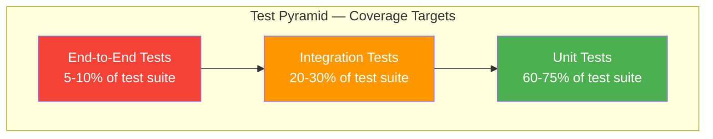
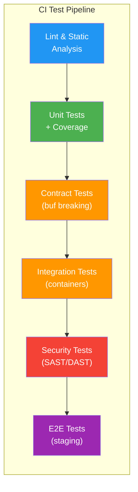

# Testing Strategy & Standards

> **CLASSIFICATION: UNCLASSIFIED**
> **Document Type**: Testing Standard
> **Parent**: `00_master_policy.md`
> **Compliance**: ITSG-33 SA-11, NIST 800-53 SA-11
> **Last Updated**: 2026-02-23

---

## 1. Purpose

This document defines the testing strategy, coverage requirements, and test design patterns for all RTSA components. Every code change must include corresponding tests. The system's safety-critical nature (military situational awareness) demands rigorous verification at every layer.

## 2. Test Pyramid



## 3. Coverage Requirements

| Component Type | Line Coverage | Branch Coverage | Test Required For |
|---|---|---|---|
| Core domain logic (fusion, inference) | 90%+ | 85%+ | Every function |
| gRPC service handlers | 85%+ | 80%+ | Every RPC method |
| Sensor adapters / parsers | 90%+ | 85%+ | Every sensor type |
| Feedback trust scoring | 95%+ | 90%+ | Every scoring path |
| ClickHouse query builders | 85%+ | 80%+ | Every query template |
| React components | 80%+ | 75%+ | Every component |
| Wasm transforms | 90%+ | 85%+ | Every transform |
| Configuration / startup | 80%+ | 75%+ | Validation paths |
| Anti-poisoning logic | 95%+ | 90%+ | Every validation rule |

**Global minimum**: 80% line coverage. CI pipeline fails if coverage drops below threshold.

## 4. Test Categories

### 4.1 Unit Tests

**Scope**: Single function or method in isolation. All dependencies are mocked or stubbed.

**Rules**:
- One test file per source file (`foo.go` → `foo_test.go`)
- Use table-driven tests in Go
- Mock all external dependencies (gRPC clients, Redpanda, ClickHouse)
- No network calls; no file system access; no database access
- Tests must complete in < 100ms per test case
- Naming convention: `Test<Function>_<Scenario>_<ExpectedResult>`

**Go Example**:

```go
// CLASSIFICATION: UNCLASSIFIED

func TestCalculateTrustScore_HighClearanceAccurateOperator_ReturnsHighScore(t *testing.T) {
    tests := []struct {
        name     string
        input    TrustInput
        expected float64
    }{
        {
            name: "secret clearance with 90% accuracy",
            input: TrustInput{
                ClearanceLevel:      ClearanceSECRET,
                HistoricalAccuracy:  0.9,
                TemporalConsistency: 0.85,
                StatisticalDeviation: 0.1,
            },
            expected: 0.87,
        },
        {
            name: "uncleared operator with low accuracy",
            input: TrustInput{
                ClearanceLevel:      ClearanceUNCLASSIFIED,
                HistoricalAccuracy:  0.3,
                TemporalConsistency: 0.5,
                StatisticalDeviation: 0.9,
            },
            expected: 0.23,
        },
    }

    for _, tc := range tests {
        t.Run(tc.name, func(t *testing.T) {
            result := CalculateTrustScore(tc.input)
            if math.Abs(result - tc.expected) > 0.01 {
                t.Errorf("expected %.2f, got %.2f", tc.expected, result)
            }
        })
    }
}
```

### 4.2 Integration Tests

**Scope**: Two or more components interacting. May use real infrastructure (Redpanda, ClickHouse in containers).

**Rules**:
- Use `testcontainers-go` for infrastructure dependencies
- Place in `*_integration_test.go` files with build tag `//go:build integration`
- Separate CI stage from unit tests (may run longer)
- Each test is self-contained — sets up and tears down its own state
- Test the full gRPC request-response cycle
- Verify Redpanda message production/consumption
- Verify ClickHouse write/read paths

**Build Tag**:

```go
//go:build integration

package integration_test
```

### 4.3 End-to-End Tests

**Scope**: Full system scenarios from sensor ingestion to UI display.

**Rules**:
- Run against a deployed test environment (Docker Compose or K8s namespace)
- Test critical user flows (sensor data in → fused track out → operator feedback → model update)
- Maximum 20 E2E tests (focus on high-value scenarios)
- Allowed to take up to 60 seconds per test
- Must include at least one test per use case (UC001–UC015)

### 4.4 Contract Tests

**Scope**: Protobuf schema compatibility between producer and consumer.

**Rules**:
- Verify backward compatibility of `.proto` files
- Use `buf breaking` in CI
- Test that serialized messages from version N can be deserialized by version N+1

## 5. Test Data Management

### 5.1 Synthetic Data Only

- **NEVER** use real operational data in tests
- **NEVER** use real sensor feeds or classified data
- All test data must be clearly synthetic and marked as such
- Coordinate ranges for test data: use well-known non-sensitive areas (e.g., mid-Atlantic Ocean)

### 5.2 Test Fixture Standards

```go
// CLASSIFICATION: UNCLASSIFIED

// testdata package provides synthetic fixtures for testing
package testdata

func SyntheticRadarEvent() *pb.SensorEvent {
    return &pb.SensorEvent{
        EventId:    "test-event-001",
        SensorId:   "test-radar-001",
        SensorType: pb.SENSOR_TYPE_RADAR,
        Position: &pb.Position{
            LatitudeDeg:  45.0000,  // Mid-Atlantic (non-sensitive)
            LongitudeDeg: -30.0000,
            AltitudeM:    10000.0,
        },
        EventTime:      timestamppb.Now(),
        Classification: pb.CLASSIFICATION_UNCLASSIFIED,
    }
}
```

### 5.3 Golden Files

For complex output validation (NATO message formatting, ClickHouse query generation):
- Store expected output in `testdata/golden/` directory
- Use `-update` flag to regenerate golden files
- Golden files are committed to version control

## 6. Mocking Standards

### 6.1 Interface-Based Mocks

Every external dependency must be accessed through an interface:

```go
// Production interface
type SensorIngester interface {
    IngestEvent(ctx context.Context, event *pb.SensorEvent) error
}

// Mock for testing
type MockSensorIngester struct {
    IngestEventFunc func(ctx context.Context, event *pb.SensorEvent) error
    IngestEventCalls int
}

func (m *MockSensorIngester) IngestEvent(ctx context.Context, event *pb.SensorEvent) error {
    m.IngestEventCalls++
    if m.IngestEventFunc != nil {
        return m.IngestEventFunc(ctx, event)
    }
    return nil
}
```

### 6.2 Mock Rules

- Do NOT mock the unit under test
- Mock at the boundary (gRPC client, Redpanda producer, ClickHouse client)
- Prefer hand-written mocks over code generation for clarity
- Verify mock interactions when side effects matter

## 7. React Testing Standards

### 7.1 Tools

| Tool | Purpose |
|---|---|
| Vitest | Test runner and assertion library |
| React Testing Library | Component rendering and interaction |
| MSW (Mock Service Worker) | gRPC-Web and REST API mocking |

### 7.2 Rules

- Test behavior, not implementation details
- Use `screen.getByRole()`, `getByLabelText()` over `getByTestId()`
- Test accessibility: every interactive element must be reachable via keyboard
- Test classification badge rendering (correct color, correct label)
- Test offline/degraded mode behavior

## 8. Continuous Integration Test Execution



### 8.1 Stage Gates

| Stage | Failure Action | Time Budget |
|---|---|---|
| Lint | Block merge | < 2 min |
| Unit tests | Block merge | < 5 min |
| Contract tests | Block merge | < 1 min |
| Integration tests | Block merge | < 10 min |
| Security tests | Block merge (Critical/High); Warn (Medium) | < 15 min |
| E2E tests | Warn (non-blocking for feature branches) | < 30 min |

## 9. AI Agent Instructions

When generating test code:

1. Always create test files alongside source files — never skip tests
2. Use table-driven tests in Go with descriptive `name` fields
3. Use synthetic test data only — coordinates in mid-Atlantic or similar non-sensitive areas
4. Mock external dependencies via interfaces — never call real services in unit tests
5. Include `//go:build integration` tag for tests requiring containers
6. Target 80%+ line coverage minimum; 90%+ for domain logic and anti-poisoning
7. Name tests with pattern `Test<Function>_<Scenario>_<ExpectedResult>`
8. For React components, test behavior (user interactions) not implementation details
9. Verify classification markings in response-handling tests
