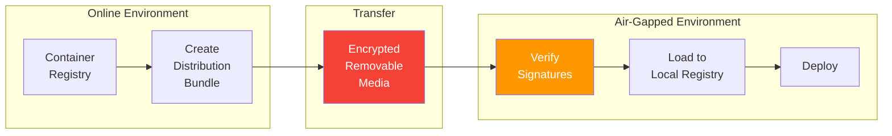

# Artifact Management Standards

> **CLASSIFICATION: UNCLASSIFIED**
> **Document Type**: Integration Standard
> **Parent**: `06_integration_cicd/ci_cd_pipeline.md`
> **Compliance**: ITSG-33 CM-2, CM-5; NIST 800-53 CM-2, CM-5
> **Last Updated**: 2026-02-23

---

## 1. Purpose

This document defines artifact management policies for RTSA. All build outputs, container images, SBOMs, and deployment bundles must be traceable, signed, and securely stored.

## 2. Artifact Types

| Artifact | Format | Registry | Retention |
|---|---|---|---|
| Go binaries | ELF (linux/amd64, linux/arm64) | CI artifacts | 90 days |
| Container images | OCI | Private container registry | 1 year (releases); 30 days (dev) |
| Protobuf generated code | Go, TypeScript packages | Monorepo (committed) | Indefinite |
| SBOMs | CycloneDX JSON | Attached to image; archived | Indefinite |
| Helm charts | OCI Helm chart | Helm chart registry | 1 year |
| Wasm transforms | `.wasm` binaries | Wasm registry / OCI | 1 year |
| SARIF reports | SARIF JSON | GitHub Code Scanning; archived | 2 years |
| Test reports | JUnit XML | CI artifacts | 90 days |
| Golden test files | Binary/text | Monorepo (committed) | Indefinite |

## 3. Container Image Tagging

```
registry.internal/rtsa/<service>:<tag>

Tag formats:
  - main branch:    sha-<short-git-sha>
  - release:        v<major>.<minor>.<patch>
  - latest release: latest (mutable, points to newest release)
```

### 3.1 Examples

```
registry.internal/rtsa/sensor-ingestion:sha-a1b2c3d
registry.internal/rtsa/sensor-ingestion:v1.2.0
registry.internal/rtsa/fusion-engine:v1.2.0
registry.internal/rtsa/inference-engine:v1.2.0
```

## 4. Image Signing and Verification

### 4.1 Signing (CI Pipeline)

```bash
# Sign image with cosign (keyless via OIDC in CI)
cosign sign --yes registry.internal/rtsa/sensor-ingestion:v1.2.0
```

### 4.2 Verification (Deployment)

```bash
# Verify image signature before deployment
cosign verify registry.internal/rtsa/sensor-ingestion:v1.2.0
```

### 4.3 Kubernetes Admission Control

- Use Sigstore Policy Controller or Kyverno to enforce image signature verification
- Block deployment of unsigned images
- Block deployment of images with Critical CVEs

## 5. SBOM Attachment

```bash
# Generate SBOM
syft registry.internal/rtsa/sensor-ingestion:v1.2.0 -o cyclonedx-json > sbom.json

# Attach SBOM to image
cosign attach sbom --sbom sbom.json registry.internal/rtsa/sensor-ingestion:v1.2.0
```

## 6. Air-Gap Distribution

For tactical edge deployments without network access:



### 6.1 Distribution Bundle Contents

| Item | Purpose |
|---|---|
| Container images (OCI tarballs) | Application containers |
| Image signatures | Integrity verification |
| SBOMs | Supply chain transparency |
| Helm charts | Deployment manifests |
| Checksums (SHA-256) | Integrity verification |
| Release notes | Change documentation |

### 6.2 Transfer Media Security

- All bundles encrypted with AES-256-GCM before writing to removable media
- Media must be sanitized after transfer (ITSG-33 MP-6)
- Chain of custody documentation required for all physical media transfers
- Two-person integrity for media handling in classified environments

## 7. Version Traceability

Every deployed artifact must be traceable back to:

| Question | Answer Source |
|---|---|
| What source code? | Git SHA in image label |
| What dependencies? | SBOM attached to image |
| What security state? | SARIF reports archived in CI |
| What tests passed? | Test reports archived in CI |
| Who approved? | PR merge history in Git |
| When built? | Build timestamp in image label |

### 7.1 Required OCI Image Labels

```dockerfile
# CLASSIFICATION: UNCLASSIFIED
LABEL org.opencontainers.image.source="https://github.com/org/rtsa"
LABEL org.opencontainers.image.revision="${GIT_SHA}"
LABEL org.opencontainers.image.created="${BUILD_TIME}"
LABEL org.opencontainers.image.version="${VERSION}"
LABEL ca.gc.dnd.rtsa.classification="UNCLASSIFIED"
```

## 8. AI Agent Instructions

When generating Dockerfiles or CI artifact steps:

1. Include all required OCI image labels (source, revision, created, version, classification)
2. Generate SBOM with `syft` and attach with `cosign attach sbom`
3. Sign images with `cosign sign` in the CI pipeline
4. Use multi-stage builds to minimize image size
5. Use distroless base images
6. Never include build tools, test data, or source code in production images
