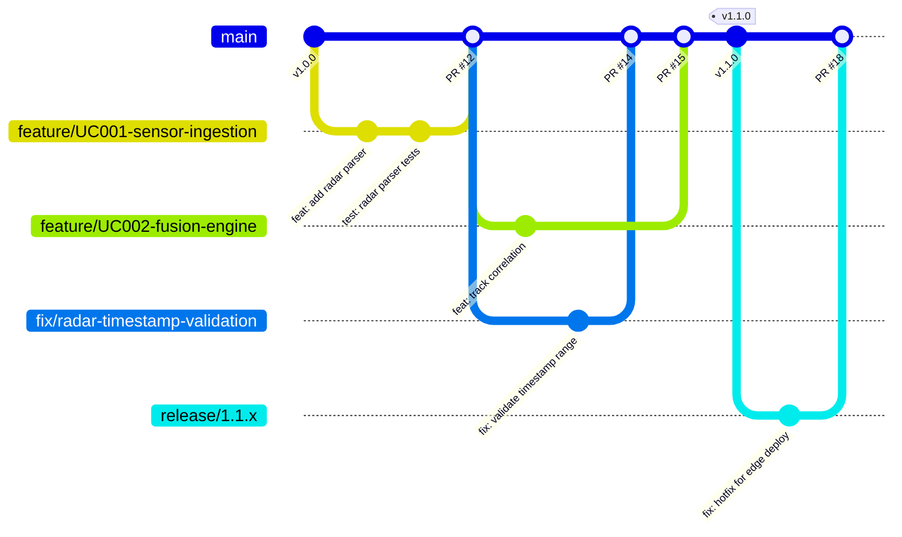

# Branching Strategy

> **CLASSIFICATION: UNCLASSIFIED**
> **Document Type**: Integration Standard
> **Parent**: `06_integration_cicd/ci_cd_pipeline.md`
> **Last Updated**: 2026-02-23

---

## 1. Purpose

This document defines the branching strategy for RTSA. The team uses **trunk-based development** optimized for a 3–5 developer team with rapid iteration and continuous integration.

## 2. Branch Model



## 3. Branch Types

| Branch Type | Pattern | Lifetime | Merges To | Source |
|---|---|---|---|---|
| Main (trunk) | `main` | Permanent | — | — |
| Feature | `feature/<UC-ID>-<description>` | < 2 days | `main` | `main` |
| Fix | `fix/<issue-id>-<description>` | < 1 day | `main` | `main` |
| Release | `release/<major>.<minor>.x` | Until EOL | `main` (cherry-pick) | `main` (tag) |

## 4. Rules

### 4.1 Trunk-Based Development Rules

1. **Short-lived branches**: Feature branches must be merged within **2 business days**
2. **Small PRs**: Each PR should be < 400 lines of meaningful change
3. **Rebase before merge**: Keep history clean; squash-merge feature branches
4. **No long-lived branches**: If a feature takes > 2 days, use feature flags
5. **Main is always deployable**: Every commit on `main` must pass all SG-1 through SG-4 gates

### 4.2 Branch Naming Convention

```
feature/UC001-sensor-ingestion-radar
feature/UC003-inference-anomaly-scoring
fix/1234-timestamp-validation-overflow
release/1.2.x
```

### 4.3 Commit Message Format

Follow Conventional Commits (see `04_coding_standards/general_coding.md`):

```
feat(fusion): add multi-sensor correlation algorithm

- Implements Dempster-Shafer evidence combining
- Supports radar + EW + SIGINT track correlation
- Adds 95% confidence threshold for track promotion

Refs: UC002, FR-FUS-001
```

### 4.4 Pull Request Requirements

| Requirement | Details |
|---|---|
| Reviewers | Minimum 1 reviewer; 2 for security-sensitive changes |
| CI pipeline | All SG-1 through SG-4 gates must pass |
| Coverage | Coverage must not decrease below 80% |
| Tests | New/changed code must include tests |
| Classification | All new files must have classification header |
| Description | PR description must reference requirement IDs |
| Breaking changes | Proto breaking changes require explicit approval + ADR |

## 5. Feature Flags

For features that require more than 2 days of development:

```go
// CLASSIFICATION: UNCLASSIFIED

// Feature flags for in-progress features
const (
    FeatureNATOExchange  = "RTSA_FEATURE_NATO_EXCHANGE"
    FeatureMLRetraining  = "RTSA_FEATURE_ML_RETRAINING"
    FeatureCyberSensor   = "RTSA_FEATURE_CYBER_SENSOR"
)

func IsFeatureEnabled(flag string) bool {
    return os.Getenv(flag) == "true"
}
```

## 6. Release Process

1. Tag `main` with semver: `git tag -a v1.2.0 -m "Release 1.2.0"`
2. Release pipeline builds, signs, and scans images
3. Create `release/1.2.x` branch for hotfix support
4. Deploy to staging → performance tests → manual approval → production
5. Hotfixes: commit to `release/1.2.x`, cherry-pick to `main`

## 7. AI Agent Instructions

When generating branch names or commit messages:

1. Feature branches reference the use case ID: `feature/UC001-<description>`
2. Fix branches reference the issue number: `fix/<issue-id>-<description>`
3. Commit messages follow Conventional Commits with scope
4. Include requirement traceability in commit body (`Refs: UC001, FR-ING-001`)
5. PRs must reference the requirement or use case being implemented
