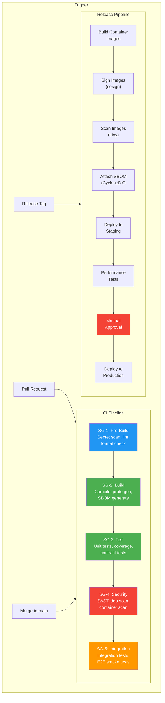

# CI/CD Pipeline Standards

> **CLASSIFICATION: UNCLASSIFIED**
> **Document Type**: Integration Standard
> **Parent**: `00_master_policy.md`
> **Compliance**: ITSG-33 CM-2, CM-3, SA-11; NIST 800-53 CM-2, CM-3, SA-11
> **Last Updated**: 2026-02-23

---

## 1. Purpose

This document defines the CI/CD pipeline architecture, stages, and quality gates for RTSA. Every code change follows this pipeline before reaching any environment. The pipeline enforces security, quality, and compliance at every stage.

## 2. Pipeline Architecture



## 3. Security Gate Details

### SG-1: Pre-Build

| Check                  | Tool                       | Failure Action |
| ---------------------- | -------------------------- | -------------- |
| Secret detection       | `gitleaks`                 | **Block**      |
| Classification headers | Custom script              | **Block**      |
| Go formatting          | `gofmt`, `goimports`       | **Block**      |
| TypeScript formatting  | `prettier`                 | **Block**      |
| Proto formatting       | `buf format`               | **Block**      |
| Commit message format  | Conventional Commits check | **Block**      |

### SG-2: Build

| Check                  | Tool                             | Failure Action                 |
| ---------------------- | -------------------------------- | ------------------------------ |
| Go compilation         | `go build ./...`                 | **Block**                      |
| Proto generation       | `buf generate`                   | **Block**                      |
| TypeScript compilation | `tsc --noEmit`                   | **Block**                      |
| SBOM generation        | `syft`                           | **Block**                      |
| License compliance     | `go-licenses`, `license-checker` | **Block** (unapproved license) |

### SG-3: Test

| Check                     | Tool                    | Failure Action             |
| ------------------------- | ----------------------- | -------------------------- |
| Go unit tests             | `go test -race -cover`  | **Block** (< 80% coverage) |
| SolidJS + Wasm unit tests | `vitest run --coverage` | **Block** (< 80% coverage) |
| Proto contract tests      | `buf breaking`          | **Block**                  |
| Test report generation    | CI native               | Archive                    |

### SG-4: Security

| Check                          | Tool                                | Failure Action            |
| ------------------------------ | ----------------------------------- | ------------------------- |
| Go SAST                        | `semgrep`, `gosec`                  | **Block** (Critical/High) |
| TypeScript SAST                | `semgrep`, `eslint-plugin-security` | **Block** (Critical/High) |
| Go dependency vulnerabilities  | `govulncheck`                       | **Block** (Critical/High) |
| NPM dependency vulnerabilities | `npm audit`                         | **Block** (Critical/High) |
| Container image scan           | `trivy`                             | **Block** (Critical/High) |
| SARIF report upload            | CI native                           | Archive for 2 years       |

### SG-5: Integration

| Check             | Tool                        | Failure Action              |
| ----------------- | --------------------------- | --------------------------- |
| Integration tests | `go test -tags=integration` | **Block**                   |
| E2E smoke tests   | Custom test runner          | **Warn** (feature branches) |

## 4. GitHub Actions Workflow Reference

```yaml
# CLASSIFICATION: UNCLASSIFIED
# .github/workflows/ci.yml — Reference structure

name: RTSA CI Pipeline

on:
  pull_request:
    branches: [main]
  push:
    branches: [main]

permissions:
  contents: read
  security-events: write

jobs:
  sg1-pre-build:
    runs-on: ubuntu-latest
    steps:
      - uses: actions/checkout@v4
      - name: Secret scan
        uses: gitleaks/gitleaks-action@v2
      - name: Classification header check
        run: ./scripts/check-classification-headers.sh
      - name: Go format check
        run: test -z "$(gofmt -l .)"
      - name: Buf format check
        run: buf format -d --exit-code

  sg2-build:
    needs: sg1-pre-build
    runs-on: ubuntu-latest
    steps:
      - uses: actions/checkout@v4
      - uses: actions/setup-go@v5
        with:
          go-version: "1.22"
      - name: Build
        run: go build ./...
      - name: Generate SBOM
        run: syft . -o cyclonedx-json > sbom.json
      - uses: actions/upload-artifact@v4
        with:
          name: sbom
          path: sbom.json

  sg3-test:
    needs: sg2-build
    runs-on: ubuntu-latest
    steps:
      - uses: actions/checkout@v4
      - uses: actions/setup-go@v5
        with:
          go-version: "1.22"
      - name: Unit tests with coverage
        run: go test -race -coverprofile=coverage.out -covermode=atomic ./...
      - name: Check coverage threshold
        run: |
          COVERAGE=$(go tool cover -func=coverage.out | grep total | awk '{print $3}' | sed 's/%//')
          if (( $(echo "$COVERAGE < 80" | bc -l) )); then
            echo "Coverage $COVERAGE% is below 80% threshold"
            exit 1
          fi

  sg4-security:
    needs: sg2-build
    runs-on: ubuntu-latest
    steps:
      - uses: actions/checkout@v4
      - name: Go security scan
        run: gosec -fmt sarif -out gosec.sarif ./...
      - name: Semgrep
        run: semgrep --config=auto --sarif -o semgrep.sarif .
      - name: Dependency vulnerabilities
        run: govulncheck ./...
      - name: Upload SARIF
        uses: github/codeql-action/upload-sarif@v3
        with:
          sarif_file: gosec.sarif
```

## 5. Pipeline Performance Targets

| Metric                        | Target       | Maximum    |
| ----------------------------- | ------------ | ---------- |
| SG-1 (Pre-build)              | < 1 min      | 2 min      |
| SG-2 (Build)                  | < 3 min      | 5 min      |
| SG-3 (Test)                   | < 5 min      | 10 min     |
| SG-4 (Security)               | < 5 min      | 15 min     |
| SG-5 (Integration)            | < 10 min     | 20 min     |
| **Total PR pipeline**         | **< 15 min** | **30 min** |
| Release pipeline (to staging) | < 30 min     | 45 min     |

## 6. Artifact Management

- Build artifacts: stored in CI artifact storage (90-day retention)
- Container images: pushed to private registry (tagged with Git SHA + semver)
- SBOMs: attached to container images and stored alongside releases
- SARIF reports: uploaded to GitHub Code Scanning and archived for 2 years
- Test reports: archived in CI for 90 days

## 7. AI Agent Instructions

When generating CI/CD configuration:

1. Always include all 5 security gates (SG-1 through SG-5)
2. Secret scanning runs FIRST — before any build step
3. Coverage threshold is 80% — fail the pipeline below this
4. Use `go test -race` to detect data races
5. SARIF reports must be uploaded for security tooling integration
6. Container images must be signed with cosign and have SBOM attached
7. Follow the stage dependency order — no parallel security-bypassing paths
