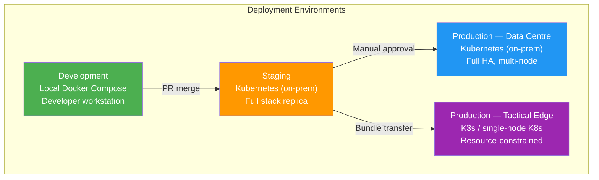

# Deployment Guidelines

> **CLASSIFICATION: UNCLASSIFIED**
> **Document Type**: Deployment Standard
> **Parent**: `00_master_policy.md`
> **Compliance**: ITSG-33 CM-2, CM-3, CM-6; NIST 800-53 CM-2, CM-3, CM-6
> **Last Updated**: 2026-02-23

---

## 1. Purpose

This document defines deployment standards for RTSA across all target environments: on-premise data centre, tactical edge, and hybrid configurations. All deployments use Infrastructure as Code (IaC) and follow immutable infrastructure principles.

## 2. Deployment Environments



## 3. Deployment Method

| Environment | Method | Tool |
|---|---|---|
| Development | Docker Compose | `docker compose up` |
| Staging | Kubernetes (Helm) | `helm upgrade --install` |
| Production — Data Centre | Kubernetes (Helm + ArgoCD) | GitOps via ArgoCD |
| Production — Tactical Edge | K3s (Helm) | Air-gap bundle deployment |

## 4. Infrastructure as Code

### 4.1 Rules

- All infrastructure defined in code (Helm charts, Kubernetes manifests)
- No manual configuration changes in any environment
- All IaC changes go through the same PR review process as application code
- Environment-specific values in separate value files (`values-staging.yaml`, `values-prod.yaml`, `values-edge.yaml`)

### 4.2 Helm Chart Structure

```
deploy/
├── charts/
│   ├── rtsa-platform/          # Umbrella chart
│   │   ├── Chart.yaml
│   │   ├── values.yaml         # Defaults
│   │   ├── values-staging.yaml
│   │   ├── values-prod.yaml
│   │   ├── values-edge.yaml
│   │   └── templates/
│   ├── sensor-ingestion/       # Per-service subchart
│   ├── fusion-engine/
│   ├── inference-engine/
│   ├── feedback-service/
│   ├── query-service/
│   ├── nato-adapter/
│   └── ui-gateway/
├── docker-compose.yml          # Local development
└── docker-compose.test.yml     # Integration tests
```

## 5. Container Security Context

```yaml
# CLASSIFICATION: UNCLASSIFIED
# Required security context for all RTSA containers
securityContext:
  runAsNonRoot: true
  runAsUser: 65534           # nobody
  readOnlyRootFilesystem: true
  allowPrivilegeEscalation: false
  capabilities:
    drop:
      - ALL
  seccompProfile:
    type: RuntimeDefault
```

## 6. Resource Profiles

### 6.1 Data Centre

```yaml
# CLASSIFICATION: UNCLASSIFIED
resources:
  requests:
    cpu: "500m"
    memory: "512Mi"
  limits:
    cpu: "2000m"
    memory: "2Gi"
```

### 6.2 Tactical Edge

```yaml
# CLASSIFICATION: UNCLASSIFIED
resources:
  requests:
    cpu: "100m"
    memory: "64Mi"
  limits:
    cpu: "500m"
    memory: "256Mi"
```

## 7. Health Checks

Every service must expose:

| Endpoint | Type | Purpose | Interval |
|---|---|---|---|
| `/healthz` | Liveness | Is the process alive? | 10s |
| `/readyz` | Readiness | Is the service ready to accept traffic? | 5s |
| `/startupz` | Startup | Has initial setup completed? | 5s (60 attempts) |

```yaml
# CLASSIFICATION: UNCLASSIFIED
livenessProbe:
  httpGet:
    path: /healthz
    port: 8080
  initialDelaySeconds: 5
  periodSeconds: 10
  failureThreshold: 3

readinessProbe:
  httpGet:
    path: /readyz
    port: 8080
  initialDelaySeconds: 5
  periodSeconds: 5
  failureThreshold: 3
```

## 8. Rollback Strategy

- All deployments use Kubernetes rolling updates
- `maxUnavailable: 0` for zero-downtime deployments
- `maxSurge: 1` to limit resource consumption
- Automatic rollback on failed health checks
- Manual rollback: `helm rollback <release> <revision>`
- Keep 5 Helm release revisions for rollback capability

## 9. Configuration Management

| Configuration Type | Source | Example |
|---|---|---|
| Application config | ConfigMap | Log level, feature flags |
| Secrets | Kubernetes Secret (encrypted at rest) | TLS certs, service accounts |
| Environment-specific | Helm values files | Resource limits, replica counts |
| Runtime toggles | Environment variables | Feature flags |

**Rule**: No configuration changes in production without a corresponding IaC change committed to the repository.

## 10. AI Agent Instructions

When generating deployment manifests:

1. Always include security context (non-root, read-only FS, drop all capabilities)
2. Include liveness, readiness, and startup probes
3. Use resource limits appropriate to the target environment (data centre vs. edge)
4. Separate environment-specific values into dedicated value files
5. Include classification labels on all Kubernetes resources
6. Never hardcode secrets in manifests — use Kubernetes Secrets
