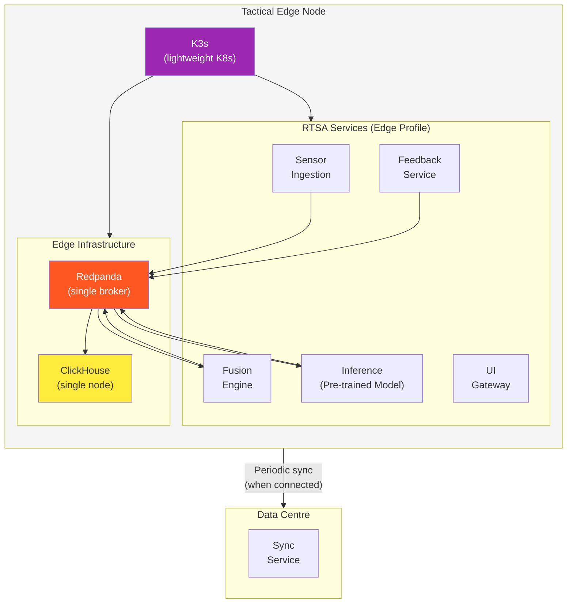
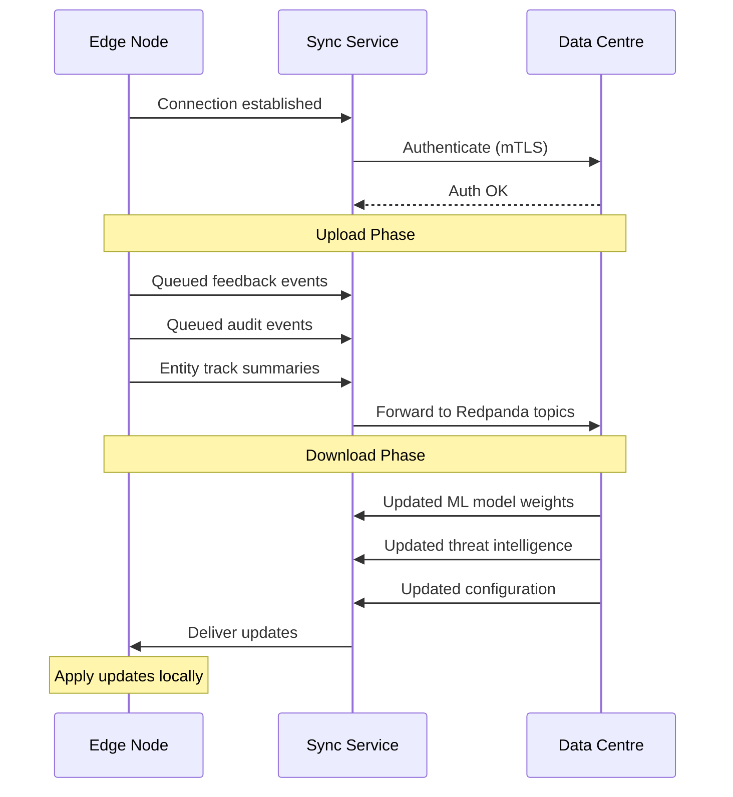

# Edge & Tactical Deployment

> **CLASSIFICATION: UNCLASSIFIED**
> **Document Type**: Deployment Standard
> **Parent**: `07_deployment_operations/deployment_guidelines.md`
> **Compliance**: ITSG-33 SC-7, PE-17; NIST 800-53 SC-7
> **Last Updated**: 2026-02-23

---

## 1. Purpose

This document defines deployment standards specific to tactical edge environments — disconnected, resource-constrained nodes that operate independently and periodically synchronize with the central data centre.

## 2. Edge Deployment Architecture



## 3. Edge Hardware Profile

| Resource | Minimum | Recommended |
|---|---|---|
| CPU | 4 cores (ARM64 or x86_64) | 8 cores |
| RAM | 8 GB | 16 GB |
| Storage | 128 GB SSD | 512 GB SSD |
| Network | 100 Mbps local | 1 Gbps local |
| External connectivity | Intermittent / None | Satellite / HF link |
| Power | Battery / generator | Shore / vehicle power |
| Environment | MIL-STD-810G (shock, vibration, temp) | — |

## 4. Edge-Specific Design Principles

### 4.1 Autonomous Operation

- Edge nodes must function with **zero connectivity** to the data centre
- All inference uses pre-trained models — no live model training at the edge
- Local ClickHouse retains data for configurable duration (default: 7 days)
- Feedback is queued locally and synced when connectivity is available

### 4.2 Resource Conservation

```yaml
# CLASSIFICATION: UNCLASSIFIED
# Edge resource profile — all services combined must fit in 8GB RAM
services:
  sensor-ingestion:
    cpu: "200m"
    memory: "128Mi"
  fusion-engine:
    cpu: "300m"
    memory: "256Mi"
  inference-engine:
    cpu: "500m"
    memory: "512Mi"
  feedback-service:
    cpu: "100m"
    memory: "64Mi"
  query-service:
    cpu: "200m"
    memory: "128Mi"
  ui-gateway:
    cpu: "100m"
    memory: "64Mi"
  redpanda:
    cpu: "500m"
    memory: "1Gi"
  clickhouse:
    cpu: "500m"
    memory: "1Gi"
  # Total: ~2.4 CPU, ~3.2 GB (leaves headroom for K3s + OS)
```

### 4.3 Graceful Degradation

| Condition | Behavior |
|---|---|
| Loss of connectivity | Continue autonomous operation; queue sync data |
| Loss of 1+ sensor feeds | Continue with remaining sensors; alert operator |
| Memory pressure | Reduce ClickHouse cache; increase GC frequency |
| Storage full | Rotate oldest data; alert operator |
| CPU saturation | Reduce inference frequency; prioritize critical sensor types |

## 5. Data Synchronization

### 5.1 Sync Protocol



### 5.2 Sync Priority

| Data Type | Direction | Priority | Compression |
|---|---|---|---|
| Operator feedback | Edge → Centre | HIGH | LZ4 |
| Audit events | Edge → Centre | HIGH | LZ4 |
| Anomaly alerts | Edge → Centre | CRITICAL | None (small payload) |
| Entity summaries | Edge → Centre | MEDIUM | LZ4 |
| Raw sensor data | Edge → Centre | LOW (bandwidth permitting) | ZSTD |
| ML model updates | Centre → Edge | HIGH | ZSTD |
| Threat intelligence | Centre → Edge | HIGH | LZ4 |
| Configuration updates | Centre → Edge | MEDIUM | None |

### 5.3 Conflict Resolution

- **Edge wins** for operator feedback (operator was present at the edge)
- **Centre wins** for ML model weights (trained on larger dataset)
- **Merge** for entity tracks (union of observations)
- **Latest-writer-wins** for configuration (with operator notification)

## 6. Edge Deployment Procedure

### 6.1 Initial Provisioning

1. Build air-gap distribution bundle (see `06_integration_cicd/artifact_management.md`)
2. Transfer bundle to edge node via encrypted removable media
3. Verify all image signatures
4. Load images into local K3s container registry
5. Deploy via Helm: `helm install rtsa ./charts/rtsa-platform -f values-edge.yaml`
6. Verify all health checks pass
7. Run edge-specific smoke tests
8. Register edge node with central management (when connected)

### 6.2 Updates

1. Build new distribution bundle with delta images
2. Transfer and verify as above
3. Rolling update via Helm: `helm upgrade rtsa ./charts/rtsa-platform -f values-edge.yaml`
4. Verify health checks
5. Rollback if any service fails: `helm rollback rtsa`

## 7. AI Agent Instructions

When generating edge deployment configurations:

1. Use edge resource profile (total < 4 CPU, < 4 GB RAM for all RTSA services)
2. Single Redpanda broker, single ClickHouse node
3. Include graceful degradation logic for all services
4. Queue outbound data when disconnected — never drop operator feedback
5. Pre-trained models only — no model training at the edge
6. Set `GOMEMLIMIT` appropriately for each service's memory limit
7. Include data rotation policies for bounded storage
