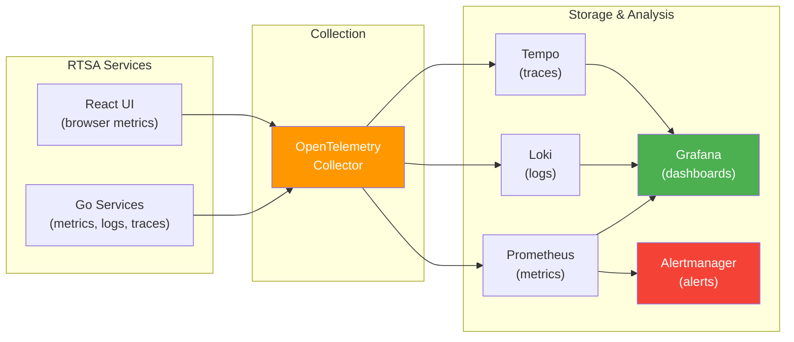

# Monitoring & Observability Standards

> **CLASSIFICATION: UNCLASSIFIED**
> **Document Type**: Operations Standard
> **Parent**: `07_deployment_operations/deployment_guidelines.md`
> **Compliance**: ITSG-33 AU-6, SI-4; NIST 800-53 AU-6, SI-4
> **Last Updated**: 2026-02-23

---

## 1. Purpose

This document defines monitoring, logging, tracing, and alerting standards for RTSA. Observability is critical for both operational reliability and security monitoring (ITSG-33 continuous monitoring requirement).

## 2. Observability Stack



## 3. Metrics

### 3.1 Required Metrics (Every Service)

Every microservice must expose these core operational metrics as a minimum:

| Metric Pattern | Type | Labels |
|---|---|---|
| `<prefix>_grpc_requests_total` | Counter | `service`, `method`, `status_code` |
| `<prefix>_grpc_request_duration_seconds` | Histogram | `service`, `method` |
| `<prefix>_grpc_active_connections` | Gauge | `service` |
| `<prefix>_messages_produced_total` | Counter | `service`, `topic` |
| `<prefix>_messages_consumed_total` | Counter | `service`, `topic`, `consumer_group` |
| `<prefix>_consumer_lag` | Gauge | `topic`, `partition`, `consumer_group` |

### 3.2 Domain-Specific Metric Design

Each service should define domain-specific metrics that reflect its business function. Follow these guidelines:

**Naming convention:**
- Use the pattern: `<project_prefix>_<domain>_<metric_name>_<unit>`
- Units follow Prometheus conventions: `_total` (counters), `_seconds` (duration), `_bytes` (size)
- Example: `myapp_ingestion_events_processed_total`, `myapp_inference_latency_seconds`

**Categories of domain metrics:**

| Category | Metric Examples | Type |
|---|---|---|
| **Ingestion** | Events ingested total, events rejected total, validation failure rate | Counter |
| **Processing / ML** | Inference latency, anomaly score distribution, model confidence | Histogram |
| **Data Quality** | Feedback submissions, trust score distribution, rejected feedback | Counter / Histogram |
| **External Integration** | Messages exchanged, protocol errors, connection state | Counter / Gauge |
| **Security** | Classification guard violations, authentication failures | Counter |
| **Query** | Query latency, rows scanned, result set size | Histogram |

**Cardinality management:**
- Limit label cardinality to prevent metric explosion (< 1000 unique label combinations per metric)
- Never use unbounded values (user IDs, request IDs) as metric labels
- Use `LowCardinality` labels: service name, method, status code, event type

### 3.3 Metric Rules

- Use OpenTelemetry SDK for instrumentation
- Expose Prometheus metrics on `:9090/metrics` (not on the service port)
- Histogram buckets: `[0.001, 0.005, 0.01, 0.025, 0.05, 0.1, 0.25, 0.5, 1, 2.5, 5, 10]`
- **NEVER include PII, classified data, or entity IDs in metric labels**
- Use `service` label to identify the source service

## 4. Structured Logging

### 4.1 Log Format

JSON structured logs via `slog` (Go) or structured logger (TypeScript):

```json
{
  "time": "2026-02-23T14:30:00.000Z",
  "level": "INFO",
  "msg": "sensor event ingested",
  "service": "sensor-ingestion",
  "correlation_id": "550e8400-e29b-41d4-a716-446655440000",
  "sensor_type": "RADAR",
  "event_count": 42,
  "classification": "UNCLASSIFIED"
}
```

### 4.2 Log Levels

| Level | Use | Examples |
|---|---|---|
| ERROR | Operation failure requiring attention | gRPC call failed, ClickHouse write failed |
| WARN | Unexpected condition, operation continues | High consumer lag, trust score below threshold |
| INFO | Normal operational events | Service started, event ingested, query completed |
| DEBUG | Diagnostic detail (disabled in production) | Request payload structure, config values |

### 4.3 Prohibited in Logs

- PII (operator names, badge numbers, personal identifiers)
- Raw sensor payloads at INFO level or above
- Classified data of any kind
- Authentication tokens, certificates, or cryptographic material
- Full error stack traces in production (use error messages only)

## 5. Distributed Tracing

### 5.1 Trace Context Propagation

All services propagate W3C Trace Context headers through gRPC metadata:

```go
// CLASSIFICATION: UNCLASSIFIED
// Trace context propagation via OpenTelemetry gRPC interceptor
import (
    "go.opentelemetry.io/contrib/instrumentation/google.golang.org/grpc/otelgrpc"
)

server := grpc.NewServer(
    grpc.StatsHandler(otelgrpc.NewServerHandler()),
)
```

### 5.2 Trace Sampling

| Environment | Sampling Rate | Rationale |
|---|---|---|
| Development | 100% | Full visibility |
| Staging | 100% | Full visibility for testing |
| Production (Data Centre) | 10% | Balance visibility vs. overhead |
| Production (Edge) | 1% | Minimize resource usage |
| Error traces | 100% | Always capture error paths |

## 6. Alerting

### 6.1 Alert Severity

| Severity | Response Time | Channel | Examples |
|---|---|---|---|
| P1 — Critical | 15 min | PagerDuty / duty phone | Service down, data loss, security incident |
| P2 — High | 1 hour | Slack + email | Latency SLA breach, high error rate |
| P3 — Medium | 4 hours | Slack | Elevated consumer lag, disk 80% |
| P4 — Low | Next business day | Dashboard | Benchmark regression, coverage drop |

### 6.2 Required Alerts

| Alert | Condition | Severity |
|---|---|---|
| Service down | No successful health check for 60s | P1 |
| High error rate | > 1% gRPC errors in 5 min window | P2 |
| Latency SLA breach | P99 latency > target for 5 min | P2 |
| Consumer lag diverging | Lag increasing for > 10 min | P2 |
| Disk space critical | > 90% usage | P1 |
| Disk space warning | > 80% usage | P3 |
| Certificate expiry | < 14 days to expiration | P2 |
| Certificate expiry imminent | < 3 days to expiration | P1 |
| Anti-poisoning alert | Trust score < 0.2 for 5+ feedback items | P2 |
| Classification guard violation | Any cross-classification attempt | P1 |
| Memory pressure | > 85% of GOMEMLIMIT | P3 |

## 7. Dashboards

### 7.1 Required Dashboards

| Dashboard | Audience | Key Panels |
|---|---|---|
| System Overview | Operations | Service health, latency, throughput, error rates |
| Sensor Ingestion | Operations | Events/sec by sensor type, rejection rate, latency |
| Fusion & Inference | Operations | Track rate, anomaly score distribution, model latency |
| Feedback & Trust | Operations + Security | Feedback rate, trust score distribution, rejections |
| Security Monitor | Security Ops | Classification violations, auth failures, suspicious patterns |
| Edge Node Status | Operations | Per-edge-node health, sync status, resource usage |
| ClickHouse Performance | DBA | Query latency, insert throughput, storage growth |

## 8. Edge Monitoring Constraints

- Edge nodes run a lightweight OpenTelemetry Collector
- Metrics stored locally in Prometheus (7-day retention)
- Logs stored locally (3-day retention, compressed)
- Traces sampled at 1%
- When connected, metrics/logs/traces forwarded to central observability stack

## 9. AI Agent Instructions

When generating service code:

1. Include OpenTelemetry instrumentation for gRPC (server and client)
2. Expose Prometheus metrics on `:9090/metrics`
3. Use `slog` structured logging — never `fmt.Println` or `log.Print`
4. Propagate correlation IDs through all gRPC calls
5. Include health check endpoints (`/healthz`, `/readyz`, `/startupz`)
6. Never log PII, classified data, or authentication material
7. Add domain-specific metrics from Section 3.2 for the relevant service
