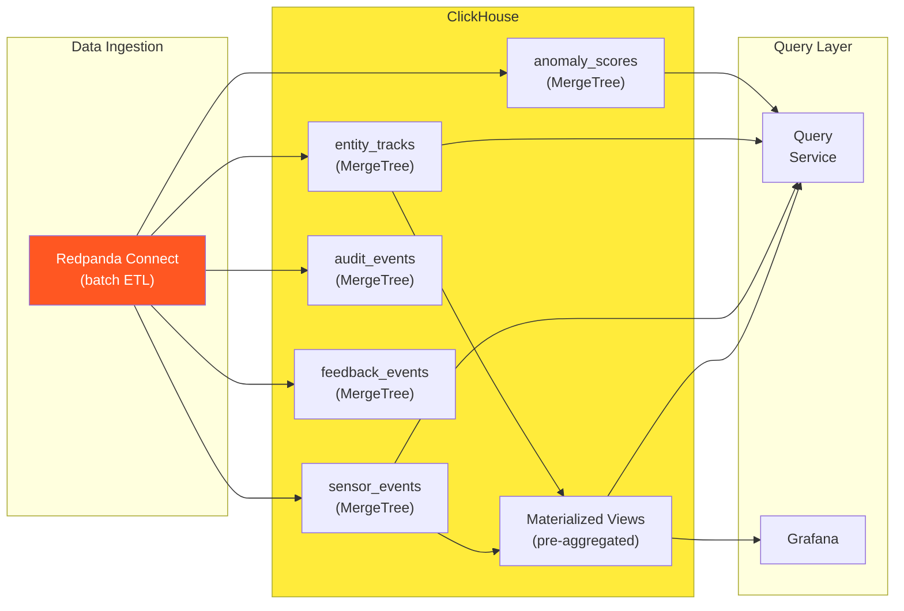

# ClickHouse Guidelines

> **CLASSIFICATION: UNCLASSIFIED**
> **Document Type**: Technology-Specific Standard
> **Parent**: `00_master_policy.md`
> **Last Updated**: 2026-02-23

---

## 1. Purpose

ClickHouse serves as the OLAP analytical store for RTSA. It provides historical storage, forensic analysis, and complex queries over sensor events, entity tracks, anomaly scores, and audit trails. This document defines schema design, query patterns, and operational standards.

## 2. Role in RTSA Architecture



## 3. Schema Design

### 3.1 Naming Conventions

| Element | Convention | Example |
|---|---|---|
| Database | `rtsa` | `rtsa` |
| Tables | `snake_case`, plural nouns | `sensor_events` |
| Columns | `snake_case` | `event_time`, `sensor_type` |
| Materialized Views | `mv_<purpose>` | `mv_hourly_track_counts` |
| Dictionaries | `dict_<entity>` | `dict_sensor_metadata` |

### 3.2 Core Tables

```sql
-- CLASSIFICATION: UNCLASSIFIED
-- ITSG-33: AU-3 — Content of Audit Records

CREATE TABLE rtsa.sensor_events
(
    event_id        String,
    sensor_id       String,
    sensor_type     Enum8(
        'RADAR' = 1,
        'EW_SIGINT' = 2,
        'ELINT_COMINT' = 3,
        'ISR' = 4,
        'AIS_BFT' = 5,
        'CYBER' = 6
    ),
    event_time      DateTime64(3, 'UTC'),
    latitude        Float64,
    longitude       Float64,
    altitude        Float64,
    speed_ms        Float64,
    heading_deg     Float64,
    classification  Enum8(
        'UNCLASSIFIED' = 0,
        'PROTECTED_A' = 1,
        'PROTECTED_B' = 2,
        'PROTECTED_C' = 3,
        'SECRET' = 4
    ),
    raw_payload     String,  -- Protobuf base64 (for replay)
    ingestion_time  DateTime64(3, 'UTC') DEFAULT now64(3)
)
ENGINE = MergeTree()
PARTITION BY toYYYYMMDD(event_time)
ORDER BY (sensor_type, sensor_id, event_time)
TTL event_time + INTERVAL 90 DAY
SETTINGS index_granularity = 8192;

CREATE TABLE rtsa.entity_tracks
(
    track_id        String,
    entity_type     Enum8(
        'UNKNOWN' = 0,
        'AIR' = 1,
        'SURFACE' = 2,
        'SUBSURFACE' = 3,
        'LAND' = 4,
        'SPACE' = 5,
        'CYBER' = 6
    ),
    hostile_status  Enum8(
        'UNKNOWN' = 0,
        'PENDING' = 1,
        'FRIENDLY' = 2,
        'NEUTRAL' = 3,
        'HOSTILE' = 4,
        'SUSPECT' = 5
    ),
    update_time     DateTime64(3, 'UTC'),
    latitude        Float64,
    longitude       Float64,
    altitude        Float64,
    speed_ms        Float64,
    heading_deg     Float64,
    confidence      Float64,
    source_sensors  Array(String),
    classification  Enum8(
        'UNCLASSIFIED' = 0,
        'PROTECTED_A' = 1,
        'PROTECTED_B' = 2,
        'PROTECTED_C' = 3,
        'SECRET' = 4
    ),
    ingestion_time  DateTime64(3, 'UTC') DEFAULT now64(3)
)
ENGINE = MergeTree()
PARTITION BY toYYYYMMDD(update_time)
ORDER BY (entity_type, track_id, update_time)
TTL update_time + INTERVAL 365 DAY
SETTINGS index_granularity = 8192;

CREATE TABLE rtsa.anomaly_scores
(
    score_id        String,
    track_id        String,
    anomaly_type    String,
    score           Float64,
    model_version   String,
    inference_time  DateTime64(3, 'UTC'),
    explanation     String,
    ingestion_time  DateTime64(3, 'UTC') DEFAULT now64(3)
)
ENGINE = MergeTree()
PARTITION BY toYYYYMMDD(inference_time)
ORDER BY (track_id, inference_time)
TTL inference_time + INTERVAL 180 DAY
SETTINGS index_granularity = 8192;

CREATE TABLE rtsa.audit_events
(
    audit_id        String,
    event_type      String,
    actor_id        String,
    actor_type      Enum8('SYSTEM' = 0, 'OPERATOR' = 1, 'SERVICE' = 2),
    action          String,
    resource_type   String,
    resource_id     String,
    outcome         Enum8('SUCCESS' = 0, 'FAILURE' = 1, 'DENIED' = 2),
    classification  Enum8(
        'UNCLASSIFIED' = 0,
        'PROTECTED_A' = 1,
        'PROTECTED_B' = 2,
        'PROTECTED_C' = 3,
        'SECRET' = 4
    ),
    event_time      DateTime64(3, 'UTC'),
    details         String,  -- JSON structured details
    ingestion_time  DateTime64(3, 'UTC') DEFAULT now64(3)
)
ENGINE = MergeTree()
PARTITION BY toYYYYMMDD(event_time)
ORDER BY (event_type, event_time)
TTL event_time + INTERVAL 730 DAY  -- 2-year retention for audit
SETTINGS index_granularity = 8192;

CREATE TABLE rtsa.feedback_events
(
    feedback_id     String,
    track_id        String,
    operator_id     String,
    feedback_type   Enum8(
        'CONFIRM_HOSTILE' = 1,
        'CONFIRM_FRIENDLY' = 2,
        'RECLASSIFY' = 3,
        'REJECT_ANOMALY' = 4,
        'CONFIRM_ANOMALY' = 5
    ),
    trust_score     Float64,
    validated       UInt8,
    feedback_time   DateTime64(3, 'UTC'),
    ingestion_time  DateTime64(3, 'UTC') DEFAULT now64(3)
)
ENGINE = MergeTree()
PARTITION BY toYYYYMMDD(feedback_time)
ORDER BY (track_id, feedback_time)
TTL feedback_time + INTERVAL 365 DAY
SETTINGS index_granularity = 8192;
```

### 3.3 Materialized Views

```sql
-- CLASSIFICATION: UNCLASSIFIED
-- Pre-aggregated hourly sensor event counts

CREATE MATERIALIZED VIEW rtsa.mv_hourly_sensor_counts
ENGINE = SummingMergeTree()
PARTITION BY toYYYYMM(hour)
ORDER BY (sensor_type, hour)
AS
SELECT
    sensor_type,
    toStartOfHour(event_time) AS hour,
    count() AS event_count,
    uniqExact(sensor_id) AS unique_sensors
FROM rtsa.sensor_events
GROUP BY sensor_type, hour;
```

## 4. Query Patterns

### 4.1 Parameterized Queries ONLY

```go
// GOOD — parameterized
rows, err := ch.Query(ctx,
    `SELECT track_id, entity_type, hostile_status, update_time, latitude, longitude
     FROM rtsa.entity_tracks
     WHERE entity_type = @entityType
       AND update_time BETWEEN @startTime AND @endTime
     ORDER BY update_time DESC
     LIMIT @limit`,
    clickhouse.Named("entityType", entityType),
    clickhouse.Named("startTime", startTime),
    clickhouse.Named("endTime", endTime),
    clickhouse.Named("limit", maxRows),
)

// BAD — string concatenation (SQL INJECTION)
query := fmt.Sprintf("SELECT * FROM entity_tracks WHERE entity_type = '%s'", entityType)
```

### 4.2 Query Guardrails

| Guardrail | Value | Purpose |
|---|---|---|
| `max_execution_time` | 30 seconds | Prevent runaway queries |
| `max_rows_to_read` | 10,000,000 | Prevent full table scans |
| `max_result_rows` | 100,000 | Limit result set size |
| `max_memory_usage` | 1 GB per query | Prevent OOM |

```sql
-- Set query guardrails
SET max_execution_time = 30;
SET max_rows_to_read = 10000000;
SET max_result_rows = 100000;
```

## 5. Partitioning Strategy

| Table | Partition Expression | Rationale |
|---|---|---|
| `sensor_events` | `toYYYYMMDD(event_time)` | Daily partitions for time-range queries |
| `entity_tracks` | `toYYYYMMDD(update_time)` | Daily partitions |
| `anomaly_scores` | `toYYYYMMDD(inference_time)` | Daily partitions |
| `audit_events` | `toYYYYMMDD(event_time)` | Daily partitions; long retention |
| `feedback_events` | `toYYYYMMDD(feedback_time)` | Daily partitions |

## 6. Data Retention (TTL)

| Table | Data Centre | Tactical Edge |
|---|---|---|
| `sensor_events` | 90 days | 7 days |
| `entity_tracks` | 365 days | 14 days |
| `anomaly_scores` | 180 days | 7 days |
| `audit_events` | 730 days (2 years) | 7 days (synced to DC) |
| `feedback_events` | 365 days | 7 days (synced to DC) |

## 7. Edge ClickHouse Configuration

```xml
<!-- CLASSIFICATION: UNCLASSIFIED -->
<!-- Edge ClickHouse: single-node, resource-constrained -->
<clickhouse>
    <max_server_memory_usage_to_ram_ratio>0.5</max_server_memory_usage_to_ram_ratio>
    <max_concurrent_queries>10</max_concurrent_queries>
    <max_connections>50</max_connections>
    <mark_cache_size>268435456</mark_cache_size> <!-- 256 MB -->
</clickhouse>
```

## 8. AI Agent Instructions

When generating ClickHouse-related code:

1. ALWAYS use parameterized queries with `clickhouse.Named()` — NEVER concatenate
2. Include query guardrails (`max_execution_time`, `max_rows_to_read`)
3. Use `MergeTree()` engine with appropriate `ORDER BY` for query patterns
4. Partition by day using `toYYYYMMDD(<time_column>)`
5. Include TTL for data retention management
6. Use `Enum8` for low-cardinality columns (sensor type, entity type, classification)
7. Use `DateTime64(3, 'UTC')` for all timestamp columns (millisecond precision, UTC)
8. Create materialized views for frequently-queried aggregations
