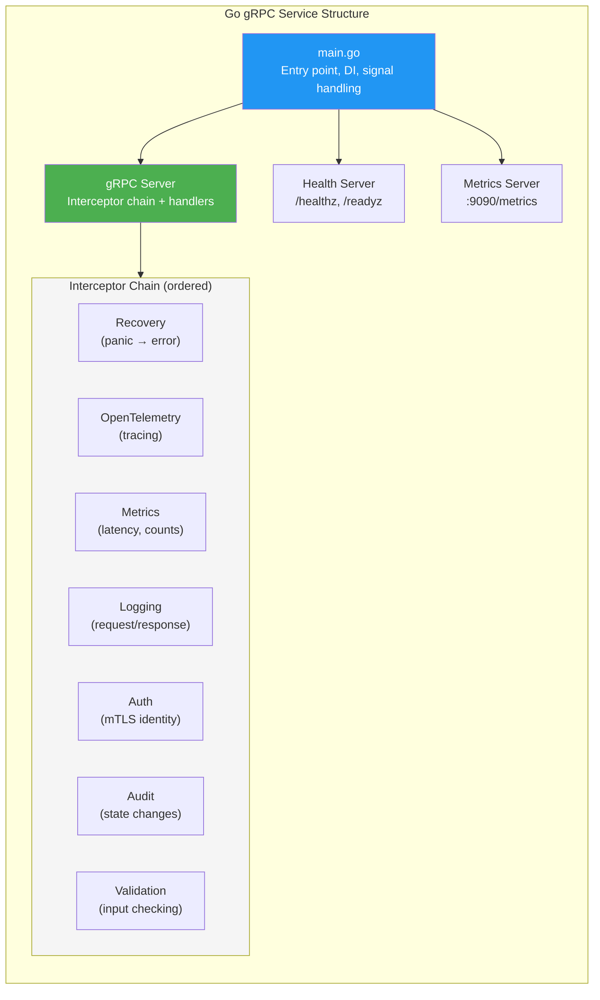

# gRPC Service Design Guidelines

> **CLASSIFICATION: UNCLASSIFIED**
> **Document Type**: Technology-Specific Standard
> **Parent**: `00_master_policy.md`
> **Last Updated**: 2026-03-02

---

## 1. Purpose

This document defines gRPC service design patterns for Go-based microservices. It covers service lifecycle, interceptor design, streaming patterns, error handling, and operational concerns applicable to any gRPC service architecture that requires mutual TLS, structured observability, and production-grade reliability.

## 2. Service Architecture

A well-structured gRPC service in Go consists of the following components:



**Key principles:**
- `main.go` is the composition root — all dependencies are wired here via constructor injection
- The gRPC server runs the interceptor chain before reaching business logic handlers
- Health and metrics servers run on separate ports from the application gRPC port
- All components shut down gracefully on signal receipt

## 3. Service Lifecycle

### 3.1 Startup Sequence

Follow this ordered startup pattern for gRPC services:

1. **Load configuration** — read from environment variables; validate at startup
2. **Initialize observability** — set up OpenTelemetry tracer, logger, metrics exporter
3. **Initialize infrastructure clients** — connect to databases, message brokers, external services
4. **Create service layer** — inject infrastructure clients into business logic services
5. **Create gRPC server** — build interceptor chain; register service handlers
6. **Start auxiliary servers** — health check and metrics servers in background goroutines
7. **Start gRPC server** — bind to configured address and begin serving
8. **Wait for shutdown signal** — block on `SIGINT` / `SIGTERM`

```go
// CLASSIFICATION: UNCLASSIFIED

func main() {
    ctx, cancel := signal.NotifyContext(context.Background(),
        syscall.SIGINT, syscall.SIGTERM)
    defer cancel()

    // 1. Load and validate configuration
    cfg, err := config.Load()
    if err != nil {
        slog.Error("failed to load config", "error", err)
        os.Exit(1)
    }

    // 2. Initialize observability
    shutdown, err := observability.Init(ctx, cfg.ServiceName)
    if err != nil {
        slog.Error("failed to init observability", "error", err)
        os.Exit(1)
    }
    defer shutdown(context.Background())

    // 3–4. Initialize clients and create service
    // ...

    // 5. Create gRPC server with interceptor chain
    grpcServer := newGRPCServer(cfg.TLS, svc)

    // 6. Start health + metrics servers
    go startHealthServer(ctx, cfg.HealthPort)
    go startMetricsServer(ctx, cfg.MetricsPort)

    // 7. Start gRPC server
    lis, err := net.Listen("tcp", cfg.GRPCAddr)
    if err != nil {
        slog.Error("failed to listen", "error", err, "addr", cfg.GRPCAddr)
        os.Exit(1)
    }
    go func() {
        slog.Info("gRPC server starting", "addr", cfg.GRPCAddr)
        if err := grpcServer.Serve(lis); err != nil {
            slog.Error("gRPC server failed", "error", err)
        }
    }()

    // 8. Wait for shutdown signal
    <-ctx.Done()
    slog.Info("shutting down gracefully")
    grpcServer.GracefulStop()
}
```

### 3.2 Graceful Shutdown

Every gRPC service must implement graceful shutdown:

1. Stop accepting new connections
2. Drain in-flight requests (30-second timeout)
3. Commit message broker consumer offsets
4. Close infrastructure connections (database, broker, caches)
5. Flush telemetry (traces, metrics)
6. Exit with code 0

**Best practices:**
- Use `grpcServer.GracefulStop()` — it waits for in-flight RPCs to complete
- Set a maximum drain timeout (e.g., 30 seconds) to prevent indefinite hangs
- Ensure the Kubernetes `terminationGracePeriodSeconds` is longer than the drain timeout
- Log shutdown progress for debugging container lifecycle issues

## 4. Interceptor Design

### 4.1 Interceptor Chain Order

Interceptors execute in order for requests and in reverse order for responses. The order matters:

```
Request:  Recovery → OTel → Metrics → Logging → Auth → Audit → Validation → Handler
Response: Handler → Validation → Audit → Auth → Logging → Metrics → OTel → Recovery
```

| Interceptor | Position | Purpose |
|---|---|---|
| **Recovery** | First | Catches panics; converts to `INTERNAL` error |
| **OpenTelemetry** | Second | Creates/propagates trace spans |
| **Metrics** | Third | Records request count, latency, status code |
| **Logging** | Fourth | Logs request/response metadata (not payloads) |
| **Auth** | Fifth | Extracts and verifies caller identity (mTLS cert) |
| **Audit** | Sixth | Records state-changing operations to audit log |
| **Validation** | Seventh | Validates request message fields |

### 4.2 Recovery Interceptor

Must be the **first** interceptor — catches panics from any downstream interceptor or handler:

```go
// CLASSIFICATION: UNCLASSIFIED

func RecoveryInterceptor() grpc.UnaryServerInterceptor {
    return func(ctx context.Context, req any, info *grpc.UnaryServerInfo,
        handler grpc.UnaryHandler) (resp any, err error) {
        defer func() {
            if r := recover(); r != nil {
                slog.Error("panic recovered in gRPC handler",
                    "method", info.FullMethod,
                    "panic", r,
                )
                err = status.Errorf(codes.Internal, "internal server error")
            }
        }()
        return handler(ctx, req)
    }
}
```

### 4.3 Auth Interceptor (mTLS Identity Extraction)

Extract client identity from the mTLS peer certificate:

```go
// CLASSIFICATION: UNCLASSIFIED

func AuthInterceptor() grpc.UnaryServerInterceptor {
    return func(ctx context.Context, req any, info *grpc.UnaryServerInfo,
        handler grpc.UnaryHandler) (any, error) {
        peer, ok := peer.FromContext(ctx)
        if !ok {
            return nil, status.Error(codes.Unauthenticated, "no peer info")
        }
        tlsInfo, ok := peer.AuthInfo.(credentials.TLSInfo)
        if !ok || len(tlsInfo.State.PeerCertificates) == 0 {
            return nil, status.Error(codes.Unauthenticated, "no client certificate")
        }
        clientCN := tlsInfo.State.PeerCertificates[0].Subject.CommonName
        ctx = context.WithValue(ctx, ctxKeyClientID, clientCN)
        return handler(ctx, req)
    }
}
```

### 4.4 Audit Interceptor Pattern

Log state-changing operations to an audit trail. The audit interceptor runs after the handler to capture the outcome:

```go
// CLASSIFICATION: UNCLASSIFIED

func AuditInterceptor(auditLogger AuditLogger) grpc.UnaryServerInterceptor {
    return func(ctx context.Context, req any, info *grpc.UnaryServerInfo,
        handler grpc.UnaryHandler) (any, error) {
        resp, err := handler(ctx, req)

        if isStateChanging(info.FullMethod) {
            auditLogger.LogAsync(ctx, AuditEvent{
                EventType: "grpc_call",
                ActorID:   getClientID(ctx),
                Action:    info.FullMethod,
                Outcome:   outcomeFromError(err),
                Timestamp: time.Now().UTC(),
            })
        }
        return resp, err
    }
}
```

**Best practices:**
- Audit logging should be asynchronous (fire-and-forget) — never block the request on audit persistence
- Log both successful and failed state-changing operations
- Include the actor identity, action, outcome, and timestamp
- Define `isStateChanging()` based on method naming conventions (e.g., Create*, Update*, Delete*)

## 5. Streaming Patterns

### 5.1 Server-Side Streaming

Use server-side streaming for pushing real-time updates to clients:

```go
// CLASSIFICATION: UNCLASSIFIED

func (s *Server) StreamUpdates(
    req *pb.StreamRequest,
    stream pb.MyService_StreamUpdatesServer,
) error {
    ctx := stream.Context()

    // Subscribe to the data source
    ch, err := s.dataSource.Subscribe(ctx, req.GetFilter())
    if err != nil {
        return status.Errorf(codes.Internal, "subscribe failed: %v", err)
    }
    defer s.dataSource.Unsubscribe(ch)

    for {
        select {
        case <-ctx.Done():
            return nil  // Client disconnected or deadline exceeded
        case item, ok := <-ch:
            if !ok {
                return nil  // Channel closed
            }
            if err := stream.Send(item); err != nil {
                return err
            }
        }
    }
}
```

**Best practices:**
- Always check `ctx.Done()` for clean cancellation
- Unsubscribe/cleanup resources when the stream ends
- Use flow control — if the client is slow, consider dropping or buffering messages
- Set appropriate keepalive parameters to detect dead connections

### 5.2 Client-Side Streaming

Use client-side streaming for bulk data ingestion:

```go
// CLASSIFICATION: UNCLASSIFIED

func (s *Server) BulkIngest(
    stream pb.MyService_BulkIngestServer,
) error {
    var count int64
    for {
        msg, err := stream.Recv()
        if err == io.EOF {
            return stream.SendAndClose(&pb.IngestResponse{
                AcceptedCount: count,
            })
        }
        if err != nil {
            return status.Errorf(codes.Internal, "receive failed: %v", err)
        }
        if err := validate(msg); err != nil {
            slog.Warn("invalid message in stream", "error", err)
            continue  // Skip invalid messages, don't break the stream
        }
        if err := s.processor.Process(stream.Context(), msg); err != nil {
            return status.Errorf(codes.Internal, "process failed: %v", err)
        }
        count++
    }
}
```

**Best practices:**
- Validate each message individually — skip invalid messages rather than terminating the stream
- Count and report accepted/rejected messages in the response
- Set maximum stream duration to prevent unbounded streams

## 6. Error Handling

### 6.1 gRPC Status Code Mapping

Map domain errors to appropriate gRPC status codes consistently:

| Condition | gRPC Code | When to Use |
|---|---|---|
| Invalid input | `InvalidArgument` | Request fields fail validation |
| Entity not found | `NotFound` | Requested resource does not exist |
| Not authenticated | `Unauthenticated` | Missing or invalid credentials |
| Not authorized | `PermissionDenied` | Authenticated but not authorized |
| Conflict / duplicate | `AlreadyExists` | Duplicate key or idempotency violation |
| Rate limited | `ResourceExhausted` | Request rate exceeded |
| Downstream failure | `Unavailable` | Database or broker is down |
| Unexpected error | `Internal` | Never expose internal details in the message |
| Timeout | `DeadlineExceeded` | Configured deadline expired |
| Client cancelled | `Cancelled` | Client cancelled the request |

### 6.2 Error Handling Rules

- **Never** expose internal error details (stack traces, internal names) in `Internal` errors
- **Always** map domain errors to specific gRPC codes — avoid defaulting everything to `Internal`
- **Always** include actionable error messages for client-facing errors (`InvalidArgument`, `NotFound`)
- Use gRPC rich error model (`google.rpc.Status` with `details`) for structured error information

## 7. Deadline Propagation

### 7.1 Rules

- **Always** set deadlines on outgoing gRPC calls — never allow unbounded waits
- Propagate the incoming deadline minus a small margin to downstream calls
- Handle `DeadlineExceeded` errors gracefully — log and return appropriate status

```go
// CLASSIFICATION: UNCLASSIFIED

// Always set deadline on outgoing calls
ctx, cancel := context.WithTimeout(ctx, 5*time.Second)
defer cancel()

resp, err := downstreamClient.DoWork(ctx, req)
if err != nil {
    if status.Code(err) == codes.DeadlineExceeded {
        slog.Warn("downstream call timed out", "method", "DoWork")
    }
    return nil, fmt.Errorf("downstream call: %w", err)
}
```

### 7.2 Recommended Deadlines

| RPC Type | Default | Max |
|---|---|---|
| Unary (fast path) | 5s | 30s |
| Unary (query/analytical) | 10s | 60s |
| Server streaming | 5 min | 24h |
| Client streaming (batch) | 30s | 5 min |
| Cross-system calls | 30s | 120s |

## 8. gRPC Server Options

### 8.1 Resource Protection

Configure gRPC server options to prevent denial of service:

```go
// CLASSIFICATION: UNCLASSIFIED

grpc.NewServer(
    grpc.MaxRecvMsgSize(4 * 1024 * 1024),    // 4 MB max incoming message
    grpc.MaxSendMsgSize(4 * 1024 * 1024),    // 4 MB max outgoing message
    grpc.MaxConcurrentStreams(100),            // Limit concurrent streams
    grpc.ConnectionTimeout(30 * time.Second), // Connection establishment timeout
    grpc.KeepaliveParams(keepalive.ServerParameters{
        MaxConnectionIdle: 5 * time.Minute,   // Close idle connections
        Time:              1 * time.Minute,   // Keepalive ping interval
        Timeout:           20 * time.Second,  // Keepalive ping timeout
    }),
    grpc.KeepaliveEnforcementPolicy(keepalive.EnforcementPolicy{
        MinTime:             30 * time.Second, // Minimum keepalive interval from clients
        PermitWithoutStream: false,            // Require active streams for keepalive
    }),
)
```

### 8.2 gRPC-Web Proxy (Cold Path Only)

For browser-based clients that need to communicate with gRPC services. In the WebGPU COP architecture, gRPC-Web is used exclusively for the **cold path** (commands, queries, feedback). Real-time track data uses WebTransport (see `webtransport_guidelines.md`).

**Best practices:**
- Use Envoy or grpc-web-proxy as the gRPC-Web proxy
- Terminate TLS at the proxy layer
- Configure CORS headers at the proxy
- Support both unary and server-streaming (client streaming not supported by gRPC-Web)
- Set appropriate timeouts on the proxy matching the backend service timeouts
- Browser client uses ConnectRPC (`@connectrpc/connect-web`) — see `solidjs_standards.md` §6

## 9. Connection Management

### 9.1 Client Connection Best Practices

- Use connection pooling — create a single `grpc.ClientConn` per downstream service and reuse it
- Enable automatic retry with backoff for transient failures
- Set keepalive parameters to detect and recover from dead connections
- Use DNS-based load balancing or a service mesh for multi-instance services

```go
// CLASSIFICATION: UNCLASSIFIED

conn, err := grpc.NewClient(
    target,
    grpc.WithTransportCredentials(tlsCreds),
    grpc.WithDefaultServiceConfig(`{
        "methodConfig": [{
            "name": [{"service": ""}],
            "waitForReady": true,
            "retryPolicy": {
                "maxAttempts": 3,
                "initialBackoff": "0.1s",
                "maxBackoff": "1s",
                "backoffMultiplier": 2,
                "retryableStatusCodes": ["UNAVAILABLE", "DEADLINE_EXCEEDED"]
            }
        }]
    }`),
    grpc.WithKeepaliveParams(keepalive.ClientParameters{
        Time:                30 * time.Second,
        Timeout:             10 * time.Second,
        PermitWithoutStream: false,
    }),
)
```

### 9.2 Load Balancing

- Use client-side round-robin load balancing for multi-instance services
- In Kubernetes, use headless services for DNS-based service discovery
- Consider a service mesh (e.g., Istio, Linkerd) for advanced traffic management

## 10. AI Agent Instructions

When generating gRPC service code:

1. Always include the full interceptor chain (Recovery → OTel → Metrics → Logging → Auth → Audit → Validation)
2. Use mTLS — every server must configure client certificate verification
3. Implement graceful shutdown with signal handling and a configurable drain timeout
4. Set deadlines on all outgoing gRPC calls — never allow unbounded waits
5. Use proper gRPC status codes — map domain errors to specific codes, never default to `Internal`
6. Include health check endpoints (`/healthz`, `/readyz`, `/startupz`) on a separate port
7. Log state-changing operations to an audit trail (asynchronous)
8. For streaming RPCs, handle `context.Done()` for clean cancellation
9. Configure resource protection (max message size, concurrent streams, keepalive)
10. Use connection pooling for outgoing gRPC clients — one connection per downstream service
