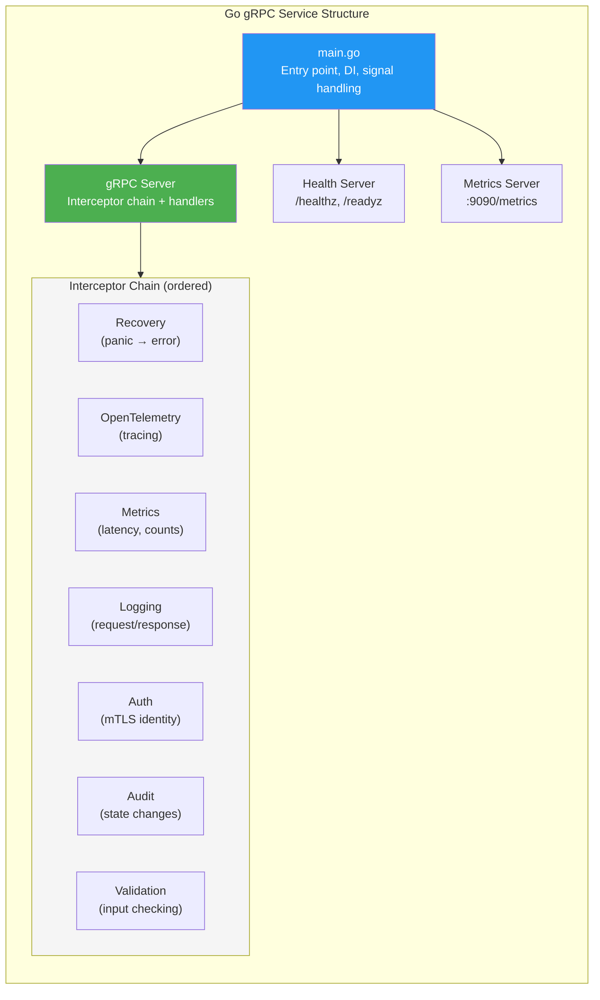

# gRPC Service Design Guidelines

> **CLASSIFICATION: UNCLASSIFIED**
> **Document Type**: Technology-Specific Standard
> **Parent**: `00_master_policy.md`
> **Last Updated**: 2026-02-23

---

## 1. Purpose

This document defines gRPC service design patterns for RTSA microservices. All inter-service communication uses gRPC with mutual TLS. This guide covers service lifecycle, interceptor design, streaming patterns, and operational concerns.

## 2. Service Architecture



## 3. Service Lifecycle

### 3.1 Startup Sequence

```go
// CLASSIFICATION: UNCLASSIFIED

func main() {
    ctx, cancel := signal.NotifyContext(context.Background(), syscall.SIGINT, syscall.SIGTERM)
    defer cancel()

    // 1. Load configuration
    cfg, err := config.Load()
    if err != nil {
        slog.Error("failed to load config", "error", err)
        os.Exit(1)
    }

    // 2. Initialize observability
    shutdown, err := observability.Init(ctx, cfg.ServiceName)
    if err != nil {
        slog.Error("failed to init observability", "error", err)
        os.Exit(1)
    }
    defer shutdown(context.Background())

    // 3. Initialize infrastructure clients
    rpClient, err := redpanda.NewClient(cfg.Redpanda)
    // ... ClickHouse, etc.

    // 4. Create service with dependencies
    svc := service.New(rpClient, chClient /*, ...*/)

    // 5. Create gRPC server with interceptor chain
    grpcServer := newGRPCServer(cfg.TLS, svc)

    // 6. Start health + metrics servers
    go startHealthServer(ctx, cfg.HealthPort)
    go startMetricsServer(ctx, cfg.MetricsPort)

    // 7. Start gRPC server
    lis, err := net.Listen("tcp", cfg.GRPCAddr)
    if err != nil {
        slog.Error("failed to listen", "error", err, "addr", cfg.GRPCAddr)
        os.Exit(1)
    }

    go func() {
        slog.Info("gRPC server starting", "addr", cfg.GRPCAddr)
        if err := grpcServer.Serve(lis); err != nil {
            slog.Error("gRPC server failed", "error", err)
        }
    }()

    // 8. Wait for shutdown signal
    <-ctx.Done()
    slog.Info("shutting down gracefully")
    grpcServer.GracefulStop()
}
```

### 3.2 Graceful Shutdown

1. Stop accepting new connections
2. Drain in-flight requests (30-second timeout)
3. Commit Redpanda consumer offsets
4. Close infrastructure connections
5. Flush telemetry
6. Exit

## 4. Interceptor Design

### 4.1 Recovery Interceptor

```go
// Must be FIRST — catches panics in downstream interceptors/handlers
func RecoveryInterceptor() grpc.UnaryServerInterceptor {
    return func(ctx context.Context, req any, info *grpc.UnaryServerInfo, handler grpc.UnaryHandler) (resp any, err error) {
        defer func() {
            if r := recover(); r != nil {
                slog.Error("panic recovered in gRPC handler",
                    "method", info.FullMethod,
                    "panic", r,
                )
                err = status.Errorf(codes.Internal, "internal server error")
            }
        }()
        return handler(ctx, req)
    }
}
```

### 4.2 Auth Interceptor (mTLS Identity)

```go
// Extract client identity from mTLS peer certificate
func AuthInterceptor() grpc.UnaryServerInterceptor {
    return func(ctx context.Context, req any, info *grpc.UnaryServerInfo, handler grpc.UnaryHandler) (any, error) {
        peer, ok := peer.FromContext(ctx)
        if !ok {
            return nil, status.Error(codes.Unauthenticated, "no peer info")
        }
        tlsInfo, ok := peer.AuthInfo.(credentials.TLSInfo)
        if !ok || len(tlsInfo.State.PeerCertificates) == 0 {
            return nil, status.Error(codes.Unauthenticated, "no client certificate")
        }
        clientCN := tlsInfo.State.PeerCertificates[0].Subject.CommonName
        ctx = context.WithValue(ctx, ctxKeyClientID, clientCN)
        return handler(ctx, req)
    }
}
```

### 4.3 Audit Interceptor

```go
// Log state-changing operations to audit trail
func AuditInterceptor(producer redpanda.Producer) grpc.UnaryServerInterceptor {
    return func(ctx context.Context, req any, info *grpc.UnaryServerInfo, handler grpc.UnaryHandler) (any, error) {
        resp, err := handler(ctx, req)

        if isStateChanging(info.FullMethod) {
            auditEvent := &pb.AuditEvent{
                EventType:   "grpc_call",
                ActorId:     getClientID(ctx),
                Action:      info.FullMethod,
                Outcome:     outcomeFromError(err),
                EventTime:   timestamppb.Now(),
            }
            // Fire-and-forget to audit topic (non-blocking)
            producer.ProduceAsync(ctx, "audit.events", auditEvent)
        }
        return resp, err
    }
}
```

## 5. Streaming Patterns

### 5.1 Server-Side Streaming (Real-Time Track Updates)

```go
// Stream fused entity tracks to subscribers
func (s *Server) StreamEntityTracks(
    req *pb.StreamTracksRequest,
    stream pb.TrackService_StreamEntityTracksServer,
) error {
    ctx := stream.Context()

    consumer, err := s.redpanda.Subscribe(ctx, "entity.tracks.fused")
    if err != nil {
        return status.Errorf(codes.Internal, "subscribe failed: %v", err)
    }
    defer consumer.Close()

    for {
        select {
        case <-ctx.Done():
            return nil
        case msg, ok := <-consumer.Messages():
            if !ok {
                return nil
            }
            track := &pb.EntityTrack{}
            if err := proto.Unmarshal(msg.Value, track); err != nil {
                slog.Warn("failed to unmarshal track", "error", err)
                continue
            }
            if matchesFilter(track, req.GetFilter()) {
                if err := stream.Send(track); err != nil {
                    return err
                }
            }
        }
    }
}
```

### 5.2 Client-Side Streaming (Bulk Sensor Ingestion)

```go
// Accept bulk sensor events from high-throughput sources
func (s *Server) IngestSensorEvents(
    stream pb.SensorService_IngestSensorEventsServer,
) error {
    var count int64
    for {
        event, err := stream.Recv()
        if err == io.EOF {
            return stream.SendAndClose(&pb.IngestResponse{
                EventsAccepted: count,
            })
        }
        if err != nil {
            return status.Errorf(codes.Internal, "receive failed: %v", err)
        }
        if err := ValidateSensorEvent(event); err != nil {
            slog.Warn("invalid sensor event", "error", err)
            continue // Skip invalid events, don't break the stream
        }
        if err := s.producer.Produce(stream.Context(), event); err != nil {
            return status.Errorf(codes.Internal, "produce failed: %v", err)
        }
        count++
    }
}
```

## 6. Error Handling

| Condition | gRPC Code | Example |
|---|---|---|
| Invalid input | `InvalidArgument` | Coordinates out of range |
| Entity not found | `NotFound` | Track ID does not exist |
| Not authenticated | `Unauthenticated` | Missing client certificate |
| Not authorized | `PermissionDenied` | Insufficient clearance level |
| Conflict | `AlreadyExists` | Duplicate event ID |
| Resource exhausted | `ResourceExhausted` | Rate limit exceeded |
| Infrastructure failure | `Unavailable` | Redpanda/ClickHouse down |
| Unexpected error | `Internal` | Never expose internal details |
| Deadline exceeded | `DeadlineExceeded` | Configured timeout expired |
| Request cancelled | `Cancelled` | Client cancelled the request |

## 7. Deadline Propagation

```go
// Always set deadlines on outgoing gRPC calls
ctx, cancel := context.WithTimeout(ctx, 5*time.Second)
defer cancel()

resp, err := client.GetEntityTrack(ctx, &pb.GetTrackRequest{TrackId: trackID})
if err != nil {
    if status.Code(err) == codes.DeadlineExceeded {
        slog.Warn("track lookup timed out", "track_id", trackID)
    }
    return nil, fmt.Errorf("get entity track: %w", err)
}
```

## 8. AI Agent Instructions

When generating gRPC service code:

1. Always include the full interceptor chain (Recovery → OTel → Metrics → Logging → Auth → Audit → Validation)
2. Use mTLS — every server must call `newTLSConfig()` with client cert verification
3. Implement graceful shutdown with signal handling and 30-second drain
4. Set deadlines on all outgoing gRPC calls — never allow unbounded waits
5. Use proper gRPC status codes — never return `Internal` for expected errors
6. Include health check endpoints (`/healthz`, `/readyz`, `/startupz`)
7. Log state-changing operations to the audit trail via Redpanda
8. For streaming RPCs, handle `context.Done()` for clean cancellation
