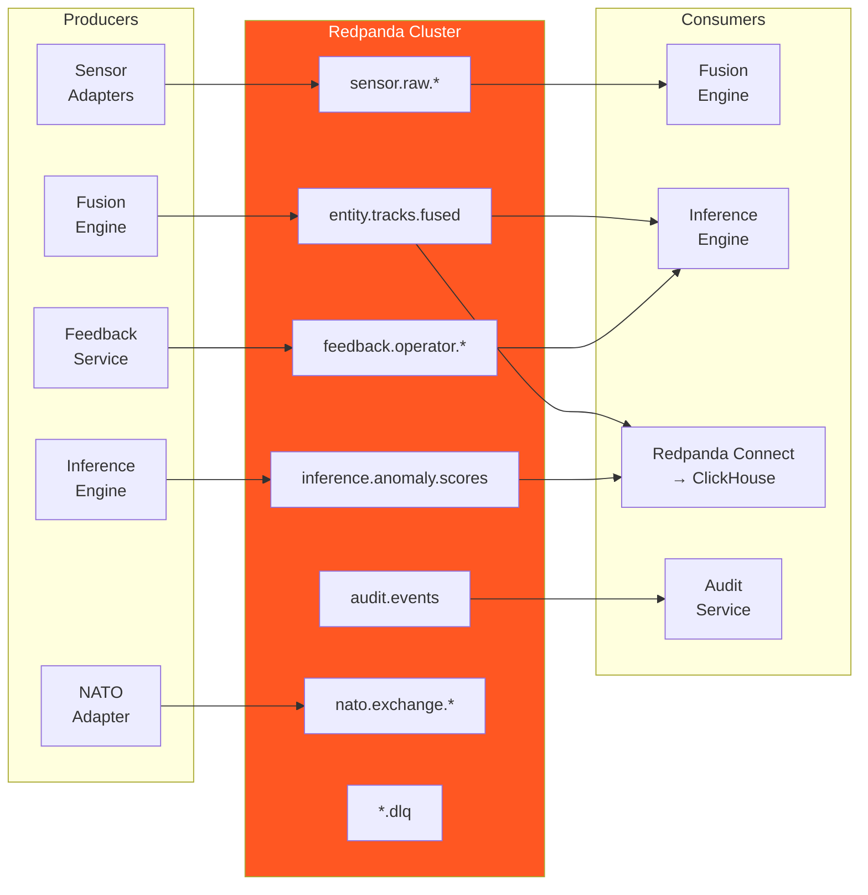

# Redpanda Guidelines

> **CLASSIFICATION: UNCLASSIFIED**
> **Document Type**: Technology-Specific Standard
> **Parent**: `00_master_policy.md`
> **Last Updated**: 2026-02-23

---

## 1. Purpose

Redpanda is the central event streaming backbone for RTSA. It serves as the real-time event log, audit trail, inter-service communication bus, and feedback routing mechanism. This document defines topic design, producer/consumer patterns, and operational standards.

## 2. Role in RTSA Architecture



## 3. Topic Design

### 3.1 Topic Naming Convention

```
<domain>.<entity>.<qualifier>

Examples:
  sensor.raw.radar
  sensor.raw.ew_sigint
  sensor.raw.elint_comint
  sensor.raw.isr
  sensor.raw.ais_bft
  sensor.raw.cyber
  entity.tracks.fused
  inference.anomaly.scores
  feedback.operator.submissions
  feedback.operator.validated
  audit.events
  nato.exchange.inbound
  nato.exchange.outbound
  *.dlq                         (dead-letter queue suffix)
```

### 3.2 Topic Configuration

| Topic Pattern | Partitions (DC) | Partitions (Edge) | Retention | Partition Key |
|---|---|---|---|---|
| `sensor.raw.*` | 12 | 3 | 24 hours | `sensor_id` |
| `entity.tracks.fused` | 12 | 3 | 48 hours | `track_id` |
| `inference.anomaly.scores` | 6 | 2 | 48 hours | `track_id` |
| `feedback.operator.submissions` | 3 | 1 | 7 days | `operator_id` |
| `feedback.operator.validated` | 3 | 1 | 7 days | `feedback_id` |
| `audit.events` | 6 | 2 | 30 days (DC), 7 days (edge) | `event_type` |
| `nato.exchange.inbound` | 3 | 1 | 24 hours | `message_type` |
| `nato.exchange.outbound` | 3 | 1 | 24 hours | `message_type` |

### 3.3 Replication

| Environment | Replication Factor | Min In-Sync Replicas |
|---|---|---|
| Data Centre (3+ brokers) | 3 | 2 |
| Staging (3 brokers) | 3 | 2 |
| Tactical Edge (1 broker) | 1 | 1 |

## 4. Producer Standards

### 4.1 Configuration

```go
// CLASSIFICATION: UNCLASSIFIED

cfg := kgo.NewClient(
    kgo.SeedBrokers(brokers...),
    kgo.DefaultProduceTopic(topic),
    kgo.ProducerBatchMaxBytes(1 * 1024 * 1024),  // 1 MB batch
    kgo.ProducerLinger(5 * time.Millisecond),     // Batch for 5ms
    kgo.RecordPartitioner(kgo.StickyKeyPartitioner(nil)),
    kgo.RequiredAcks(kgo.AllISRAcks()),           // Wait for all ISR
    kgo.ProducerOnDataLossDetected(func(topic string, partition int32) {
        slog.Error("data loss detected",
            "topic", topic,
            "partition", partition,
        )
    }),
)
```

### 4.2 Producer Rules

1. **Always set a partition key** — ensures ordering per entity
2. **Always wait for ACK** — use `AllISRAcks()` for durability
3. **Include schema version** in message headers
4. **Serialize with Protobuf** — not JSON (except audit events)
5. **Handle produce errors** — retry transient errors; route to DLQ on persistent failure
6. **Include correlation ID** in message headers for tracing

### 4.3 Message Headers

| Header | Required | Purpose |
|---|---|---|
| `rtsa-correlation-id` | Yes | Distributed tracing |
| `rtsa-schema-version` | Yes | Schema evolution |
| `rtsa-classification` | Yes | Data classification level |
| `rtsa-source-service` | Yes | Producer identification |
| `rtsa-timestamp` | Yes | Production timestamp (ISO 8601) |

## 5. Consumer Standards

### 5.1 Configuration

```go
// CLASSIFICATION: UNCLASSIFIED

cfg := kgo.NewClient(
    kgo.SeedBrokers(brokers...),
    kgo.ConsumerGroup(consumerGroup),
    kgo.ConsumeTopics(topics...),
    kgo.FetchMaxWait(100 * time.Millisecond),
    kgo.FetchMaxBytes(5 * 1024 * 1024),
    kgo.DisableAutoCommit(),  // Manual commit after processing
    kgo.BlockRebalanceOnPoll(),
)
```

### 5.2 Consumer Rules

1. **Manual offset commit** — commit only after successful processing
2. **Idempotent processing** — handle duplicate deliveries gracefully
3. **Monitor consumer lag** — alert when lag is increasing for > 10 minutes
4. **Graceful shutdown** — commit offsets and leave consumer group cleanly
5. **Dead-letter queue** — route unprocessable messages to `<topic>.dlq`
6. **Classification check** — verify message classification matches consumer's authorized level

### 5.3 Dead-Letter Queue Pattern

```go
// CLASSIFICATION: UNCLASSIFIED

func processRecord(ctx context.Context, record *kgo.Record) error {
    err := handler.Process(ctx, record)
    if err != nil {
        if isRetryable(err) {
            return err // Will be retried
        }
        // Non-retryable: send to DLQ
        dlqRecord := &kgo.Record{
            Topic: record.Topic + ".dlq",
            Key:   record.Key,
            Value: record.Value,
            Headers: append(record.Headers,
                kgo.RecordHeader{Key: "rtsa-dlq-reason", Value: []byte(err.Error())},
                kgo.RecordHeader{Key: "rtsa-dlq-timestamp", Value: []byte(time.Now().Format(time.RFC3339))},
            ),
        }
        return dlqProducer.ProduceSync(ctx, dlqRecord).FirstErr()
    }
    return nil
}
```

## 6. Schema Management

- All Redpanda messages use Protobuf serialization
- Schema versions tracked via `rtsa-schema-version` header
- Backward compatibility rules from `04_coding_standards/protobuf_grpc_standards.md` apply
- Consumer must handle messages from schema version N and N-1 (one-version tolerance)

## 7. Redpanda Connect (ETL to ClickHouse)

```yaml
# CLASSIFICATION: UNCLASSIFIED
# Redpanda Connect pipeline: sensor.raw.* → ClickHouse

input:
  kafka_franz:
    seed_brokers: ["${RTSA_REDPANDA_BROKERS}"]
    topics: ["sensor.raw.radar", "sensor.raw.ew_sigint"]
    consumer_group: "rtsa-clickhouse-sink"

pipeline:
  processors:
    - protobuf:
        operator: to_json
        message: rtsa.sensor.v1.SensorEvent
    - mapping: |
        root.event_id = this.event_id
        root.sensor_id = this.sensor_id
        root.sensor_type = this.sensor_type
        root.event_time = this.event_time
        root.latitude = this.position.latitude_deg
        root.longitude = this.position.longitude_deg
        root.altitude = this.position.altitude_m
        root.classification = this.classification
        root.ingestion_time = now()

output:
  sql_insert:
    driver: clickhouse
    dsn: "${RTSA_CLICKHOUSE_DSN}"
    table: sensor_events
    columns: [event_id, sensor_id, sensor_type, event_time, latitude, longitude, altitude, classification, ingestion_time]
    batching:
      count: 1000
      period: "1s"
```

## 8. Operational Procedures

| Procedure | How |
|---|---|
| Add a new topic | Define in IaC (Terraform/Helm); deploy via CI/CD |
| Increase partitions | Update IaC; apply carefully (rebalances consumers) |
| Monitor consumer lag | Grafana dashboard; alert on diverging lag |
| Recover from DLQ | Manual inspection; replay after fix |
| Edge broker recovery | Re-deploy from air-gap bundle; consumers resume from committed offsets |

## 9. AI Agent Instructions

When generating Redpanda-related code:

1. Use `franz-go` (`kgo`) client library — not sarama or confluent-kafka-go
2. Always set `AllISRAcks()` for producers
3. Always use manual offset commit for consumers
4. Include all required message headers (correlation-id, schema-version, classification, source-service, timestamp)
5. Route unprocessable messages to `<topic>.dlq` with reason header
6. Use Protobuf serialization — not JSON (except audit events)
7. Set partition key based on the entity ID (sensor_id, track_id, etc.)
