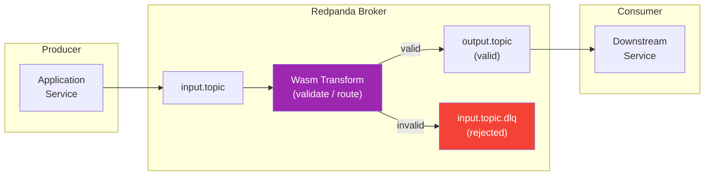

# Wasm Data Transforms

> **CLASSIFICATION: UNCLASSIFIED**
> **Document Type**: Technology-Specific Standard
> **Parent**: `00_master_policy.md`
> **Last Updated**: 2026-03-02

---

## 1. Purpose

Redpanda supports WebAssembly (Wasm) broker-side data transforms that execute inline as messages flow through topics. This document defines best practices for developing, testing, deploying, and operating Wasm transforms for real-time data validation, filtering, routing, and enrichment at the broker level — before messages reach consumer services.

## 2. Transform Architecture

Wasm transforms intercept messages between an input topic and one or more output topics, running validation, enrichment, or routing logic inside the Redpanda broker's sandbox:



**Key points:**
- Transforms run inside the broker — no network calls, no external dependencies
- Transforms execute synchronously on the message path — they must be fast
- Invalid messages are routed to dead-letter queues — never silently dropped

## 3. Use Cases for Wasm Transforms

Wasm transforms are best suited for lightweight, stateless data processing at the broker level:

| Pattern | Description | Example |
|---|---|---|
| **Input Validation** | Validate message format, field ranges, required fields | Reject messages with invalid coordinates, missing timestamps, malformed Protobuf |
| **Data Routing** | Route messages to different topics based on content | Route by message type, priority level, or geographic region |
| **Classification Guard** | Verify data classification markings | Block messages with incorrect classification for the target topic |
| **Pre-Filtering** | Remove or flag obviously invalid data before consumers process it | Filter spam submissions, reject statistically anomalous input |
| **Enrichment (lightweight)** | Add derived fields from existing message data | Compute hash, normalize timestamps, add processing metadata |

**Anti-patterns — do NOT use Wasm transforms for:**
- Complex business logic (belongs in consumer services)
- Stateful processing (transforms are stateless between messages)
- Network calls or external lookups (prohibited in the Wasm sandbox)
- Heavy computation (must complete in < 1ms per message)

## 4. Development Standards

### 4.1 Language Selection

| Language | SDK | When to Use |
|---|---|---|
| **Go** | `redpanda-data/redpanda/src/transform-sdk/go` | Default choice; team expertise |
| **Rust** | `redpanda-data/redpanda/src/transform-sdk/rust` | Performance-critical transforms requiring maximum efficiency |

### 4.2 Transform Template (Go)

```go
// CLASSIFICATION: UNCLASSIFIED

package main

import (
    "github.com/redpanda-data/redpanda/src/transform-sdk/go/transform"
)

func main() {
    transform.OnRecordWritten(processMessage)
}

func processMessage(event transform.WriteEvent, writer transform.RecordWriter) error {
    record := event.Record()

    // Step 1: Parse the message
    msg, err := parseMessage(record.Value)
    if err != nil {
        // Cannot parse: route to DLQ with reason
        record.Headers = append(record.Headers,
            transform.RecordHeader{
                Key:   []byte("dlq-reason"),
                Value: []byte("parse_error: " + err.Error()),
            },
        )
        return writer.Write(record, transform.ToTopic(record.Topic+".dlq"))
    }

    // Step 2: Validate fields
    if err := validate(msg); err != nil {
        record.Headers = append(record.Headers,
            transform.RecordHeader{
                Key:   []byte("dlq-reason"),
                Value: []byte("validation_error: " + err.Error()),
            },
        )
        return writer.Write(record, transform.ToTopic(record.Topic+".dlq"))
    }

    // Step 3: Route to output topic
    return writer.Write(record, transform.ToTopic(outputTopic(msg)))
}
```

### 4.3 Validation Transform Pattern

Validate message fields against expected ranges and required field presence:

```go
// CLASSIFICATION: UNCLASSIFIED

func validate(msg *Message) error {
    // Required fields
    if msg.ID == "" {
        return fmt.Errorf("id is required")
    }

    // Range checks
    if msg.Latitude < -90 || msg.Latitude > 90 {
        return fmt.Errorf("latitude out of range: %f", msg.Latitude)
    }
    if msg.Longitude < -180 || msg.Longitude > 180 {
        return fmt.Errorf("longitude out of range: %f", msg.Longitude)
    }

    // Timestamp checks (not in future, not too old)
    if msg.Timestamp.After(time.Now().Add(1 * time.Hour)) {
        return fmt.Errorf("timestamp in the future")
    }
    if msg.Timestamp.Before(time.Now().Add(-24 * time.Hour)) {
        return fmt.Errorf("timestamp too old")
    }

    return nil
}
```

### 4.4 Classification Guard Pattern

Verify that message classification markings are appropriate for the target topic:

```go
// CLASSIFICATION: UNCLASSIFIED

func classificationGuard(event transform.WriteEvent, writer transform.RecordWriter) error {
    record := event.Record()

    // Extract classification from message header
    var classification string
    for _, h := range record.Headers {
        if string(h.Key) == "classification" {
            classification = string(h.Value)
            break
        }
    }

    // Verify classification is allowed for this topic
    topicMaxLevel := getTopicClassificationLevel(event.Record().Topic)
    if !isClassificationAllowed(classification, topicMaxLevel) {
        // Classification violation — route to DLQ with alert metadata
        record.Headers = append(record.Headers,
            transform.RecordHeader{
                Key:   []byte("dlq-reason"),
                Value: []byte("classification_violation"),
            },
        )
        return writer.Write(record, transform.ToTopic(record.Topic+".dlq"))
    }

    return writer.Write(record)
}
```

## 5. Build and Deployment

### 5.1 Building Wasm Transforms

```bash
# Build Go Wasm transform
GOOS=wasip1 GOARCH=wasm go build -o my_transform.wasm ./transforms/my_transform/

# Or using Redpanda's rpk tool
rpk transform build --name my_transform
```

**Build best practices:**
- Use `GOOS=wasip1 GOARCH=wasm` for Go → Wasm compilation
- Keep the Wasm binary small — minimize imports and dependencies
- Test the Wasm binary locally before deploying to the cluster
- Version the transform alongside the service that depends on it

### 5.2 Deploying Transforms

```bash
# Deploy to Redpanda cluster
rpk transform deploy my_transform.wasm \
    --name my_transform \
    --input-topic source.topic \
    --output-topic validated.topic,source.topic.dlq

# List deployed transforms
rpk transform list

# Delete a transform
rpk transform delete my_transform
```

### 5.3 IaC Deployment

- Store transform binaries in an OCI registry alongside container images
- Deploy transforms via CI/CD pipeline (same flow as service updates)
- Version transforms alongside the service that produces to the input topic
- Use infrastructure-as-code to manage transform deployment configuration

## 6. Testing

### 6.1 Unit Tests

Test transforms with both valid and invalid inputs:

```go
// CLASSIFICATION: UNCLASSIFIED

func TestValidateMessage_ValidInput_PassesThrough(t *testing.T) {
    msg := validTestMessage()
    data, _ := proto.Marshal(msg)

    record := transform.Record{
        Value: data,
        Headers: []transform.RecordHeader{
            {Key: []byte("classification"), Value: []byte("UNCLASSIFIED")},
        },
    }

    writer := &mockRecordWriter{}
    err := processMessage(mockWriteEvent(record), writer)

    assert.NoError(t, err)
    assert.Equal(t, "validated.topic", writer.lastTopic)
}

func TestValidateMessage_InvalidField_RoutedToDLQ(t *testing.T) {
    msg := validTestMessage()
    msg.Latitude = 999.0 // Invalid
    data, _ := proto.Marshal(msg)

    record := transform.Record{Value: data}

    writer := &mockRecordWriter{}
    err := processMessage(mockWriteEvent(record), writer)

    assert.NoError(t, err)
    assert.Contains(t, writer.lastTopic, ".dlq")
}

func TestValidateMessage_MalformedInput_RoutedToDLQ(t *testing.T) {
    record := transform.Record{Value: []byte("not valid protobuf")}

    writer := &mockRecordWriter{}
    err := processMessage(mockWriteEvent(record), writer)

    assert.NoError(t, err)
    assert.Contains(t, writer.lastTopic, ".dlq")
}
```

### 6.2 Integration Tests

- Deploy the transform to a test Redpanda cluster (or Docker container)
- Produce test messages to the input topic
- Verify valid messages appear on the output topic
- Verify invalid messages appear on the DLQ with appropriate reason headers
- Verify transform does not crash on edge cases (empty messages, maximum size messages)

### 6.3 Fuzz Tests

Fuzz test input parsing to ensure transforms never crash on malformed data:

```go
func FuzzProcessMessage(f *testing.F) {
    f.Add([]byte{0x0a, 0x10, 0x74, 0x65, 0x73, 0x74})

    f.Fuzz(func(t *testing.T, data []byte) {
        record := transform.Record{Value: data}
        writer := &mockRecordWriter{}
        // Must not panic for any input
        _ = processMessage(mockWriteEvent(record), writer)
    })
}
```

## 7. Performance Constraints

Wasm transforms run inside the Redpanda broker and must not impact broker performance:

| Constraint | Limit | Rationale |
|---|---|---|
| Transform latency | < 1ms per message | Must not add significant latency to the message path |
| Memory usage | < 10 MB per transform | Broker memory budget |
| No network calls | Prohibited | Transforms run in the broker's Wasm sandbox |
| No disk I/O | Prohibited | Transforms are pure data processors |
| No external dependencies | Prohibited | Self-contained Wasm module |
| No mutable global state | Prohibited | Each message processed independently |

**Performance best practices:**
- pre-compile validation rules — avoid runtime regex compilation
- Avoid unnecessary memory allocation — reuse buffers where possible
- Keep transforms simple — complex logic belongs in consumer services
- Measure transform latency and report as a metric

## 8. Operational Best Practices

### 8.1 Monitoring

- Monitor transform throughput (messages/second processed)
- Monitor DLQ message count — a spike indicates data quality issues or upstream changes
- Monitor transform latency — should stay well under 1ms
- Alert on transform failures or crashes

### 8.2 Versioning and Rollback

- Deploy transforms with semantic versioning
- Keep the previous version available for quick rollback
- Test new versions in a staging environment before production deployment
- Use canary deployment patterns when possible (deploy to a subset of partitions first)

### 8.3 DLQ Management

- Set longer retention on DLQ topics than on source topics
- Implement a DLQ reprocessing tool for replaying messages after fixes
- Review DLQ content regularly — persistent DLQ accumulation indicates upstream issues
- Include original topic, error reason, and timestamp in DLQ message headers

## 9. AI Agent Instructions

When generating Wasm transform code:

1. Use the Redpanda transform SDK (`transform.OnRecordWritten`)
2. Route invalid messages to `<topic>.dlq` — never drop messages silently
3. Include DLQ reason in message headers for all rejected messages
4. Keep transforms stateless — no state between messages
5. No network calls, no disk I/O, no external dependencies
6. Target < 1ms per message — transforms must be fast
7. Build with `GOOS=wasip1 GOARCH=wasm`
8. Include comprehensive unit tests with valid, invalid, and fuzz inputs
9. Include classification guard logic when transforms handle data with classification markings
10. Version transforms alongside the services that depend on them
