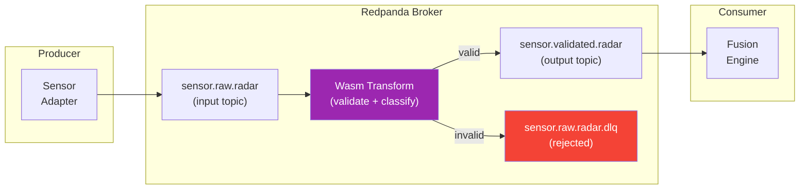

# Wasm Data Transforms

> **CLASSIFICATION: UNCLASSIFIED**
> **Document Type**: Technology-Specific Standard
> **Parent**: `00_master_policy.md`
> **Last Updated**: 2026-02-23

---

## 1. Purpose

Redpanda supports WebAssembly (Wasm) broker-side data transforms that execute inline as messages flow through topics. RTSA uses Wasm transforms for real-time data validation, classification enforcement, and anti-poisoning pre-filtering at the broker level — before messages reach consumer services.

## 2. Transform Architecture



## 3. Use Cases for Wasm Transforms

| Transform | Input Topic | Output Topic | Purpose |
|---|---|---|---|
| Sensor Validation | `sensor.raw.*` | `sensor.validated.*` | Validate coordinates, timestamps, required fields |
| Classification Guard | Any | Same (or DLQ) | Verify classification marking; block misclassified data |
| Feedback Pre-Filter | `feedback.operator.submissions` | `feedback.operator.prefiltered` | Basic trust score check; obvious spam rejection |
| NATO Inbound Validator | `nato.exchange.inbound` | `nato.validated.inbound` | Validate STANAG/NFFI message structure |

## 4. Development Standards

### 4.1 Language

- Write transforms in **Go** compiled to Wasm (via `redpanda-labs/redpanda-data-transformer` SDK)
- Alternatively, Rust → Wasm is acceptable for performance-critical transforms

### 4.2 Go Wasm Transform Template

```go
// CLASSIFICATION: UNCLASSIFIED

package main

import (
    "github.com/redpanda-data/redpanda/src/transform-sdk/go/transform"
)

func main() {
    transform.OnRecordWritten(validateSensorEvent)
}

func validateSensorEvent(event transform.WriteEvent, writer transform.RecordWriter) error {
    record := event.Record()

    // Parse the protobuf message
    sensor := &SensorEvent{}
    if err := proto.Unmarshal(record.Value, sensor); err != nil {
        // Cannot parse: route to DLQ
        return writer.Write(record, transform.ToTopic("sensor.raw.dlq"))
    }

    // Validate coordinates
    if sensor.Position != nil {
        if sensor.Position.LatitudeDeg < -90 || sensor.Position.LatitudeDeg > 90 {
            return writer.Write(record, transform.ToTopic("sensor.raw.dlq"))
        }
        if sensor.Position.LongitudeDeg < -180 || sensor.Position.LongitudeDeg > 180 {
            return writer.Write(record, transform.ToTopic("sensor.raw.dlq"))
        }
    }

    // Validate timestamp (not in future, not too old)
    eventTime := time.Unix(sensor.EventTime.Seconds, int64(sensor.EventTime.Nanos))
    if eventTime.After(time.Now().Add(1 * time.Hour)) {
        return writer.Write(record, transform.ToTopic("sensor.raw.dlq"))
    }
    if eventTime.Before(time.Now().Add(-24 * time.Hour)) {
        return writer.Write(record, transform.ToTopic("sensor.raw.dlq"))
    }

    // Validate required fields
    if sensor.SensorId == "" || sensor.SensorType == SENSOR_TYPE_UNSPECIFIED {
        return writer.Write(record, transform.ToTopic("sensor.raw.dlq"))
    }

    // Valid: route to validated topic
    return writer.Write(record, transform.ToTopic("sensor.validated."+sensorTypeName(sensor.SensorType)))
}
```

### 4.3 Classification Guard Transform

```go
// CLASSIFICATION: UNCLASSIFIED

func classificationGuard(event transform.WriteEvent, writer transform.RecordWriter) error {
    record := event.Record()

    // Extract classification from message header
    var classification string
    for _, h := range record.Headers {
        if string(h.Key) == "rtsa-classification" {
            classification = string(h.Value)
            break
        }
    }

    // Verify classification matches topic's allowed level
    topicClassification := getTopicClassification(event.Record().Topic)
    if !isClassificationAllowed(classification, topicClassification) {
        // CRITICAL: Classification violation — route to DLQ and alert
        record.Headers = append(record.Headers,
            transform.RecordHeader{
                Key:   []byte("rtsa-dlq-reason"),
                Value: []byte("classification_violation"),
            },
        )
        return writer.Write(record, transform.ToTopic(record.Topic+".dlq"))
    }

    return writer.Write(record)
}
```

## 5. Build and Deployment

### 5.1 Build

```bash
# Build Wasm transform
GOOS=wasip1 GOARCH=wasm go build -o sensor_validator.wasm ./transforms/sensor_validator/

# Or using Redpanda's rpk tool
rpk transform build --name sensor_validator
```

### 5.2 Deploy

```bash
# Deploy to Redpanda cluster
rpk transform deploy sensor_validator.wasm \
    --name sensor_validator \
    --input-topic sensor.raw.radar \
    --output-topic sensor.validated.radar,sensor.raw.dlq

# List transforms
rpk transform list

# Delete transform
rpk transform delete sensor_validator
```

### 5.3 IaC Deployment

- Transform binaries stored in OCI registry alongside container images
- Deployed via CI/CD pipeline (same flow as service updates)
- Versioned alongside the service that depends on the transform

## 6. Testing

### 6.1 Unit Tests

```go
// CLASSIFICATION: UNCLASSIFIED

func TestValidateSensorEvent_ValidRadarEvent_PassesThrough(t *testing.T) {
    event := syntheticRadarEvent()
    data, _ := proto.Marshal(event)

    record := transform.Record{
        Value: data,
        Headers: []transform.RecordHeader{
            {Key: []byte("rtsa-classification"), Value: []byte("UNCLASSIFIED")},
        },
    }

    writer := &mockRecordWriter{}
    err := validateSensorEvent(mockWriteEvent(record), writer)

    assert.NoError(t, err)
    assert.Equal(t, "sensor.validated.radar", writer.lastTopic)
}

func TestValidateSensorEvent_InvalidCoordinates_RoutedToDLQ(t *testing.T) {
    event := syntheticRadarEvent()
    event.Position.LatitudeDeg = 999.0 // Invalid
    data, _ := proto.Marshal(event)

    record := transform.Record{Value: data}

    writer := &mockRecordWriter{}
    err := validateSensorEvent(mockWriteEvent(record), writer)

    assert.NoError(t, err)
    assert.Equal(t, "sensor.raw.dlq", writer.lastTopic)
}
```

### 6.2 Integration Tests

- Deploy transform to test Redpanda cluster
- Produce test messages to input topic
- Verify valid messages appear on output topic
- Verify invalid messages appear on DLQ

## 7. Performance Constraints

| Constraint | Limit | Rationale |
|---|---|---|
| Transform latency | < 1ms per message | Must not add significant latency |
| Memory usage | < 10 MB per transform | Broker memory budget |
| No network calls | Prohibited | Transforms run in broker sandbox |
| No disk I/O | Prohibited | Transforms are pure data processors |
| No external dependencies | Prohibited | Self-contained Wasm module |

## 8. AI Agent Instructions

When generating Wasm transform code:

1. Use the Redpanda transform SDK (`transform.OnRecordWritten`)
2. Route invalid messages to `<topic>.dlq` — never drop messages silently
3. Include classification guard logic in all transforms
4. Keep transforms stateless — no state between messages
5. No network calls, no disk I/O, no external dependencies
6. Target < 1ms per message — transforms must be fast
7. Build with `GOOS=wasip1 GOARCH=wasm`
8. Include comprehensive unit tests with valid and invalid inputs
