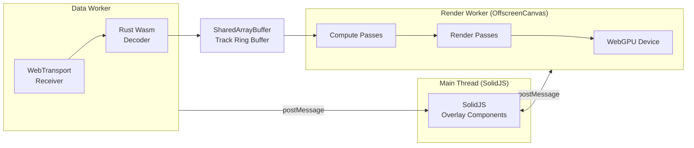
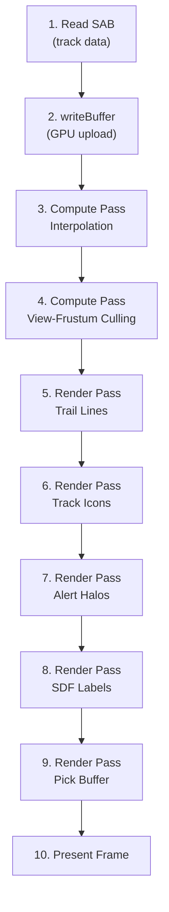
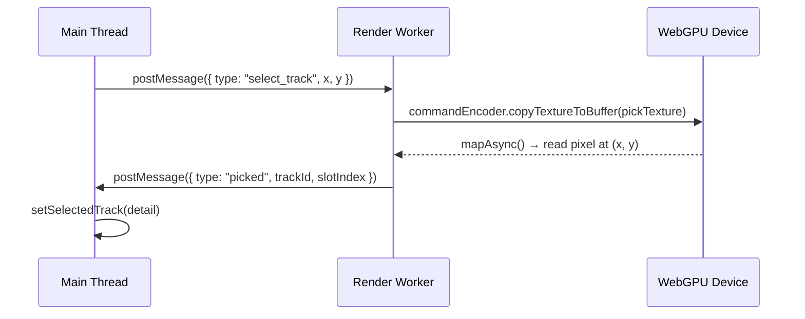

<!-- CLASSIFICATION: UNCLASSIFIED -->
# WebGPU Development Guidelines

> **Document**: RTSA WebGPU Development Guidelines
> **Version**: 1.0
> **Classification**: UNCLASSIFIED
> **Last Updated**: 2026-03-05
> **Prerequisite**: Load `general_coding.md`, `secure_coding.md`, and `wgsl_shader_standards.md` first

---

## 1. Overview

The RTSA COP uses WebGPU as its primary rendering API, replacing MapLibre GL JS / WebGL. All track rendering, label display, trail lines, alert halos, and spatial selection run on the GPU via WebGPU compute and render passes.

### Performance Targets

| Metric | Target |
|---|---|
| Sustained track count | 50,000 @ 60 FPS |
| Update-to-pixel latency | < 16 ms |
| Main thread CPU | < 20% |
| VRAM budget (GPU buffers) | < 512 MB |
| Browser ingestion throughput | 50,000+ msg/s |

---

## 2. Architecture Context



The WebGPU device is acquired in the **Render Worker** and operates on an `OffscreenCanvas` transferred from the main thread. The main thread never touches WebGPU directly.

---

## 3. Device Initialization

### 3.1 Adapter & Device Acquisition

```typescript
// CLASSIFICATION: UNCLASSIFIED
// src/gpu/device.ts

export async function initGPU(canvas: OffscreenCanvas): Promise<{
  device: GPUDevice;
  context: GPUCanvasContext;
  format: GPUTextureFormat;
}> {
  const adapter = await navigator.gpu.requestAdapter({
    powerPreference: "high-performance",
  });
  if (!adapter) throw new Error("WebGPU adapter unavailable");

  const device = await adapter.requestDevice({
    requiredLimits: {
      maxStorageBufferBindingSize: adapter.limits.maxStorageBufferBindingSize,
      maxBufferSize: adapter.limits.maxBufferSize,
    },
  });

  device.lost.then((info) => {
    console.error(`WebGPU device lost: ${info.reason}`, info.message);
    // Attempt re-initialization after delay
    if (info.reason !== "destroyed") {
      setTimeout(() => initGPU(canvas), 1000);
    }
  });

  const context = canvas.getContext("webgpu")!;
  const format = navigator.gpu.getPreferredCanvasFormat();
  context.configure({ device, format, alphaMode: "premultiplied" });

  return { device, context, format };
}
```

### 3.2 Capability Gate

Before launching the Render Worker, the main thread must verify browser capabilities:

```typescript
// CLASSIFICATION: UNCLASSIFIED

export async function checkCapabilities(): Promise<{
  webgpu: boolean;
  webtransport: boolean;
  sharedArrayBuffer: boolean;
  offscreenCanvas: boolean;
}> {
  return {
    webgpu: "gpu" in navigator,
    webtransport: "WebTransport" in globalThis,
    sharedArrayBuffer: typeof SharedArrayBuffer !== "undefined",
    offscreenCanvas: typeof OffscreenCanvas !== "undefined",
  };
}
```

All four capabilities are **required**. Display a degraded-mode notice if any are missing.

---

## 4. Buffer Management

### 4.1 Track Buffer Layout

Track data arrives as 128-byte FlatBuffer records written to SharedArrayBuffer by the Data Worker. The Render Worker creates a GPU storage buffer mirroring this layout:

```
Offset  Size  Type       Field
──────  ────  ─────────  ─────────────────
0x00    4     f32        longitude (radians)
0x04    4     f32        latitude (radians)
0x08    4     f32        course (radians)
0x0C    4     f32        speed (m/s)
0x10    4     f32        altitude (meters)
0x14    4     u32        track_id_hash
0x18    4     u32        source_bitmap
0x1C    4     u32        classification_level
0x20    4     u32        threat_level (0-5 enum)
0x24    4     u32        icon_index (atlas row)
0x28    4     u32        alert_flags (bitmask)
0x2C    4     u32        update_epoch_ms
0x30    16    [f32; 4]   trail_ring[0] (lon, lat, lon, lat)
0x40    16    [f32; 4]   trail_ring[1]
0x50    16    [f32; 4]   trail_ring[2]
0x60    16    [f32; 4]   trail_ring[3]
0x70    16    [f32; 4]   trail_ring[4]
```

**Total: 128 bytes per track (GPU-aligned, no padding needed)**

### 4.2 Buffer Upload Strategy

```typescript
// CLASSIFICATION: UNCLASSIFIED

function uploadTrackData(
  device: GPUDevice,
  trackBuffer: GPUBuffer,
  sab: SharedArrayBuffer,
  trackCount: number
) {
  const byteLength = trackCount * 128;
  // Read from SharedArrayBuffer into staging
  const src = new Uint8Array(sab, 0, byteLength);
  device.queue.writeBuffer(trackBuffer, 0, src, 0, byteLength);
}
```

### 4.3 Buffer Sizing Rules

| Buffer | Size Formula | Typical (50k tracks) |
|---|---|---|
| Track storage | `maxTracks × 128` | 6.1 MB |
| Instance quads | `maxTracks × 64` | 3.1 MB |
| Pick buffer | `canvasWidth × canvasHeight × 4` | ~8.3 MB (1920×1080) |
| Icon atlas | 2048 × 2048 × RGBA | 16 MB |
| SDF font atlas | 2048 × 1024 × R8 | 2 MB |
| Trail line vertices | `maxTracks × 5 × 16` | 3.8 MB |
| Uniform buffers | ~1 KB per pipeline | < 16 KB |
| **Total VRAM** | | **~40 MB** (well within 512 MB budget) |

### 4.4 Buffer Lifecycle Rules

1. **Create once, reuse** — allocate max-capacity buffers at startup, not per-frame
2. **No per-frame allocation** — buffer creation triggers pipeline stalls
3. **Use `device.queue.writeBuffer`** — for <64 KB updates, simpler than staging buffers
4. **Use staging buffers** — for larger updates (full SAB upload uses `writeBuffer` for simplicity since it copies from CPU-side SAB)
5. **Destroy on device lost** — all GPU objects become invalid; re-create after new device

---

## 5. Render Pipeline Architecture

### 5.1 Per-Frame Pipeline



### 5.2 Compute Pass Guidelines

- **Workgroup size**: Use `@workgroup_size(256)` for track-parallel compute shaders
- **Dispatch**: `ceil(trackCount / 256)` workgroups
- **Read from**: Track storage buffer (readonly)
- **Write to**: Instance buffer (read_write) or indirect draw args
- **No atomics needed**: Each thread writes to its own slot

### 5.3 Render Pass Guidelines

- Use **instanced rendering**: one draw call per layer, `instanceCount = visibleTrackCount`
- Bind the instance buffer from the compute output
- Use `GPURenderPassDescriptor.colorAttachments[0].loadOp = "clear"` only on the first pass
- Subsequent passes use `loadOp: "load"` to composite layers

### 5.4 Pipeline Caching

```typescript
// CLASSIFICATION: UNCLASSIFIED

// Create all pipelines at init, never per-frame
const trackIconPipeline = device.createRenderPipeline({
  label: "track-icons",
  layout: "auto",
  vertex: {
    module: device.createShaderModule({ code: trackIconsWGSL }),
    entryPoint: "vs_main",
  },
  fragment: {
    module: device.createShaderModule({ code: trackIconsWGSL }),
    entryPoint: "fs_main",
    targets: [{ format }],
  },
  primitive: { topology: "triangle-strip", stripIndexFormat: undefined },
});
```

---

## 6. Icon & SDF Atlas Management

### 6.1 Icon Atlas

- Single 2048×2048 RGBA texture atlas containing all NATO APP-6 symbology icons
- Each icon occupies a 64×64 cell → max 1024 unique icons
- Icon index stored in track record field `icon_index` → maps to atlas row/column
- Atlas loaded once at startup, never regenerated at runtime

### 6.2 SDF Text Atlas

- Signed Distance Field font atlas for GPU-rendered text labels
- Eliminates all DOM-based label overlays (source of DOM thrashing in React COP)
- Single 2048×1024 R8 texture → ~2 MB VRAM
- Font glyphs baked at build time using `msdf-atlas-gen` or equivalent

### 6.3 Atlas Update Rules

1. Atlas textures are **immutable at runtime** — baked at build time
2. To add new icons: update atlas source, rebuild, deploy
3. Never generate textures from HTML Canvas at runtime (perf anti-pattern)

---

## 7. Pick Buffer (Spatial Selection)

### 7.1 How It Works

A secondary render target writes `track_id_hash` values (u32) instead of colors. On click, `readBufferAsync` retrieves the pixel under the cursor → O(1) track identification.



### 7.2 Performance Rules

- Pick buffer renders in a **separate render pass** (not multisampled)
- Pick buffer resolution can be **half** canvas resolution to save VRAM/bandwidth
- `readBufferAsync` is async — do not block the render loop waiting for it
- Only read on user interaction (click/tap), never per-frame

---

## 8. OffscreenCanvas Rules

### 8.1 Initialization

```typescript
// CLASSIFICATION: UNCLASSIFIED
// Main thread — transfer canvas to Render Worker

const canvas = document.getElementById("map-canvas") as HTMLCanvasElement;
const offscreen = canvas.transferControlToOffscreen();

const renderWorker = new Worker(
  new URL("./workers/render-worker.ts", import.meta.url),
  { type: "module" }
);

renderWorker.postMessage({ type: "init", canvas: offscreen, sab }, [offscreen]);
```

### 8.2 Rules

1. **Transfer once** — `transferControlToOffscreen()` can only be called once per canvas
2. **Resize via postMessage** — main thread sends new dimensions when window resizes
3. **Never touch canvas from main thread** after transfer
4. **requestAnimationFrame alternative** — in Workers, use `setInterval(render, 16)` or a self-scheduling `postMessage` loop

---

## 9. Error Handling

### 9.1 Device Lost Recovery

```typescript
// CLASSIFICATION: UNCLASSIFIED

device.lost.then(async (info) => {
  if (info.reason === "destroyed") return; // Intentional cleanup
  // Log telemetry event
  console.error(`GPU device lost: ${info.reason}`);
  // Re-initialize after delay
  const { device: newDevice } = await initGPU(canvas);
  rebuildAllPipelines(newDevice);
  rebuildAllBuffers(newDevice);
});
```

### 9.2 Validation Errors

During development, enable WebGPU error scopes:

```typescript
device.pushErrorScope("validation");
// ... GPU operations ...
device.popErrorScope().then((error) => {
  if (error) console.warn("WebGPU validation:", error.message);
});
```

**Rule**: Error scope checking must be removed or disabled in production builds.

### 9.3 Out-of-Memory

- Monitor `adapter.limits.maxBufferSize` before allocation
- If buffer creation fails, cap track count and log a warning

---

## 10. Performance Guard Rails

| Rule | Rationale |
|---|---|
| Max 1 `writeBuffer` per frame for track data | Minimize CPU→GPU transfers |
| Max 2 compute passes per frame | Interpolation + culling are sufficient |
| Max 5 render passes per frame | Trails, icons, halos, labels, pick |
| No texture creation after init | Runtime texture alloc causes stalls |
| No `mapAsync` in render loop (except pick on click) | Blocks GPU pipeline |
| All pipelines created at init | Pipeline compilation is expensive |
| Uniform buffer updates via `writeBuffer` | Not `mapAsync` for small uniforms |
| Track capacity pre-allocated to max (65,536) | Avoids buffer reallocation |

---

## 11. Security Considerations

1. **No shader injection** — WGSL source is bundled at build time, never user-provided
2. **VRAM exhaustion protection** — cap total buffer allocation at 512 MB
3. **Timer precision** — WebGPU GPU timestamps may be fingerprinting vectors; do not expose raw timestamps to the main thread
4. **Out-of-bounds reads** — WGSL enforces array bounds checking at runtime; no action needed
5. **Cross-origin isolation** — required for SharedArrayBuffer, also limits certain resource loading; see `webtransport_guidelines.md` §7

---

## 12. Cross-References

| Document | Path |
|---|---|
| WGSL Shader Standards | `docs/sdlc_guidelines/08_tech_specific/wgsl_shader_standards.md` |
| FlatBuffers Guidelines | `docs/sdlc_guidelines/08_tech_specific/flatbuffers_guidelines.md` |
| WebTransport Guidelines | `docs/sdlc_guidelines/08_tech_specific/webtransport_guidelines.md` |
| SolidJS Standards | `docs/sdlc_guidelines/04_coding_standards/solidjs_standards.md` |
| v1 Architecture — WebGPU Section | `docs/architecture/v1/RTSA_WebGPU_Architecture_v1.md` §4–5 |
| Component Design | `docs/architecture/component_design.md` |
