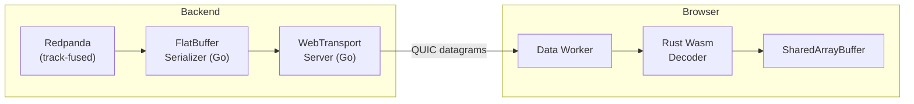
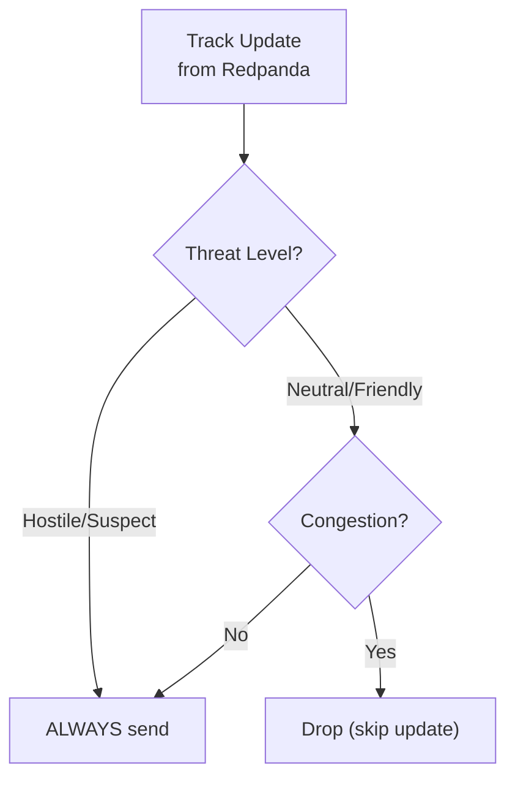
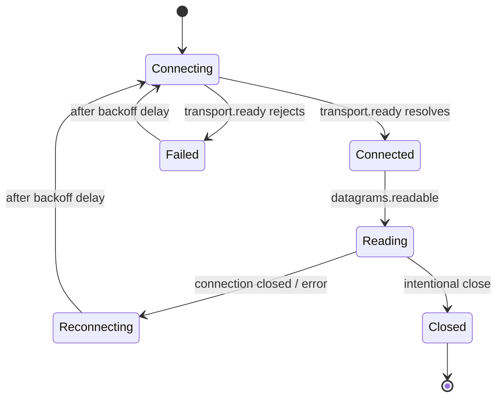

<!-- CLASSIFICATION: UNCLASSIFIED -->
# WebTransport Development Guidelines

> **Document**: RTSA WebTransport Development Guidelines
> **Version**: 1.0
> **Classification**: UNCLASSIFIED
> **Last Updated**: 2026-03-05
> **Prerequisite**: Load `general_coding.md`, `secure_coding.md`, and `flatbuffers_guidelines.md` first

---

## 1. Overview

WebTransport is the **hot-path delivery mechanism** in the RTSA WebGPU architecture. It replaces gRPC-Web streaming for real-time track position updates, providing QUIC-based unreliable datagrams that eliminate head-of-line blocking and enable sub-16ms delivery to the browser.

### Dual-Protocol Summary

| Path | Protocol | Format | Transport | Use Case |
|---|---|---|---|---|
| **Hot** | WebTransport | FlatBuffers | QUIC unreliable datagrams | Track positions, alert push |
| **Cold** | gRPC-Web | Protobuf | HTTP/2 (via Envoy) | Commands, queries, feedback |

---

## 2. Architecture



---

## 3. Go Server Implementation

### 3.1 Location

```
pkg/webtransport/
├── server.go            # WebTransport server (quic-go based)
├── server_test.go       # Unit tests
├── session.go           # Per-client session management
├── priority.go          # Load shedding / priority logic
└── auth.go              # Session authentication (JWT validation)
```

### 3.2 Server Setup

```go
// CLASSIFICATION: UNCLASSIFIED
// pkg/webtransport/server.go

package webtransport

import (
    "context"
    "crypto/tls"
    "net/http"

    "github.com/quic-go/quic-go/http3"
    "github.com/quic-go/webtransport-go"
)

type Server struct {
    wt       *webtransport.Server
    sessions *SessionManager
    logger   *slog.Logger
}

func NewServer(cfg Config, tlsConf *tls.Config, logger *slog.Logger) (*Server, error) {
    wts := &webtransport.Server{
        H3: http3.Server{
            Addr:      cfg.ListenAddr,
            TLSConfig: tlsConf,
        },
        CheckOrigin: func(r *http.Request) bool {
            return isAllowedOrigin(r, cfg.AllowedOrigins)
        },
    }

    return &Server{
        wt:       wts,
        sessions: NewSessionManager(cfg.MaxSessions, logger),
        logger:   logger,
    }, nil
}

func (s *Server) HandleSession(w http.ResponseWriter, r *http.Request) {
    // Validate JWT from query parameter or header
    claims, err := validateSessionAuth(r)
    if err != nil {
        http.Error(w, "unauthorized", http.StatusUnauthorized)
        return
    }

    session, err := s.wt.Upgrade(w, r)
    if err != nil {
        s.logger.Error("WebTransport upgrade failed", "error", err)
        return
    }

    s.sessions.Register(session, claims)
    defer s.sessions.Unregister(session)

    // Start sending track updates via datagrams
    s.streamTrackUpdates(r.Context(), session, claims)
}
```

### 3.3 Datagram Sending

```go
// CLASSIFICATION: UNCLASSIFIED

func (s *Server) streamTrackUpdates(
    ctx context.Context,
    session *webtransport.Session,
    claims *SessionClaims,
) {
    consumer := s.redpandaConsumer.Subscribe("track-fused")
    defer consumer.Close()

    builder := flatbuffers.NewBuilder(256)

    for {
        select {
        case <-ctx.Done():
            return
        case msg := <-consumer.Messages():
            track := decodeProtobufTrack(msg.Value)

            // Classification filter — drop records above operator clearance
            if track.ClassificationLevel > claims.ClearanceLevel {
                continue
            }

            data := flatbuf.SerializeTrackUpdate(builder, track)

            if err := session.SendDatagram(data); err != nil {
                // Datagram send failure is expected under load
                // (QUIC flow control). Log at DEBUG, not ERROR.
                s.logger.Debug("datagram send failed",
                    "error", err,
                    "session_id", session.ID(),
                )
            }
        }
    }
}
```

---

## 4. Datagram vs Stream Mode

### 4.1 When to Use Datagrams

| Data Type | Mode | Rationale |
|---|---|---|
| Track position updates | **Datagram** (unreliable) | Stale positions are worthless; skip and get latest |
| Alert notifications | **Stream** (reliable) | Alerts must be delivered exactly once |
| Session metadata | **Stream** (reliable) | Initial handshake data |
| Heartbeat / keepalive | **Datagram** (unreliable) | Loss is acceptable |

### 4.2 Datagram Rules

- **Max datagram size**: QUIC limits datagrams to ~1200 bytes (MTU). Our 128-byte records fit easily.
- **No ordering guarantee**: Records may arrive out of order. The `update_epoch_ms` field is the authoritative timestamp.
- **No delivery guarantee**: Track updates are designed to be overwritten by the next update, so loss is acceptable.
- **Batch up to 9 records per datagram**: `9 × 128 = 1152 bytes < 1200 MTU`. Batching reduces per-packet overhead.

### 4.3 Stream Rules

For reliable data (alerts), open a unidirectional stream from server to client:

```go
// CLASSIFICATION: UNCLASSIFIED

stream, err := session.OpenUniStream()
if err != nil {
    return err
}
defer stream.Close()

// Write length-prefixed Protobuf alert
alertData, _ := proto.Marshal(alert)
binary.Write(stream, binary.LittleEndian, uint32(len(alertData)))
stream.Write(alertData)
```

---

## 5. Priority Shedding (Load Management)

### 5.1 When Load Exceeds Capacity

When the server detects congestion (QUIC flow control backpressure or high CPU):



### 5.2 Priority Rules

| Priority | Threat Level | Behavior Under Load |
|---|---|---|
| P0 (Critical) | Hostile | Always delivered |
| P1 (High) | Suspect | Delivered unless severe congestion |
| P2 (Normal) | Neutral, Pending | Dropped first under load |
| P3 (Low) | Friendly, Unknown | Dropped aggressively under load |

### 5.3 Implementation

```go
// CLASSIFICATION: UNCLASSIFIED

func (s *Server) shouldSend(track *trackpb.TrackUpdate, congested bool) bool {
    if !congested {
        return true
    }
    switch track.ThreatLevel {
    case trackpb.ThreatLevel_HOSTILE, trackpb.ThreatLevel_SUSPECT:
        return true
    default:
        return false
    }
}
```

---

## 6. Browser Data Worker Integration

### 6.1 WebTransport Client in Data Worker

```typescript
// CLASSIFICATION: UNCLASSIFIED
// src/workers/data-worker.ts

const RECORD_SIZE = 128;

async function connectWebTransport(url: string, sab: SharedArrayBuffer) {
  const transport = new WebTransport(url);
  await transport.ready;

  const reader = transport.datagrams.readable.getReader();
  let slotIndex = 0;
  const maxSlots = sab.byteLength / RECORD_SIZE;

  while (true) {
    const { value: datagram, done } = await reader.read();
    if (done) break;

    // Rust Wasm decoder writes directly to SharedArrayBuffer
    const ok = wasmDecoder.decode_track_update(
      datagram,
      sabPtr,
      slotIndex % maxSlots,
      maxSlots
    );

    if (ok) {
      slotIndex++;
    }
  }
}
```

### 6.2 Connection Lifecycle



### 6.3 Reconnection Strategy

```typescript
// CLASSIFICATION: UNCLASSIFIED

const MAX_BACKOFF_MS = 30_000;
const BASE_BACKOFF_MS = 1_000;

async function connectWithRetry(url: string, sab: SharedArrayBuffer) {
  let attempt = 0;
  while (true) {
    try {
      await connectWebTransport(url, sab);
    } catch (err) {
      attempt++;
      const delay = Math.min(BASE_BACKOFF_MS * 2 ** attempt, MAX_BACKOFF_MS);
      postMessage({ type: "connection_status", connected: false, latency: -1 });
      await sleep(delay);
    }
  }
}
```

---

## 7. Security

### 7.1 Session Authentication

WebTransport sessions are authenticated via JWT token passed in the connection URL:

```
https://rtsa.mil.ca/wt?token=<JWT>
```

The Go server validates the JWT before accepting the session upgrade (see §3.2).

**Rules**:
- JWT tokens are short-lived (5 min TTL) and refreshed via gRPC cold path
- Tokens include operator clearance level (used for classification filtering)
- Token refresh happens on the gRPC cold path, not through WebTransport

### 7.2 TLS Requirements

- WebTransport runs over QUIC, which mandates TLS 1.3
- Use CSE-approved cipher suites per ITSG-33
- Certificate pinning recommended for deployed environments
- In development: self-signed certificates are acceptable with explicit trust

### 7.3 Cross-Origin Isolation

WebTransport + SharedArrayBuffer requires cross-origin isolation headers:

```
Cross-Origin-Opener-Policy: same-origin
Cross-Origin-Embedder-Policy: require-corp
```

These headers are set by the HTTP/3 proxy (Envoy/Caddy) serving the SolidJS application.

### 7.4 Classification Filtering

The WebTransport server **must** filter track records based on operator clearance level before sending. Records with `classification_level > operator_clearance` are dropped server-side and never reach the browser.

### 7.5 Audit Trail

All WebTransport session events are logged to the audit topic:

| Event | Logged Fields |
|---|---|
| Session opened | session_id, operator_id, clearance_level, client_ip, timestamp |
| Session closed | session_id, duration, bytes_sent, datagrams_sent, close_reason |
| Auth failure | client_ip, token_hash (not raw token), reason, timestamp |

---

## 8. Monitoring & Metrics

### 8.1 Server-Side Metrics (OpenTelemetry)

| Metric | Type | Labels |
|---|---|---|
| `webtransport_sessions_active` | Gauge | — |
| `webtransport_datagrams_sent_total` | Counter | `priority` |
| `webtransport_datagrams_dropped_total` | Counter | `reason` (congestion, classification) |
| `webtransport_session_duration_seconds` | Histogram | — |
| `webtransport_bytes_sent_total` | Counter | — |

### 8.2 Client-Side Metrics (Data Worker → Main Thread)

| Metric | Frequency | Delivery |
|---|---|---|
| Connection state | On change | `postMessage` to main thread |
| Datagrams received/sec | Every 1s | `postMessage` stats |
| Decode failures | On occurrence | `postMessage` error |
| Round-trip latency estimate | Every 5s | Derived from `update_epoch_ms` delta |

---

## 9. Testing

### 9.1 Go Server Unit Tests

```go
// CLASSIFICATION: UNCLASSIFIED

func TestServer_ClassificationFiltering(t *testing.T) {
    claims := &SessionClaims{ClearanceLevel: 2}
    track := &trackpb.TrackUpdate{ClassificationLevel: 3}

    // Should not send — track above operator clearance
    assert.False(t, server.shouldSendToSession(track, claims))
}

func TestServer_PriorityShedding(t *testing.T) {
    hostile := &trackpb.TrackUpdate{ThreatLevel: trackpb.ThreatLevel_HOSTILE}
    friendly := &trackpb.TrackUpdate{ThreatLevel: trackpb.ThreatLevel_FRIENDLY}

    assert.True(t, server.shouldSend(hostile, true))   // Always send hostile
    assert.False(t, server.shouldSend(friendly, true))  // Drop friendly under load
}
```

### 9.2 Integration Tests

Integration tests use a real `quic-go` WebTransport server with self-signed certificates:

```go
// tests/integration/webtransport_test.go
func TestWebTransport_EndToEnd(t *testing.T) {
    // Start WebTransport server
    // Connect client
    // Send FlatBuffer datagrams
    // Verify datagrams received
    // Verify classification filtering
}
```

### 9.3 Browser E2E Tests

Playwright tests verify:
1. WebTransport connection established (check connection indicator in SolidJS UI)
2. Tracks appear on WebGPU canvas after connection
3. Reconnection works after server restart
4. Classification filtering prevents unauthorized track display

---

## 10. Configuration

### 10.1 Server Configuration

| Variable | Default | Description |
|---|---|---|
| `WEBTRANSPORT_LISTEN_ADDR` | `:4443` | QUIC listener address |
| `WEBTRANSPORT_TLS_CERT` | — | TLS certificate path |
| `WEBTRANSPORT_TLS_KEY` | — | TLS private key path |
| `WEBTRANSPORT_MAX_SESSIONS` | `100` | Maximum concurrent sessions |
| `WEBTRANSPORT_ALLOWED_ORIGINS` | — | Comma-separated allowed origins |
| `WEBTRANSPORT_DATAGRAM_BATCH_SIZE` | `9` | Records per datagram (max 9 × 128 = 1152 < MTU) |

### 10.2 Client Configuration

| Variable | Default | Description |
|---|---|---|
| `VITE_WEBTRANSPORT_URL` | — | WebTransport server URL |
| `VITE_WEBTRANSPORT_RECONNECT_BASE_MS` | `1000` | Base reconnection delay |
| `VITE_WEBTRANSPORT_RECONNECT_MAX_MS` | `30000` | Maximum reconnection delay |

---

## 11. Cross-References

| Document | Path |
|---|---|
| FlatBuffers Guidelines | `docs/sdlc_guidelines/08_tech_specific/flatbuffers_guidelines.md` |
| WebGPU Guidelines | `docs/sdlc_guidelines/08_tech_specific/webgpu_guidelines.md` |
| SolidJS Standards | `docs/sdlc_guidelines/04_coding_standards/solidjs_standards.md` |
| Security Architecture — WebTransport | `docs/architecture/security_architecture.md` §13 |
| Integration Architecture — WebTransport | `docs/architecture/integration_architecture.md` §9 |
| v1 Architecture — Hot Path | `docs/architecture/v1/RTSA_WebGPU_Architecture_v1.md` §3, §9 |
| gRPC Service Guidelines | `docs/sdlc_guidelines/08_tech_specific/grpc_service_guidelines.md` |
