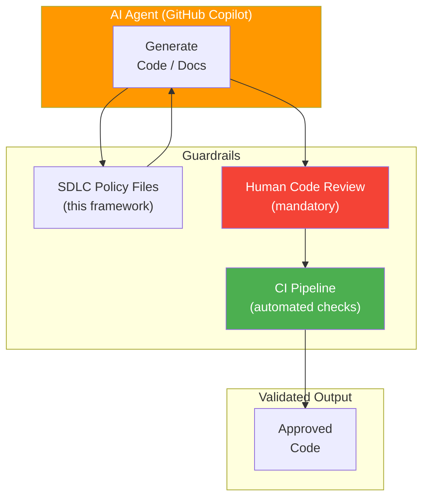

# AI Agent Governance

> **CLASSIFICATION: UNCLASSIFIED**
> **Document Type**: Governance Standard
> **Parent**: `00_master_policy.md`
> **Last Updated**: 2026-02-23

---

## 1. Purpose

This document defines governance rules for AI coding agents (GitHub Copilot) operating on the RTSA codebase. AI-generated code is subject to the same quality, security, and compliance standards as human-authored code — no exceptions.

## 2. Agent Authorization Model



## 3. Agent Capabilities and Boundaries

### 3.1 Permitted Actions

| Action | Conditions |
|---|---|
| Generate application code (Go, TypeScript, Protobuf) | Must follow coding standards; must include tests |
| Generate test code | Must use synthetic data only |
| Generate configuration (Helm, Docker, CI) | Must follow deployment guidelines |
| Generate documentation | Must include classification header |
| Refactor existing code | Must not change behavior; must maintain test coverage |
| Fix bugs | Must include regression test |

### 3.2 Prohibited Actions

| Action | Reason |
|---|---|
| Generate or suggest hardcoded secrets | Security violation (ITSG-33 IA-5) |
| Generate code that bypasses classification controls | Security violation (ITSG-33 AC-4) |
| Generate code using unapproved dependencies | Supply chain risk (ITSG-33 SA-12) |
| Generate code that logs PII or classified data | Privacy and security violation |
| Generate panic() calls in production Go code | Reliability violation |
| Generate code without corresponding tests | Quality violation |
| Generate SQL queries with string concatenation | SQL injection risk |
| Access or reference real operational data | Classification violation |
| Generate code that disables mTLS | Security violation (ITSG-33 SC-8) |

## 4. Output Validation Checklist

Every AI-generated artifact must pass this checklist before acceptance:

```markdown
## AI Output Validation Checklist

- [ ] Classification header present (`// CLASSIFICATION: UNCLASSIFIED`)
- [ ] No hardcoded secrets, passwords, API keys, or tokens
- [ ] No PII in code, comments, or logs
- [ ] No references to real operational data or coordinates
- [ ] Error handling present (no silenced errors, no panic in production)
- [ ] Tests included (unit tests at minimum)
- [ ] Approved dependencies only (check supply_chain_security.md)
- [ ] Input validation on all external data
- [ ] Parameterized queries for ClickHouse (no string concatenation)
- [ ] mTLS configuration for gRPC connections
- [ ] Structured logging with slog (no fmt.Println)
- [ ] Conventional commit message format
- [ ] Code compiles without errors
- [ ] Linter passes (golangci-lint, eslint)
```

## 5. Policy File Loading Requirements

### 5.1 Automatic Context Loading

The root `.github/copilot-instructions.md` file instructs the agent to load relevant policy files based on the task type. This ensures the agent has the correct constraints in context before generating code.

### 5.2 Minimum Context for Code Generation

For any code generation task, the agent must have loaded:
1. `00_master_policy.md` — Universal rules
2. `01_security_compliance/security_classification.md` — Classification requirements
3. The task-specific guideline (e.g., `04_coding_standards/go_standards.md` for Go code)
4. `04_coding_standards/secure_coding.md` — Security coding rules

## 6. Human Review Requirements

### 6.1 All AI-Generated Code Requires Human Review

- No AI-generated code enters the codebase without PR review
- Reviewer must verify the AI output validation checklist
- Reviewer must verify the code makes sense in the broader architectural context
- Reviewer must verify tests are meaningful (not tautological)

### 6.2 Enhanced Review for Security-Critical Code

| Code Area | Additional Review Required |
|---|---|
| Authentication / authorization | Security reviewer sign-off |
| Classification guard logic | Security reviewer sign-off |
| Anti-poisoning / trust scoring | Domain expert + security reviewer |
| NATO interoperability adapters | Domain expert sign-off |
| Cryptographic operations | Security reviewer sign-off |
| Wasm transforms | Performance + security review |

## 7. Traceability

### 7.1 AI-Generated Code Markers

When AI generates significant code blocks, the commit message should indicate AI involvement:

```
feat(fusion): add Dempster-Shafer evidence combining

- AI-assisted implementation reviewed by [reviewer]
- Follows UC002, FR-FUS-001

Co-authored-by: GitHub Copilot <copilot@github.com>
Refs: UC002, FR-FUS-001
```

## 8. Continuous Improvement

### 8.1 Agent Performance Tracking

Track metrics on AI agent output quality:

| Metric | Target | Measurement |
|---|---|---|
| PR review pass rate (first attempt) | > 80% | PRs accepted without rework |
| Security finding rate | < 5% | SAST findings on AI-generated code |
| Test coverage of AI code | > 80% | Coverage measurement in CI |
| Policy compliance rate | 100% | Checklist pass rate |

### 8.2 Policy Iteration

- Review and update SDLC guideline files quarterly
- Incorporate lessons learned from AI-generated code reviews
- Add new rules when recurring issues are identified
- Remove rules that are consistently automated by CI

## 9. AI Agent Instructions

When generating any code or documentation:

1. ALWAYS load the master policy and relevant task-specific guidelines first
2. ALWAYS include classification headers on generated files
3. NEVER hardcode secrets — use environment variables
4. NEVER generate code that bypasses security controls
5. ALWAYS include tests alongside code
6. ALWAYS use parameterized queries for database access
7. ALWAYS validate external input before processing
8. Reference this checklist in Section 4 as your self-review before presenting output
