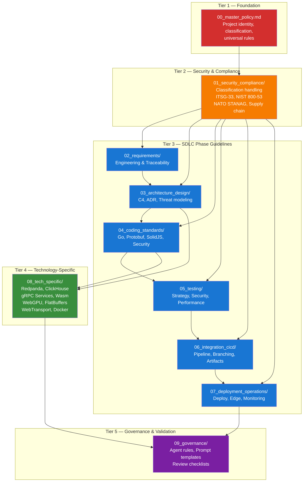

# SDLC Guidelines Framework — Index & Dependency Graph

> **CLASSIFICATION: UNCLASSIFIED**
> **Document Type**: Index / Navigation
> **Project**: RTSA — Real-Time Situational Awareness & Risk Assessment
> **Last Updated**: 2026-02-23

## Purpose

This directory contains the **SDLC Guidelines Framework** for the RTSA project — a hierarchical set of policy files that AI agents (primarily GitHub Copilot) load at runtime to enforce security, quality, and compliance standards across all development activities.

These guidelines are organized in a **5-tier dependency hierarchy**. Agents must load from the top tier down, ensuring foundational policies are always in effect before technology-specific guidance.

## Guideline Dependency Hierarchy



## Loading Order by Agent Task

| Agent Task | Required Files (load in order) |
|---|---|
| **Any task** | `00_master_policy.md` → `01_security_compliance/security_classification.md` |
| **Requirements** | + `02_requirements/requirements_engineering.md` → `traceability.md` |
| **Architecture** | + `03_architecture_design/architecture_guidelines.md` → `design_guidelines.md` → `threat_modeling.md` |
| **Go coding** | + `04_coding_standards/general_coding.md` → `go_standards.md` → `secure_coding.md` |
| **Protobuf/gRPC** | + `04_coding_standards/protobuf_grpc_standards.md` → `secure_coding.md` |
| **SolidJS coding** | + `04_coding_standards/general_coding.md` → `solidjs_standards.md` → `secure_coding.md` |
| **Testing** | + `05_testing/testing_strategy.md` → `security_testing.md` → `performance_testing.md` |
| **CI/CD** | + `06_integration_cicd/ci_cd_pipeline.md` → `branching_strategy.md` → `artifact_management.md` |
| **Deployment** | + `07_deployment_operations/deployment_guidelines.md` → `edge_tactical_deployment.md` → `monitoring_observability.md` |
| **Redpanda** | + `08_tech_specific/redpanda_guidelines.md` |
| **ClickHouse** | + `08_tech_specific/clickhouse_guidelines.md` |
| **gRPC services** | + `08_tech_specific/grpc_service_guidelines.md` |
| **Wasm transforms** | + `08_tech_specific/wasm_transforms.md` |
| **WebGPU rendering** | + `08_tech_specific/webgpu_guidelines.md` → `wgsl_shader_standards.md` |
| **FlatBuffers** | + `08_tech_specific/flatbuffers_guidelines.md` |
| **WebTransport** | + `08_tech_specific/webtransport_guidelines.md` |
| **Docker development** | + `development/docker_development.md` → `08_tech_specific/docker_container_guidelines.md` |
| **Review/Governance** | + `09_governance/agent_governance.md` → `review_checklists.md` |

## Directory Structure

```
docs/sdlc_guidelines/
├── README.md                              ← You are here
├── 00_master_policy.md                    ← ALWAYS LOAD FIRST
├── 01_security_compliance/
│   ├── security_classification.md         ← Protected C/Secret data handling
│   ├── itsg33_controls.md                 ← ITSG-33 control mapping
│   ├── nist800_53_controls.md             ← NIST 800-53 Rev 5 mapping
│   ├── nato_stanag_compliance.md          ← NATO STANAG 5516/NFFI/MIP
│   └── supply_chain_security.md           ← SBOM, dependency vetting
├── 02_requirements/
│   ├── requirements_engineering.md        ← Requirement capture format
│   └── traceability.md                    ← Bidirectional traceability
├── 03_architecture_design/
│   ├── architecture_guidelines.md         ← C4 model, ADR format
│   ├── design_guidelines.md              ← Microservice design patterns
│   └── threat_modeling.md                 ← STRIDE/DREAD methodology
├── 04_coding_standards/
│   ├── general_coding.md                  ← Language-agnostic rules
│   ├── go_standards.md                    ← Go conventions
│   ├── protobuf_grpc_standards.md         ← Proto3/gRPC patterns
│   ├── solidjs_standards.md               ← SolidJS/TypeScript (WebGPU COP)
│   └── secure_coding.md                   ← OWASP, crypto, input validation
├── 05_testing/
│   ├── testing_strategy.md                ← Test pyramid, coverage
│   ├── security_testing.md                ← SAST/DAST/fuzz/pentest
│   └── performance_testing.md             ← Latency, throughput, edge
├── 06_integration_cicd/
│   ├── ci_cd_pipeline.md                  ← Pipeline stages & gates
│   ├── branching_strategy.md              ← Trunk-based for small team
│   └── artifact_management.md             ← Registry, SBOM, signing
├── 07_deployment_operations/
│   ├── deployment_guidelines.md           ← Procedures, rollback
│   ├── edge_tactical_deployment.md        ← Disconnected ops
│   └── monitoring_observability.md        ← Logging, metrics, traces
├── 08_tech_specific/
│   ├── redpanda_guidelines.md             ← Topics, partitions, tiering
│   ├── clickhouse_guidelines.md           ← Schema, engines, queries
│   ├── grpc_service_guidelines.md         ← Interceptors, patterns
│   ├── wasm_transforms.md                 ← Broker-side data transforms
│   ├── docker_container_guidelines.md     ← Container images, security, ops
│   ├── webgpu_guidelines.md               ← WebGPU device, buffers, pipelines
│   ├── wgsl_shader_standards.md           ← WGSL naming, patterns, perf rules
│   ├── flatbuffers_guidelines.md          ← Hot-path wire format, schema sync
│   └── webtransport_guidelines.md         ← QUIC datagrams, Go server, Data Worker
├── development/
│   └── docker_development.md              ← Docker Compose dev workflow
└── 09_governance/
    ├── agent_governance.md                ← AI output validation rules
    ├── prompt_templates.md                ← Structured prompt templates
    └── review_checklists.md               ← Phase-gate checklists
```

## Cross-References

- **Project Documentation**: `docs/business/` (requirements, features, use cases)
- **Architecture Documentation**: `docs/architecture/` (C4 diagrams, data models, deployment)
- **Copilot Root Loader**: `.github/copilot-instructions.md`
- **Dependency Graph**: `docs/architecture/dependency_graph.md`
